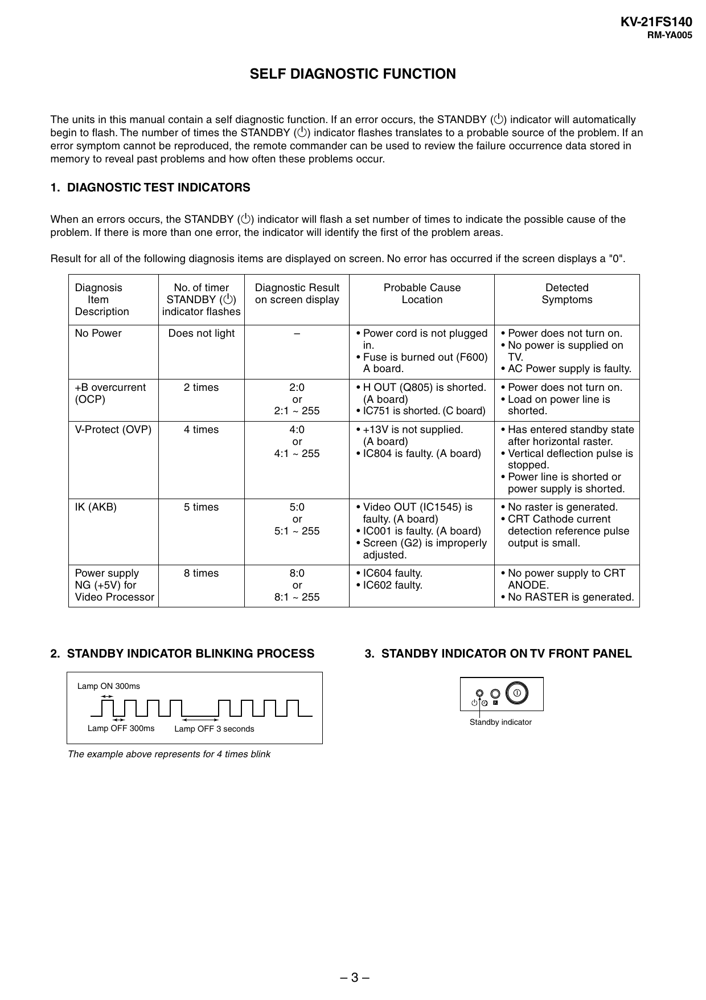

KV-21FS140
RM-YA005

SELF DIAGNOSTIC FUNCTION
The units in this manual contain a self diagnostic function. If an error occurs, the STANDBY (1) indicator will automatically
begin to flash. The number of times the STANDBY (1) indicator flashes translates to a probable source of the problem. If an
error symptom cannot be reproduced, the remote commander can be used to review the failure occurrence data stored in
memory to reveal past problems and how often these problems occur.

1. DIAGNOSTIC TEST INDICATORS
When an errors occurs, the STANDBY (1) indicator will flash a set number of times to indicate the possible cause of the
problem. If there is more than one error, the indicator will identify the first of the problem areas.
Result for all of the following diagnosis items are displayed on screen. No error has occurred if the screen displays a "0".
Diagnosis
Item
Description

No. of timer
STANDBY (1)
indicator flashes

Diagnostic Result
on screen display

Probable Cause
Location

Detected
Symptoms

No Power

Does not light

–

• Power cord is not plugged
in.
• Fuse is burned out (F600)
A board.

• Power does not turn on.
• No power is supplied on
TV.
• AC Power supply is faulty.

+B overcurrent
(OCP)

2 times

2:0
or
2:1 ~ 255

• H OUT (Q805) is shorted.
(A board)
• IC751 is shorted. (C board)

• Power does not turn on.
• Load on power line is
shorted.

V-Protect (OVP)

4 times

4:0
or
4:1 ~ 255

• +13V is not supplied.
(A board)
• IC804 is faulty. (A board)

• Has entered standby state
after horizontal raster.
• Vertical deflection pulse is
stopped.
• Power line is shorted or
power supply is shorted.

IK (AKB)

5 times

5:0
or
5:1 ~ 255

• Video OUT (IC1545) is
faulty. (A board)
• IC001 is faulty. (A board)
• Screen (G2) is improperly
adjusted.

• No raster is generated.
• CRT Cathode current
detection reference pulse
output is small.

Power supply
NG (+5V) for
Video Processor

8 times

8:0
or
8:1 ~ 255

• IC604 faulty.
• IC602 faulty.

• No power supply to CRT
ANODE.
• No RASTER is generated.

2. STANDBY INDICATOR BLINKING PROCESS

3. STANDBY INDICATOR ON TV FRONT PANEL

Lamp ON 300ms

Lamp OFF 300ms

Standby indicator

Lamp OFF 3 seconds

The example above represents for 4 times blink

–3–


