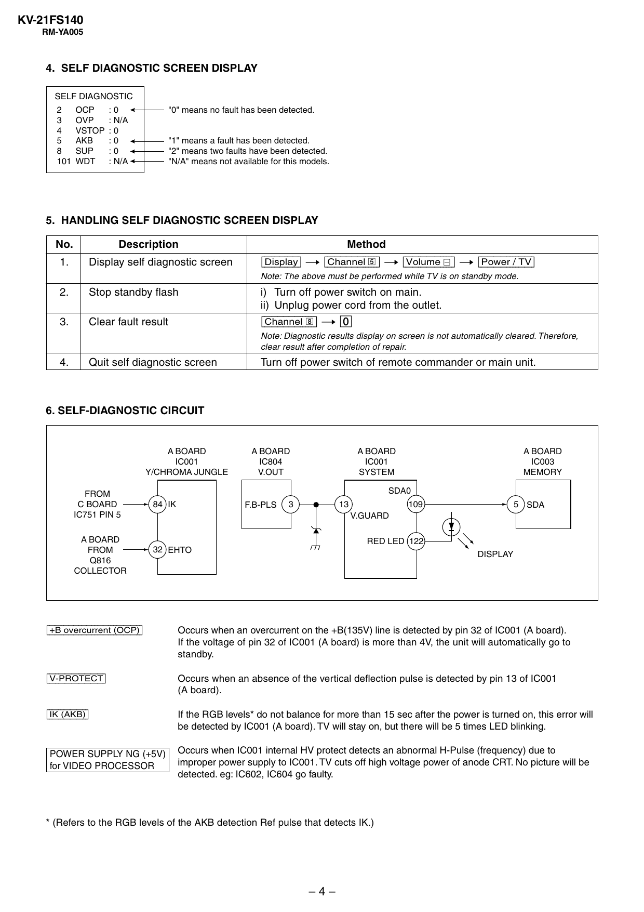

KV-21FS140
RM-YA005

4. SELF DIAGNOSTIC SCREEN DISPLAY
SELF DIAGNOSTIC
2
OCP
:0
3
OVP
: N/A
4
VSTOP : 0
5
AKB
:0
8
SUP
:0
101 WDT
: N/A

"0" means no fault has been detected.

"1" means a fault has been detected.
"2" means two faults have been detected.
"N/A" means not available for this models.

5. HANDLING SELF DIAGNOSTIC SCREEN DISPLAY
No.
1.

Description
Display self diagnostic screen

Method

[Display] t [Channel 5 ] t [Volume ] t [Power / TV]
Note: The above must be performed while TV is on standby mode.

2.

Stop standby flash

i) Turn off power switch on main.
ii) Unplug power cord from the outlet.

3.

Clear fault result

[Channel 8] t Note: Diagnostic results display on screen is not automatically cleared. Therefore,
clear result after completion of repair.

4.

Quit self diagnostic screen

Turn off power switch of remote commander or main unit.

6. SELF-DIAGNOSTIC CIRCUIT

A BOARD
IC001
Y/CHROMA JUNGLE
FROM
C BOARD
IC751 PIN 5
A BOARD
FROM
Q816
COLLECTOR

A BOARD
IC804
V.OUT

A BOARD
IC001
SYSTEM

A BOARD
IC003
MEMORY

SDA0
84 IK

F.B-PLS

3

109

13

5 SDA

V.GUARD
RED LED 122
32 EHTO

DISPLAY

[+B overcurrent $OCP%]

Occurs when an overcurrent on the +B(135V) line is detected by pin 32 of IC001 (A board).
If the voltage of pin 32 of IC001 (A board) is more than 4V, the unit will automatically go to
standby.

[V-PROTECT]

Occurs when an absence of the vertical deflection pulse is detected by pin 13 of IC001
(A board).

[IK $AKB%]

If the RGB levels* do not balance for more than 15 sec after the power is turned on, this error will
be detected by IC001 (A board). TV will stay on, but there will be 5 times LED blinking.

POWER SUPPLY NG (+5V)
for VIDEO PROCESSOR

Occurs when IC001 internal HV protect detects an abnormal H-Pulse (frequency) due to
improper power supply to IC001. TV cuts off high voltage power of anode CRT. No picture will be
detected. eg: IC602, IC604 go faulty.

* (Refers to the RGB levels of the AKB detection Ref pulse that detects IK.)

–4–


