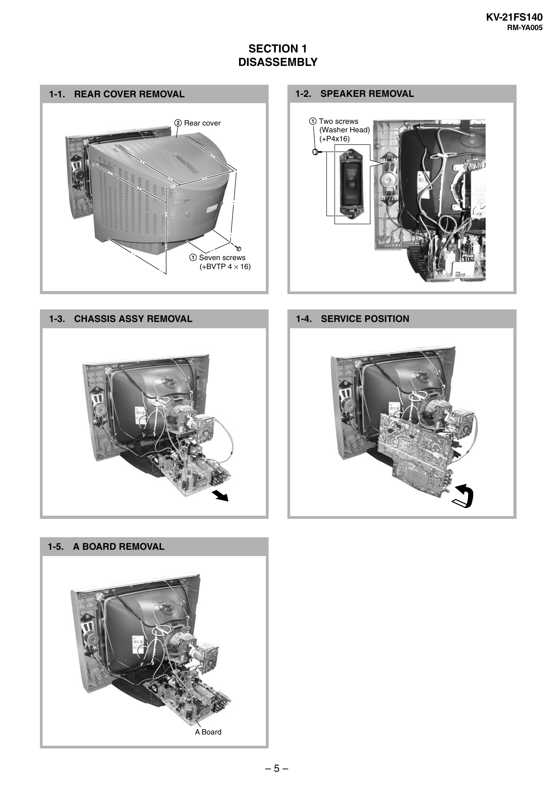

KV-21FS140
RM-YA005

SECTION 1
DISASSEMBLY
1-2. SPEAKER REMOVAL

1-1. REAR COVER REMOVAL

1 Two screws
(Washer Head)
(+P4x16)

2 Rear cover

1 Seven screws
(+BVTP 4 × 16)

1-4. SERVICE POSITION

1-3. CHASSIS ASSY REMOVAL

1-5. A BOARD REMOVAL

A Board

–5–


