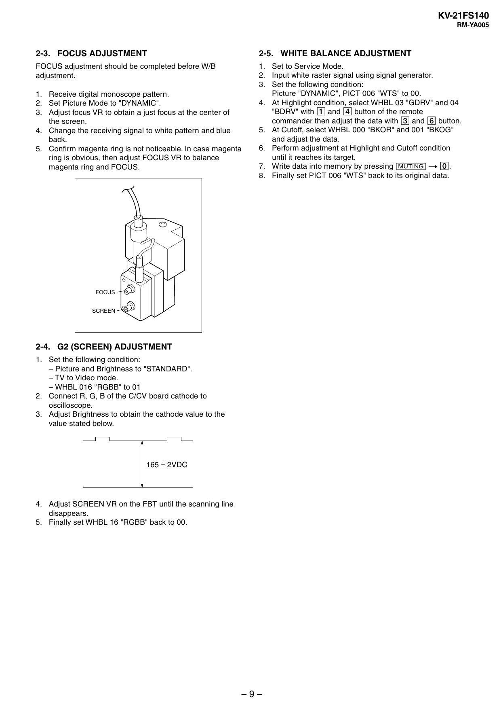

KV-21FS140
RM-YA005

2-3. FOCUS ADJUSTMENT

2-5. WHITE BALANCE ADJUSTMENT

FOCUS adjustment should be completed before W/B
adjustment.

1. Set to Service Mode.
2. Input white raster signal using signal generator.
3. Set the following condition:
Picture "DYNAMIC", PICT 006 "WTS" to 00.
4. At Highlight condition, select WHBL 03 "GDRV" and 04
"BDRV" with 1 and 4 button of the remote
commander then adjust the data with 3 and 6 button.
5. At Cutoff, select WHBL 000 "BKOR" and 001 "BKOG"
and adjust the data.
6. Perform adjustment at Highlight and Cutoff condition
until it reaches its target.
7. Write data into memory by pressing [MUTING] t -.
8. Finally set PICT 006 "WTS" back to its original data.

1. Receive digital monoscope pattern.
2. Set Picture Mode to "DYNAMIC".
3. Adjust focus VR to obtain a just focus at the center of
the screen.
4. Change the receiving signal to white pattern and blue
back.
5. Confirm magenta ring is not noticeable. In case magenta
ring is obvious, then adjust FOCUS VR to balance
magenta ring and FOCUS.

FOCUS
SCREEN

2-4. G2 (SCREEN) ADJUSTMENT
1. Set the following condition:
– Picture and Brightness to "STANDARD".
– TV to Video mode.
– WHBL 016 "RGBB" to 01
2. Connect R, G, B of the C/CV board cathode to
oscilloscope.
3. Adjust Brightness to obtain the cathode value to the
value stated below.

165 ± 2VDC

4. Adjust SCREEN VR on the FBT until the scanning line
disappears.
5. Finally set WHBL 16 "RGBB" back to 00.

–9–


