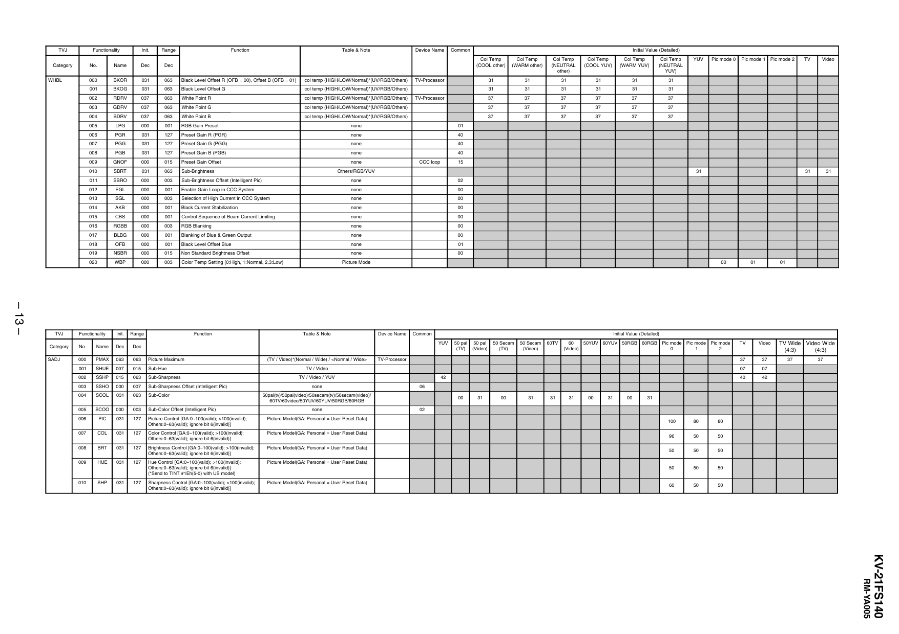

TVJ
Category
WHBL

– 13 –

TVJ

Functionality

Init.

Range

No.

Name

Dec

Dec

000

BKOR

031

063

Black Level Offset R (OFB = 00), Offset B (OFB = 01)

col temp (HIGH/LOW/Normal)*(UV/RGB/Others)

001

BKOG

031

063

Black Level Offset G

col temp (HIGH/LOW/Normal)*(UV/RGB/Others)

Function

Table & Note

Device Name

Common

Initial Value (Detailed)
Col Temp
(COOL other)

002

RDRV

037

063

White Point R

col temp (HIGH/LOW/Normal)*(UV/RGB/Others)

003

GDRV

037

063

White Point G

col temp (HIGH/LOW/Normal)*(UV/RGB/Others)

004

BDRV

037

063

White Point B

col temp (HIGH/LOW/Normal)*(UV/RGB/Others)

005

LPG

000

001

RGB Gain Preset

TV-Processor

TV-Processor

none

006

PGR

031

127

Preset Gain R (PGR)

none

40

PGG

031

127

Preset Gain G (PGG)

none

40

008

PGB

031

127

Preset Gain B (PGB)

none

GNOF

000

015

Preset Gain Offset

none

010

SBRT

031

063

Sub-Brightness

Others/RGB/YUV

01 1

SBRO

000

003

Sub-Brightness Offset (Intelligent Pic)

000

001

Enable Gain Loop in CCC System

none

00

000

003

Selection of High Current in CCC System

none

00

014

AKB

000

001

Black Current Stabilization

none

00

015

CBS

000

001

Control Sequence of Beam Current Limiting

none

00

016

RGBB

000

003

RGB Blanking

none

00

017

BLBG

000

001

Blanking of Blue & Green Output

none

00

018

OFB

000

001

Black Level Offset Blue

none

01

019

NSBR

000

015

Non Standard Brightness Offset

none

00

020

WBP

000

003

Color Temp Setting (0:High, 1:Normal, 2,3:Low)

Init.

Range

Dec

Dec

SADJ

000

PMAX

063

06 3

Picture Maximum

001

SHUE

007

015

Sub-Hue

Function

SSHP

015

063

Sub-Sharpness

003

SSHO

000

007

Sub-Sharpness Offset (Intelligent Pic)

31

31

31

31

31

31

31

31

31

31

37

37

37

37

37

37

37

37

37

37

37

37

37

37

37

37

37

37

Picture Mode

Table & Note

(TV / Video)*(Normal / Wide) / <Normal / Wide>

Pic mode 0

Device Name

Common
50 pal
(Video)

50 Secam
(TV)

50 Secam
(Video)

60TV

60
50YUV 60YUV 50RGB 60RGB
(Video)

Pic mode Pic mode Pic mode
0
1
2

TV-Processor

TV / Video / YUV

004

SCOL

031

063

Sub-Color

005

SCOO

000

003

Sub-Color Offset (Intelligent Pic)

006

PIC

031

127

Picture Control [GA:0~100(valid); >100(invalid);
Others:0~63(valid); ignore bit 6(invalid)]

Picture Model(GA: Personal = User Reset Data)

007

COL

031

127

Color Control [GA:0~100(valid); >100(invalid);
Others:0~63(valid); ignore bit 6(invalid)]

Picture Model(GA: Personal = User Reset Data)

008

BRT

031

127

Brightness Control [GA:0~100(valid); >100(invalid);
Others:0~63(valid); ignore bit 6(invalid)]

Picture Model(GA: Personal = User Reset Data)

009

HUE

031

127

Hue Control [GA:0~100(valid); >100(invalid);
Others:0~63(valid); ignore bit 6(invalid)]
(*Send to TINT #1Eh(5-0) with US model)

Picture Model(GA: Personal = User Reset Data)

010

SHP

031

127

Sharpness Control [GA:0~100(valid); >100(invalid);
Others:0~63(valid); ignore bit 6(invalid)]

Picture Model(GA: Personal = User Reset Data)

Video

31

31

01

01

42

TV

Video

37

37

07

07

40

42

TV Wide Video Wide
(4:3)
(4:3)
37

37

06

50pal(tv)/50pal(video)/50secam(tv)/50secam(video)/
60TV/60video/50YUV/60YUV/50RGB/60RGB
none

TV

Initial Value (Detailed)
50 pal
(TV)

TV / Video

none

Pic mode 1 Pic mode 2

00

YUV

002

31
31

YUV

02

EGL

Name

Col Temp
(NEUTRAL
YUV)

31

none

SGL

Functionality

Col Temp
(WARM YUV)

15

013

No.

Col Temp
(COOL YUV)

40
CCC loop

012

Category

Col Temp
(NEUTRAL
other)

01

007

009

Col Temp
(WARM other)

00

31

00

31

31

31

00

31

00

31

02
100

80

80

96

50

50

50

50

50

50

50

50

60

50

50

RM-YA005

KV-21FS140


