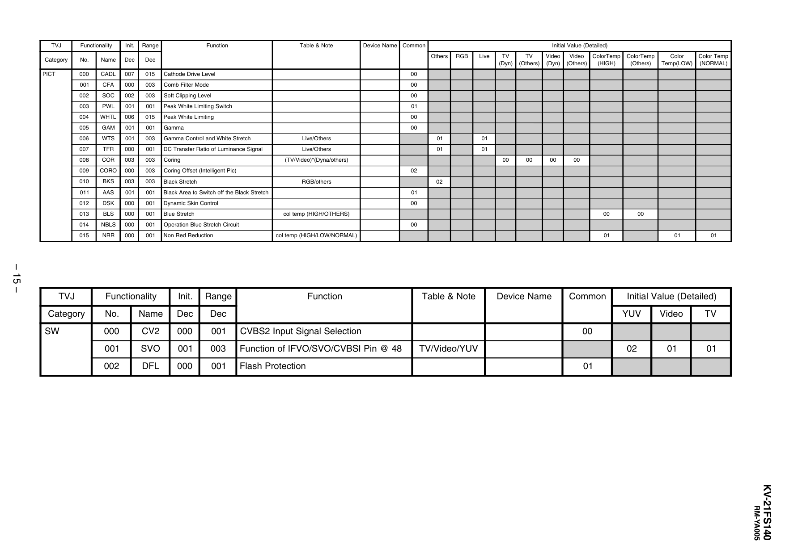

TVJ

Functionality

Init.

Range

Function

Table & Note

Device Name Common

Initial Value (Detailed)
Others

Category

No.

Name

Dec

Dec

PICT

000

CADL

007

015

Cathode Drive Level

001

CFA

000

003

Comb Filter Mode

00

002

SOC

002

003

Soft Clipping Level

00

RGB

Live

TV
(Dyn)

TV
(Others)

Video
(Dyn)

00

00

00

Video
ColorTemp
(Others)
(HIGH)

ColorTemp
(Others)

Color
Temp(LOW)

Color Temp
(NORMAL)

01

01

00

003

PWL

001

001

Peak White Limiting Switch

01

004

WHTL

006

015

Peak White Limiting

00

005

GAM

001

001

Gamma

006

WTS

001

003

Gamma Control and White Stretch

Live/Others

01

01

007

TFR

000

001

DC Transfer Ratio of Luminance Signal

Live/Others

01

01

00

008

COR

003

003

Coring

009

CORO

000

003

Coring Offset (Intelligent Pic)

010

BKS

003

003

Black Stretch

011

AAS

001

001

Black Area to Switch off the Black Stretch

012

DSK

000

001

Dynamic Skin Control

013

BLS

000

001

Blue Stretch

014

NBLS

000

001

Operation Blue Stretch Circuit

015

NRR

000

001

Non Red Reduction

(TV/Video)*(Dyna/others)

00

02
RGB/others

02
01
00

col temp (HIGH/OTHERS)

00

00

00
col temp (HIGH/LOW/NORMAL)

01

– 15 –
TVJ

Functionality

Init.

Range

Category

No.

Name

Dec

Dec

SW

000

CV2

000

001

CVBS2 Input Signal Selection

001

SVO

001

003

Function of IFVO/SVO/CVBSI Pin @ 48

002

DFL

000

001

Flash Protection

Function

Table & Note

Device Name

Common

Initial Value (Detailed)
YUV

Video

TV

02

01

01

00
TV/Video/YUV
01

RM-YA005

KV-21FS140


