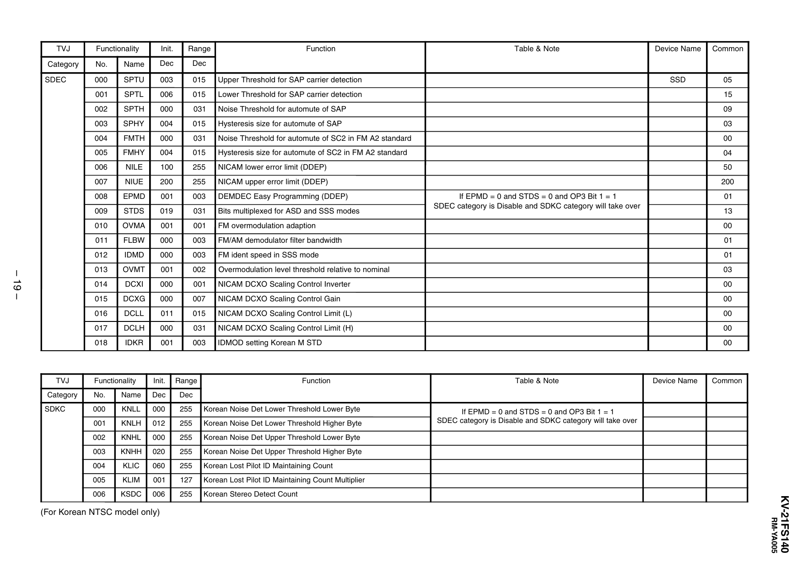

TVJ

Functionality

Init.

Range

Category

No.

Name

Dec

Dec

SDEC

000

SPTU

003

015

Upper Threshold for SAP carrier detection

001

SPTL

006

015

Lower Threshold for SAP carrier detection

15

002

SPTH

000

031

Noise Threshold for automute of SAP

09

– 19 –
TVJ

Function

Table & Note

Device Name

Common

SSD

05

003

SPHY

004

015

Hysteresis size for automute of SAP

03

004

FMTH

000

031

Noise Threshold for automute of SC2 in FM A2 standard

00

005

FMHY

004

015

Hysteresis size for automute of SC2 in FM A2 standard

04

006

NILE

100

255

NICAM lower error limit (DDEP)

50

007

NIUE

200

255

NICAM upper error limit (DDEP)

200

008

EPMD

001

003

DEMDEC Easy Programming (DDEP)

If EPMD = 0 and STDS = 0 and OP3 Bit 1 = 1
SDEC category is Disable and SDKC category will take over

01

009

STDS

019

031

Bits multiplexed for ASD and SSS modes

010

OVMA

001

001

FM overmodulation adaption

00

011

FLBW

000

003

FM/AM demodulator filter bandwidth

01

012

IDMD

000

003

FM ident speed in SSS mode

01

013

OVMT

001

002

Overmodulation level threshold relative to nominal

03

014

DCXI

000

001

NICAM DCXO Scaling Control Inverter

00

13

015

DCXG

000

007

NICAM DCXO Scaling Control Gain

00

016

DCLL

011

015

NICAM DCXO Scaling Control Limit (L)

00

017

DCLH

000

031

NICAM DCXO Scaling Control Limit (H)

00

018

IDKR

001

003

IDMOD setting Korean M STD

00

Functionality

Init.

Range

Category

No.

Dec

Dec

SDKC

000

KNLL

000

255

Korean Noise Det Lower Threshold Lower Byte

001

KNLH

012

255

Korean Noise Det Lower Threshold Higher Byte

002

KNHL

000

255

Korean Noise Det Upper Threshold Lower Byte

Name

Function

KNHH

020

255

Korean Noise Det Upper Threshold Higher Byte

KLIC

060

255

Korean Lost Pilot ID Maintaining Count

005

KLIM

001

127

Korean Lost Pilot ID Maintaining Count Multiplier

006

KSDC

006

255

Korean Stereo Detect Count

Device Name

Common

If EPMD = 0 and STDS = 0 and OP3 Bit 1 = 1
SDEC category is Disable and SDKC category will take over

(For Korean NTSC model only)
RM-YA005

KV-21FS140

003
004

Table & Note


