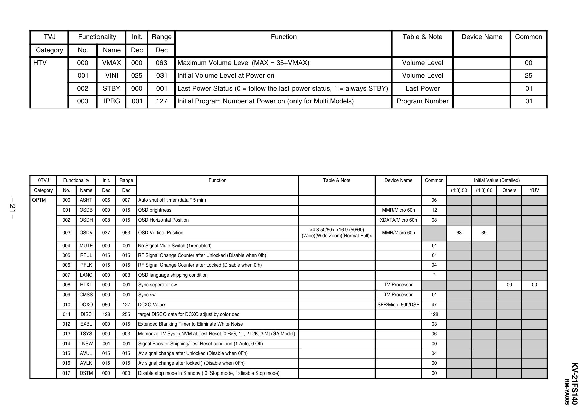

TVJ

Functionality

Init.

Range

Category

No.

Name

Dec

Dec

HTV

000

VMAX

000

063

Maximum Volume Level (MAX = 35+VMAX)

Volume Level

00

001

VINI

025

031

Initial Volume Level at Power on

Volume Level

25

002

STBY

000

001

Last Power Status (0 = follow the last power status, 1 = always STBY)

Last Power

01

003

IPRG

001

127

Initial Program Number at Power on (only for Multi Models)

Program Number

01

0TVJ

Function

– 21 –

Functionality

Init.

Range

Category

No.

Name

Dec

Dec

OPTM

000

ASHT

006

007

Auto shut off timer (data * 5 min)

001

OSDB

000

015

OSD brightness

002

OSDH

008

015

OSD Horizontal Position

Function

003

OSDV

037

063

OSD Vertical Position

004

MUTE

000

001

No Signal Mute Switch (1=enabled)

Table & Note

Table & Note

Device Name

Device Name

Common

Common

Initial Value (Detailed)
(4:3) 50

(4:3) 60

63

39

Others

YUV

00

00

06

<4:3 50/60> <16:9 (50/60)
(Wide)(Wide Zoom)(Normal Full)>

MMR/Micro 60h

12

XDATA/Micro 60h

08

MMR/Micro 60h
01

005

RFUL

015

015

RF Signal Change Counter after Unlocked (Disable when 0fh)

01

006

RFLK

015

015

RF Signal Change Counter after Locked (Disable when 0fh)

04

007

LANG

000

003

OSD language shipping condition

008

HTXT

000

001

Sync seperator sw

009

CMSS

000

001

Sync sw

010

DCXO

060

127

DCXO Value

*
TV-Processor
TV-Processor

01

SFR/Micro 60h/DSP

47

011

DISC

128

255

target DISCO data for DCXO adjust by color dec

128

012

EXBL

000

015

Extended Blanking Timer to Eliminate White Noise

03

013

TSYS

000

003

Memorize TV Sys in NVM at Test Reset [0:B/G, 1:I, 2:D/K, 3:M] (GA Model)

06

014

LNSW

001

001

Signal Booster Shipping/Test Reset condition (1:Auto, 0:Off)

00

AVUL

015

015

Av signal change after Unlocked (Disable when 0Fh)

04

AVLK

015

015

Av signal change after locked ) (Disable when 0Fh)

00

017

DSTM

000

000

Disable stop mode in Standby ( 0: Stop mode, 1:disable Stop mode)

00

RM-YA005

KV-21FS140

015
016


