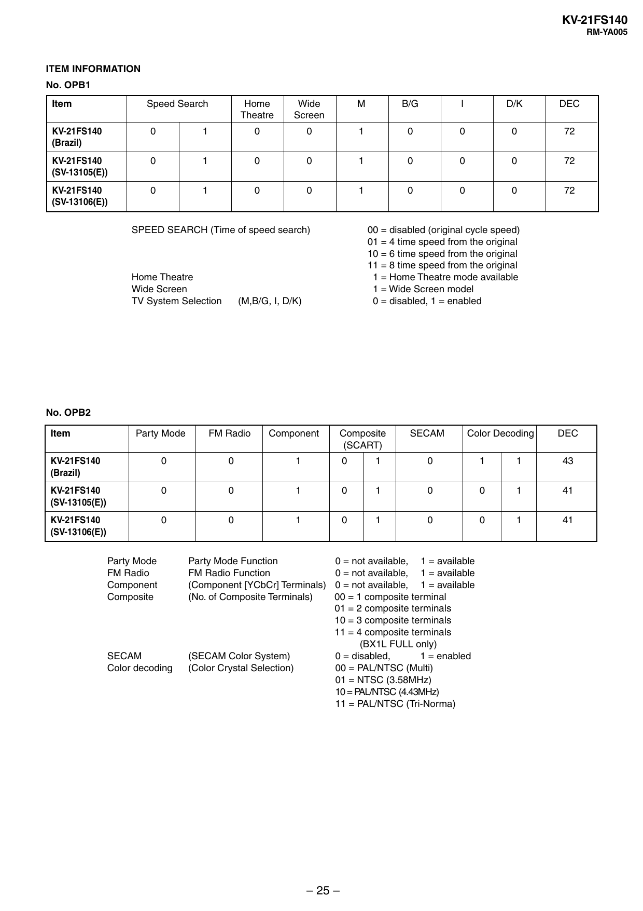

KV-21FS140
RM-YA005

ITEM INFORMATION
No. OPB1
Item

Speed Search

Home
Theatre

Wide
Screen

M

B/G

I

D/K

DEC

KV-21FS140
(Brazil)

0

1

0

0

1

0

0

0

72

KV-21FS140
(SV-13105(E))

0

1

0

0

1

0

0

0

72

KV-21FS140
(SV-13106(E))

0

1

0

0

1

0

0

0

72

SPEED SEARCH (Time of speed search)

Home Theatre
Wide Screen
TV System Selection

00 = disabled (original cycle speed)
01 = 4 time speed from the original
10 = 6 time speed from the original
11 = 8 time speed from the original
1 = Home Theatre mode available
1 = Wide Screen model
0 = disabled, 1 = enabled

(M,B/G, I, D/K)

No. OPB2
Item

Party Mode

FM Radio

Component

KV-21FS140
(Brazil)

0

0

1

0

1

0

1

1

43

KV-21FS140
(SV-13105(E))

0

0

1

0

1

0

0

1

41

KV-21FS140
(SV-13106(E))

0

0

1

0

1

0

0

1

41

Party Mode
FM Radio
Component
Composite

Party Mode Function
FM Radio Function
(Component [YCbCr] Terminals)
(No. of Composite Terminals)

SECAM
Color decoding

(SECAM Color System)
(Color Crystal Selection)

Composite
(SCART)

SECAM

Color Decoding

0 = not available, 1 = available
0 = not available, 1 = available
0 = not available, 1 = available
00 = 1 composite terminal
01 = 2 composite terminals
10 = 3 composite terminals
11 = 4 composite terminals
(BX1L FULL only)
0 = disabled,
1 = enabled
00 = PAL/NTSC (Multi)
01 = NTSC (3.58MHz)
10 = PAL/NTSC (4.43MHz)
11 = PAL/NTSC (Tri-Norma)

– 25 –

DEC


