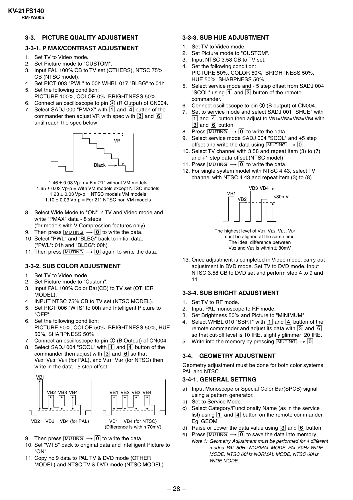

KV-21FS140
RM-YA005

3-3.

PICTURE QUALITY ADJUSTMENT

3-3-3. SUB HUE ADJUSTMENT

3-3-1. P MAX/CONTRAST ADJUSTMENT
1. Set TV to Video mode.
2. Set Picture mode to "CUSTOM".
3. Input PAL 100% CB to TV set (OTHERS), NTSC 75%
CB (NTSC model).
4. Set PICT 003 "PWL" to 00h WHBL 017 "BLBG" to 01h.
5. Set the following condition:
PICTURE 100%, COLOR 0%, BRIGHTNESS 50%
6. Connect an oscilloscope to pin 4 (R Output) of CN004.
7. Select SADJ 000 "PMAX" with 1 and 4 button of the
commander then adjust VR with spec with 3 and 6
until reach the spec below:

VR

Black

1.46 ± 0.03 Vp-p = For 21" without VM models
1.65 ± 0.03 Vp-p = With VM models except NTSC models
1.23 ± 0.03 Vp-p = NTSC models VM models
1.10 ± 0.03 Vp-p = For 21" NTSC non VM models

1.
2.
3.
4.

Set TV to Video mode.
Set Picture mode to "CUSTOM".
Input NTSC 3.58 CB to TV set.
Set the following condition:
PICTURE 50%, COLOR 50%, BRIGHTNESS 50%,
HUE 50%, SHARPNESS 50%
5. Select service mode and - 5 step offset from SADJ 004
"SCOL" using 1 and 3 button of the remote
commander.
6. Connect oscilloscope to pin 2 (B output) of CN004.
7. Set to service mode and select SADJ 001 "SHUE" with
1 and 4 button then adjust to VB1=VB2=VB3=VB4 with
3 and 6 button.
8. Press [MUTING] t - to write the data.
9. Select service mode SADJ 004 "SCOL" and +5 step
offset and write the data using [MUTING] t -.
10. Select TV channel with 3.58 and repeat item (3) to (7)
and +1 step data offset.(NTSC model)
11. Press [MUTING] t - to write the data.
12. For single system model with NTSC 4.43, select TV
channel with NTSC 4.43 and repeat item (3) to (8).
VB3 VB4
VB1
VB2

8. Select Wide Mode to "ON" in TV and Video mode and
write "PMAX" data - 8 steps
(for models with V-Compression features only).
9. Then press [MUTING] t - to write the data.
10. Select "PWL" and "BLBG" back to initial data.
("PWL": 01h and "BLBG": 00h)
11. Then press [MUTING] t - again to write the data.

80mV

The highest level of VB1, VB2, VB3, VB4
must be aligned at the same time.
The ideal difference between
VB2 and VB3 is within ± 80mV

3-3-2. SUB COLOR ADJUSTMENT
1. Set TV to Video mode.
2. Set Picture mode to "Custom".
3. Input PAL 100% Color Bar(CB) to TV set (OTHER
MODEL).
4. INPUT NTSC 75% CB to TV set (NTSC MODEL).
5. Set PICT 006 "WTS" to 00h and Intelligent Picture to
"OFF".
6. Set the following condition:
PICTURE 50%, COLOR 50%, BRIGHTNESS 50%, HUE
50%, SHARPNESS 50%
7. Connect an oscilloscope to pin 2 (B Output) of CN004.
8. Select SADJ 004 "SCOL" with 1 and 4 button of the
commander then adjust with 3 and 6 so that
VB2=VB3=VB4 (for PAL), and VB1=VB4 (for NTSC) then
write in the data +5 step offset.
VB1

13. Once adjustment is completed in Video mode, carry out
adjustment in DVD mode. Set TV to DVD mode. Input
NTSC 3.58 CB to DVD set and perform step 4 to 9 and
11.

3-3-4. SUB BRIGHT ADJUSTMENT
1.
2.
3.
4.

Set TV to RF mode.
Input PAL monoscope to RF mode.
Set Brightness 50% and Picture to "MINIMUM".
Select WHBL 010 "SBRT" with 1 and 4 button of the
remote commander and adjust its data with 3 and 6
so that cut-off level is 10 IRE, slightly glimmer: 20 IRE.
5. Write into the memory by pressing [MUTING] t -.

3-4.

GEOMETRY ADJUSTMENT

Geometry adjustment must be done for both color systems
PAL and NTSC.

3-4-1. GENERAL SETTING
VB2 VB3 VB4

VB1 VB2 VB3 VB4

VB2 = VB3 = VB4 (for PAL)

VB1 = VB4 (for NTSC)
(Difference is within 70mV)

9. Then press [MUTING] t - to write the data.
10. Set "WTS" back to original data and Intelligent Picture to
"ON".
11. Copy no.9 data to PAL TV & DVD mode (OTHER
MODEL) and NTSC TV & DVD mode (NTSC MODEL)

a) Input Monoscope or Special Color Bar(SPCB) signal
using a pattern generator.
b) Set to Service Mode.
c) Select Category/Functionally Name (as in the service
list) using 1 and 4 button on the remote commander.
Eg. GEOM
d) Raise or Lower the data value using 3 and 6 button.
e) Press [MUTING] t - to save the data into memory.

– 28 –

Note 1: Geometry Adjustment must be performed for 4 different
modes: PAL 50Hz NORMAL MODE, PAL 50Hz WIDE
MODE, NTSC 60Hz NORMAL MODE, NTSC 60Hz
WIDE MODE.


