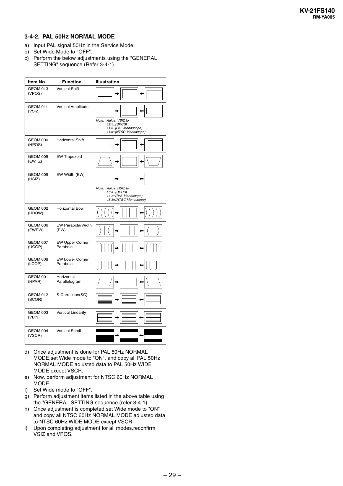

KV-21FS140
RM-YA005

3-4-2. PAL 50Hz NORMAL MODE
a) Input PAL signal 50Hz in the Service Mode.
b) Set Wide Mode to "OFF".
c) Perform the below adjustments using the "GENERAL
SETTING" sequence (Refer 3-4-1)
Item No.

Function

GEOM 013
(VPOS)

Vertical Shift

GEOM 011
(VSIZ)

Vertical Amplitude

Illustration

Note: Adjust VSIZ to
12.4±(SPCB)
11.3±(PAL Monoscope)
11.5±(NTSC Monoscope)

GEOM 000
(HPOS)

Horizontal Shift

GEOM 009
(EWTZ)

EW Trapezoid

GEOM 005
(HSIZ)

EW Width (EW)

Note: Adjust HSIZ to
16.4±(SPCB)
14.6±(PAL Monoscope)
15.3±(NTSC Monoscope)

GEOM 002
(HBOW)

Horizontal Bow

GEOM 006
(EWPW)

EW Parabola/Width
(PW)

GEOM 007
(UCOP)

EW Upper Corner
Parabola

GEOM 008
(LCOP)

EW Lower Corner
Parabola

GEOM 001
(HPAR)

Horizontal
Parallelogram

GEOM 012
(SCOR)

S-Correction(SC)

GEOM 003
(VLIN)

Vertical Linearity

GEOM 004
(VSCR)

Vertical Scroll

d) Once adjustment is done for PAL 50Hz NORMAL
MODE,set Wide mode to "ON", and copy all PAL 50Hz
NORMAL MODE adjusted data to PAL 50Hz WIDE
MODE except VSCR.
e) Now, perform adjustment for NTSC 60Hz NORMAL
MODE.
f) Set Wide mode to "OFF".
g) Perform adjustment items listed in the above table using
the "GENERAL SETTING sequence (refer 3-4-1).
h) Once adjustment is completed,set Wide mode to "ON"
and copy all NTSC 60Hz NORMAL MODE adjusted data
to NTSC 60Hz WIDE MODE except VSCR.
i) Upon completing adjustment for all modes,reconfirm
VSIZ and VPOS.

– 29 –


