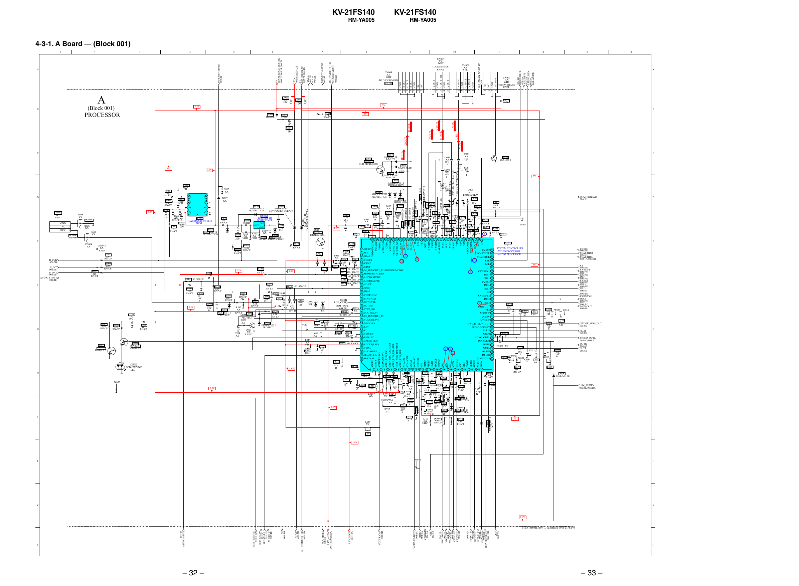

KV-21FS140

KV-21FS140

RM-YA005

RM-YA005

4-3-1. A Board — (Block 001)

A

C006
470
10V

C005
100
16V

Y OUT
GND
U OUT / FB
GND
V OUT

Y IN / G
GND
U IN / B
V IN / R
GND

003:10D;004:2C;005:4E
+B
+B
NC
GND
VM OUT

1
2
3
4
5

1
2
3
4
5

1
2
3
4
R377
1.5k

R394
4.7k
RN-CP

FB003
XX
L039
XX

IC003
CAT24WC16WI-TE13
NVM
D055
RD5.6SB-T1
PROTECTION

E
FB004
XX

B_INT
006:2B
B_DAT
006:2B
AUDIO-STDBY
002:4E

R096
220
RN-CP
R097
220
RN-CP

C333
470
10V

OUT
VCC
GND

C010
470p
CH
C009
XX
R362
D054
XX
R363 RD5.6SB-T1
CHIP 0:CHIP
PROTECTION

R098
220
RN-CP

R398
10
RN-CP

Q006
UN2216
G LED SW

Q007
UN2216
R LED SW

C328
0.01
25V
B
Q016
UN2211
PROTECTOR

L031
XX
L043
10uH

1.8V

TP03

R323
100
RN-CP

R010
10k
RN-CP

R020
100
RN-CP

C023
2.2
16V
F

97 SIRSC

U IN
V IN
D008 XX PROTECTION

D006
XX
PROTECTION
D007 XX PROTECTION

R356
0:CHIP

C312
1000p
B

5V

D009
XX
PROTECTION
C056
100
16V
L005
10uH

SCARTFBL/A16
006:5H

D005
C302
XX
C054
2.2
C094
0.1
16V
C092
0.1 C095
F
16V
16V 0.1
0.1
R058
C038
B
16V
100
C053 B 16V
R386
0.1
B
B
100
0.022
RN-CP
C026
16V
C096 0.1
RN-CP
25V
47
B
B
16V
R059
B
35V
R395
R385
1k
C093
FB008 R056
100k
100
R384
C301
0.1
0UH 100
RN-CP TP04
RN-CP 100
470p
16V
5
RN-CP
CH
B
RN-CP
96 95 94 93 92 91 90 89 88 87 86 85 84 83 82 81 80 79 78 77 76 75 74 73 72 71 70 69 68 67 66 65
C028
0.1
16V
B

C025
0.22
16V
B

C030
0.22
16V
B

G
R

D914
SPB-25MVWF
LED

E
CVBSO
006:6H
SCARTHPR
006:5H
SCARTHPL
002:1A;006:5H
5V

C072
0.01
25V
B

C303
16V
100

L004
47uH

C1
006:8H
CVBS1/Y1
006:7H
INR1
006:7H
INL1

C319
47p
CH
C069
0.1
16V
B

W033 W034

C320
47p
CH

C064
2.2

W030

C316
0.47
10V
B
W031

W032

C309
XX

W010

C063
0.1
16V
B

G

MONO_OUTL
005:6D;006:2C
OUTR
006:6B
OUTL
006:6B

C065
3.3

R379
68k
RN-CP

R060
100
RN-CP

C073
2.2

F

IFVO/IF_MON_OUT
005:6D
PLLIF
005:6D

JR1012
0

FB002 XX

006:7H
CVBS3
006:6H
INR3
006:6H
INL3
006:6H
006:4H
CVBS2/Y2
INR2
006:5H
INL2
006:5H
MON-OUT
006:6B

D074
MMDL914T1

C058
1000p
B

H

1.8V_AUDIO
001:8L;003:10C

I

D063
MMDL914T1
OCP

L008
10uH

C050 10

W053

W003

IC001
*
SYSTEM CONTROLLER
- VIDEO PROCESSOR
- AUDIO PROCESSOR

CVBS0 64
SCARTHPR 63
SCARTHPL 62
6
LSR 61
LSL 60
C1 59
CVBS1/Y1 58
7
INR1 57
INL1 56
CVBS3 55
INR3 54
INL3 53
C2 52
CVBS2/Y2 51
INR2 50
4 INL2 49
MON-OUT 48
VP2 47
AGC2SIF 46
VCC8V 45
INTC0-IF 44
IFVO/IF_MON_OUT 43
SIFAGC/SCART 42
PLLIF 41
GND2 40
MONO_OUTL 39
DECSDEM 38
OUTR 37
OUTL 36
D1 RIN 35
D1 LIN 34
AVL/2SIF 33

R011
470
RN-CP

H

D

R317
3.3k
RN-CP

VSSP2
VSSC4
VDDC4(1.8V)
VDDA3(3.3V)
VREF_POS_LSL
VREF_NEG_LSL+LSR
VREF_POS_LSR+HPL
vREF_NEG_HPL+HPR
VREF_POS_HPR
XTALIN
XTALOUT
VSSA1
VGUARD
DECDIG
VP1
PH2LF
PH1LF
GND1
SECPLL
DECBG
EWD
VDVD+
VIFIN1
VIFIN2
VSC
IREF
GNDIF
SIFIN1
SIFIN2
AGCOUT
EHT0

R087
220
RN-CP

C008 R361
XX
47
35V CHIP

IC002
RPM7240-H5
IC RECEIVER

R364
1k
RN-CP

Q010
2SA1235-F

C068
XX
16V C051
XX
F
16V
F

98 SCL1
L011
9
99 SDA1
XX C012
C021 100 VDDC2
8
100p
10
0.22
CH
16V
101 VSSC2
B
L041
B INT
10uH R012 2.2k RN-CP 102
C313
R336
3.3V
1000p
103 D1_JP/MODE2_EU/MONSW-MONO
4.7k
1.8V
R337 470 RN-CP
B
RN-CP
R324
104 MOMUTE-AUDIO
0:CHIP
R339 100 RN-CP
105 AUDIO STDBY
R014 100 RN-CP
R341 100 RN-CP
106 AUDIO MUTE
R018 100 RN-CP
R030
107 HD SW
100
R029 100 RN-CP
R338
SCL0
108
R340
RN-CP
2.2k
10k
RN-CP
109 SDA0
R015
RN-CP
L009 10uH
C020
1.5k
110 VDDP(3.3V)
R380
0.1
C091
RN-CP
100
C311
16V
100p
111 S1/VC(GA)
RN-CP
004:2B
C090
2.2
B
CH
R322
D070
112 ROT CTRL
100p
ROT_CTRL
4.7k
C308
XX
R319 C011 CH
0.01
ROT_SW
RN-CP
113 ROT SW
3.3V
R392
XX
25V
D076
D069
XX
004:2B
114 STBY_SW
D068
XX
B
16V B
XX
XX
R024
R320
RN-CP
RD5.6SB-T1
115 DGC RELAY
D071
4.7k
100 RN-CP
PROTECT
MMDL914T1
116 D1_JP/MODE1_EU
RN-CP
PROTECT
117 VDDC1(1.8V)
R023
C014
L012
D072
XX
118 DECV1V8
0.22
W063
MMDL914T1
10uH
16V
JR1011 119 KEY
C013
PROTECT
0:CHIP
B
100 16V
Q013
120 S2
R026
XX
R021
C314
C082
121 VSSC1/P
0:CHIP 100
RESET
XX
XX
RN-CP
122 RED LED
L013
123 GREEN LED
XX
R025 100 RN-CP
124 VDDC3(1.8V)
C018
125 VSSC3
0.22
1 2
16V
L042
126 AGC-MUTE
B
10uH
3
127 SECAM L-L
128 M-SYS-IF
C325
0.022
25V
TP02
B
1.8V
10 11 12 13 14 15 16 17 18 19 20 21 22 23 24 25 26 27 28 29 30 31 32
X001
C048
R044
C089
181331121
FB005
0.22
12k
1000p
16V B
FB006 FB007
RN-CP
0uH
B
C052
0uH + 0uH C032
R051
C022
C304
1000p
C029
39k
XX
0.22
C046
100
470
B
R048
RN-CP
6800p
16V
10V
16V
100
C024
25V B R045
L040
B
C034
100
RN-CP C055
L036
22
10uH
0.15
3.3V
R046
XX
RN-CP
XX
C323
250V
100
C083
L047 C044
1000p
RN-CP
2700p
10uH
L010
2.2
L033 L045
B
B
D065
16V F
XX
XX 10uH
RD5.6SB-T1
C041
W060 C324
PROTECTION
C317 C049
2200p
XX
220 0.022 C081
B
1000p
C321
16V 25V
B
1.8V
D064
0.01
B
R397
C042
25V
RD5.6SB-T1
C080
0.22
XX
1000p
B
PROTECTION
16V B
B
C322
R314
1000p
R316
R315
6.8k
B
XX
6.8k
L032
RN-CP
CHIP
RN-CP
XX

R099
220
RN-CP

F

G

R360
0:CHIP

R001
4.7k
R003
RN-CP
4.7k
RN-CP

JR1010
XX
CHIP

B_CLK
006:2B

R331
100
RN-CP

L046
10uH

L007 10uH
D075 MM3Z9V1ST1
C037 4.7

4

R006
XX
RN-CP
C002
470
R393 16V
100
RN-CP

L035
XX

L006
10uH

C097
XX
16V
F

C

C071
XX
16V
F

VDDADC(1.8)
VSSADC
VDDA2
VDDA(1.8)
GNDA
VREFAD
VREFAD_PO
VREFAD_NE
VDDA(3.3V)
B OUT
G OUT
R OUT
IK
ABL
VP3
GND3
B-Y/BIN
Y/GIN
R-Y/RIN
SCARTFBL
VOUT
UOUT
YOUT
YSYNC
YIN
UIN
VIN
VDDCOMB
VSSCOMB
HOUT
AFC
VM

JR1014
0:CHIP

JR1013
0:CHIP

C318
0.1
16V
B

D002
MMDL914T1
3.3V POWER SUPPLY

D003
MMDL914T1
5V POWER SUPPLY

D056
MMDL914T1
PROTECTION

U OUT

Y OUT

G OUT
D023
MM3Z9V1ST1
PROTECTION

1

3.3V

C098
XX
16V
F

D025
MM3Z9V1ST1
PROTECTION

D067
XX

2

R002
100
RN-CP

C015
XX

C001
100p
CH

3

R004
100
RN-CP
D

L038
XX

D058
MMDL914T1
G-MUTE
D059
MMDL914T1
B-MUTE
D024
MM3Z9V1ST1
PROTECTION

3.3V

C003
100p
CH

C099
XX
16V
F

R038 100 RN-CP
R039 100 RN-CP
R041 100 RN-CP
R042 2.2k RN-CP
C036 100 16V

5V

B OUT

D057
MMDL914T1
R-MUTE

Q001
UN2211
RGB-MUTE SPOT

Y IN

V OUT

5V

D004 XX

L003
10uH

R OUT

D066
PG102R

C

1
2
3

A

9V

C004
100
16V

GND
NC
KEY

CN003
XX
WHT
TO CV BOARD
CN711

14

B

PROCESSOR

CN005
3P
WHT

CN009
XX
YEL

13

004:4G
HOUT-DEFL
004:6A
AFC-DEFL
002:2A
LSR-AUDIO
002:2A
LSL-AUDIO

GND
B OUT
G OUT
R OUT
GND
IK
9V
1
2
3
4
5
6
7

CN004
XX
WHT
TO C/CV BOARD
CN701

12

11

CN007
XX
WHT
TO A(Block006)
CN905

3.3V

(Block 001)

B

10

9

D1_JP/MODE2_EU/
MONSW-MONO
006:2D

PWR-OFF-MUTE
002:4E

A

8

7

MOMUTE-AUDIO
002:4E

6

5

SDA-0
005:2E
SCL-0
005:2E

4

3.3V
003:11A;004:2B
5V
003:10B;004:2C;
005:2E;006:4B

3

2

9V
002:2E;002:6D;003:10B;
004:2C;005:2E;006:7B

1

I

5V

L044
10uH
1.8V

W011

J

J

K

K

1.8V

– 32 –

2SIF
005:7D

005:7D
SIFIN1-IF
005:7D
SIFIN2-IF
TUAGC-IF
005:4E
OVP-DEFL
004:11F
OCP-PROTECT
004:11G

004:5A
EWD-DEFL
004:7A
VD--DEFL
004:7A
VD+-DEFL
005:5D
VIFIN1-IF
VIFIN2-IF
005:5D

VGUARD-DEFL
004:6A
PH2LF
004:5A
VZOOM
004:6A
ABL
004:7A

VDDC4_CAP
005:5D

1.8V_MAIN
003:10A

AGC-MUTE
005:3E
1.8V_AUDIO
001:13H;003:10C

S1/VC
006:7H
D1_JP/MODE1_EU
006:2D

S2
006:4G

DGC-RELAY
003:2C
SECAM-L-L
005:5D
M-SYS-IF
005:4E

003:11E;005:5D
STBY_SW

L

002:3E
AUDIO-MUTE

B-BX1S(05)13107-...-A..(Block 001)-21FS140

L

– 33 –


