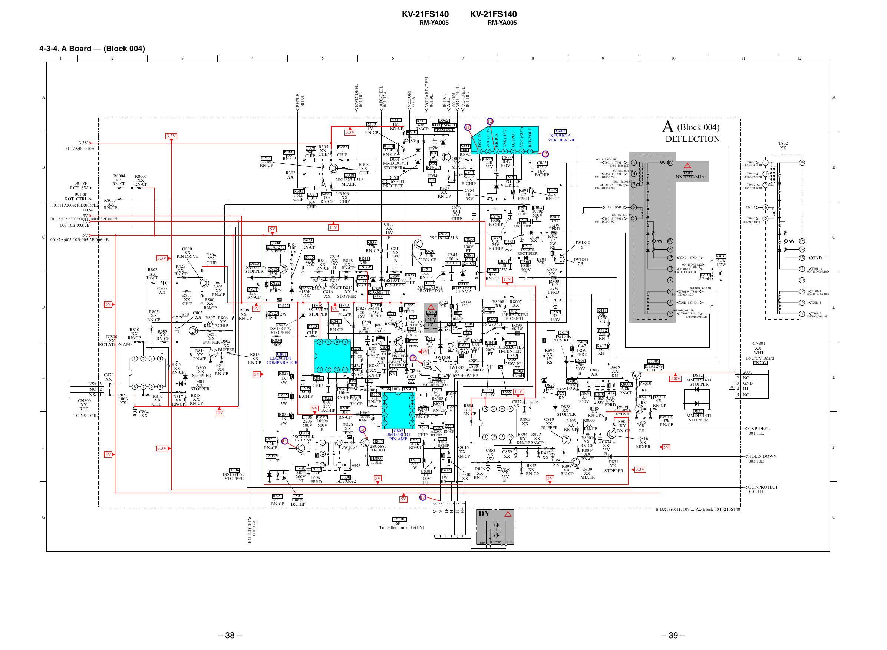

KV-21FS140

KV-21FS140

RM-YA005

RM-YA005

4-3-4. A Board — (Block 004)
6

R303
2.2M
RN-CP

B

R308
XX
CHIP

R302
XX

R8005
XX
RN-CP

Q008
2SC1623-L5L6
MIXER

R301
1.5M C077 R304
100k
CHIP 0.047 RN-CP
16V
CHIP

R8003
XX
RN-CP

D060
RD5.6SB-T1
PROTECT

R306
XX
CHIP

C877
0.01
25V
:CHIP

001:6A;002:2E;002:6D;003:10B;005:2E;006:7B

11V

C

11V

5V

5V
001:7A;003:10B;005:2E;006:4B

3.3V

R425
XX
RN-CP

R802
XX
RN-CP
C800
XX
5V

D

R805
XX
RN-CP
R810
XX
IC800
RN-CP
XX
ROTATION AMP
1

NS+ 3
NC 2
NS- 1
CN800
XX
RED

2

3

7

6

5

C804
XX

F

3.3V
5V

R803
XX
RN-CP
R800
XX
RN-CP

R817
XX
RN-CP

REF-VOLT

VCC (OUT)

OUTPUT

F.B-PLS

VSS (-13V)

C862
R893
10k
1000p
CHIP
500V
B
D823
PG104R
RECTIFIER

C876
1000p
B:CHIP

C813
XX
16V
B

Q814
2SC1623-L5L6 C850
R831
R838
0.1
Q804
C811 4.7k
27k
100V
KTA1279 100 RN-CP
C812
RN-CP
PT
STOPPER 16V
R420
XX
C845
R887
4.7k
C815
16V
R835
R844
1000p
22k
RN-CP
B
220k R841 XX R848
6.8k
B:CHIP RN-CP
D805
1/2W XX 16V XX
RN-CP
1SS133T-77 R826
RN-CP B RN-CP
R421
STOPPER
10k
330k
D809 R839 RN-CP
R853
1SS133T-77 0
R842
3.3k
R845
D830
R822
D818
RN-CP
XX
STOPPER CHIP
XX
MMDL914T1
1k
R833 RN-CP RN-CP D812
RD5.1ESB2
D829
R824
PROTECTOR
FPRD
CLAMP
XX
150k
C816
RD5.6SB-T1
33k
1/2W
REG
XX STOPPER
RN-CP
JW1839
R422
C830
R868
12.5
R852
D808
R827
XX
!
C828 0.01
10
1SS133T-77 9V 10k
1
R808 9V
FPRD
C840
100
R882
25V
R823 2W
STOPPER
XX
RN-CP 16V B:CHIP C831
2.2k
C833
13000P
0.1
180K
RN-CP
RN-CP
0.1
1.2KV
16V
R846
C826
16V C836
D816
C846
B:CHIP XX PP
R861 B:CHIP
D807
0.022
2.2k
R423
BY228GP
330P
2.2k
Q806
25V
1SS133T-77
2KV
0
RN-CP
DAMPER
B:CHIP RN-CP
2SC1623-L5L6
C847
STOPPER
CHIP
MIXER

C878
0.01 C861
25V 220
B:CHIP 25V
C857
220
R888 25V
47k
RN-CP 11V

C864
XX
D824
PG104R
RECTIFIER

C860
1000p
500V
B

R8008 R8007
XX
XX
L802
D821
22mH
10ERB20-TB3
H-CENT1
S800
157270711
R890

A (Block 004)

IC804
STV9302A
VERTICAL-IC

DEFLECTION

004:11B;004:9B
T801-1 T801-1
004:11B;004:9B

HV

GND_1 GND_1

!
T801
NX-4751//M3A4

6

004:11C;004:9C
T801-5 T801-5
5
004:11C;004:9C

C841
0.1
400V
PP

R865
R869
1k
1
RN-CP
FPRD
R857 C832
Q807
220p
XX
2SA1235-F
RN-CP CHIP PIN DRIVE
16
D815
C883
XX MM3Z9V1ST1
PROTECT
R858

R834
180K

1

T801-4
004:9B;004:9B

4

T801-2
004:9B;004:9B

2

GND_1

6

T801-5
004:9C;004:9C

5

C

FV
SV
GND_1 GND_1

C865
XX

11

004:10D;004:12D
T801-11
T801-11
004:10D;004:12D

R400
0.47
1/2W
FPRD

10

R411
68k
1/2W
RN

HV

B

SV

JW1841
7.5

C867
33
160V

T801-1
004:9B;004:9B

FV

JW1840
5

13

L804
XX

T802
XX

004:11B;004:9B
T801-2 T801-2
2
004:11B;004:9B

R401
0.47
1/2W
FPRD
R402
XX
2W
RS

1

004:11B;004:9B
T801-4 T801-4
4
004:11B;004:9B

R416
4.7k
1/2W

L805
2.2mH

13

GND_1

11

T801-11
004:10D;004:10D

10

9

004:10D;004:12D
T801-9 T801-9
004:10D;004:12D

9

T801-9
004:10D;004:10D

8

GND_1 GND_1

8

GND_1

004:10D;004:12D
T801-7 T801-7
7
004:10D;004:12D

7

T801-7
004:10D;004:10D

D

68 3W

R412
D827
22k
PG104R
RN
200V
RECT
8 7
6 5
R405
C849
D819
R883 0.01 0.022
R413
0.47
R855
2.2k 200V 200V 10ERB20-TB3
15k
R896
1/2W
H-CENTER
9V
FPRD PT
10k
RN
PT
IC801
FPRD
XX
R813
C852
RN-CP
JW1834
LM2903DT
1W
XX
0.33
C868
7.5
Q8009
RS
RN-CP COMPARATOR
250V PP
470p
R812
R424
KTA1279
R419
JW1842 L800
D800
S
500V C882
XX
1 2 3 4 150k
C829
145684812
BUFFER
XX
W026
XX
10
L803
XX
R829
B
XX
5V
XX
RN-CP RN-CP
4.7mH
STOPPER RN-CP
RN
C842 0.022 400V PP
C834
1K
Q808
R843
200V
C825
R851
R406
XX
IRF614-037
D801
0
3W
0.01
R8010
R8009
1k
S-CORRECTION
220k
XX
D826
CHIP
*
25V
C809
6.8k
XX R897 1/2W
STOPPER
C835
R847 RN-CP B:CHIP R866 100k RN-CP
RN
C851
1000p
R889 11V
0.01
10k
R879
XX
C869 C870 R414 RN-CP
R859
1 450V
R828
25V
R818
B:CHIP
*
R8013 R8011
33
*
RN
8
C822 RN-CP R854
B:CHIP
0.068 4.7k
33k 1
1K
XX
18k
*
47k
250V
W025
C872
RN-CP
200V 1/2W
0.01
RN RN-CP
R876
RN-CP
3W
RN-CP
FPRD Q8010
XX
R884
2
7
D828
10k R880
R856
9V 25V
R408
8
7
6
5
R873 RN-CP
2SC3209LK
XX
XX
B:CHIP
*
XX
10k
11V
R864
47k
SWITCH
RN-CP
STOPPER
3
6 RN-CP
R825
RN-CP
5.6K
R8012
RN-CP
C808 C810
1K
Q810
IC803
RN-CP
R8000
47k
R403
220p 1000p
R8002
C875
4
5
3W
XX
XX
R840
RN-CP
XX
XX
R877
500V 500V
XX
XX
R872
C839 220k
BUFFER RN-CP
XX
RN-CP
15
B
B
RN-CP
IC802
0
CH
2200p RN-CP
FPRD
Q803
R894 R899
TJM4558CDT
CHIP B:CHIP
2SC3209LK
1 2 3 4
R8001
C837
Q816
XX
XX
PIN AMP R870
R820
H-DRIVE
14
Q805
XX
C874
4700p
4
1
XX
RN-CP RN-CP
3.3k
2.2k
B:CHIP
XX
RN-CP
2SC5885
MIXER
RN-CP
JW1837
5V
R8015
RN-CP
25V
H-OUT
C853
R8014
5
XX
C859
R417
2
B
XX
XX
C805
RN-CP
XX
XX
FB800
RN-CP
25V
1
R871
C866
D831
1.1uH
220
XX R898
36
W027
R892
XX
1W
C806 R830
R886
C856
Q809
3.3V
R878
XX
XX
D804
STOPPER
C838
0.022
XX
2.2k
XX
XX
1
RN-CP
RN-CP
1SS133T-77
TH800
0.1
25V
200V
T800
MIXER
1W
1/2W
5V
5V
XX RN-CP
100V
STOPPER
B
PT
143793622
RS
FPRD
PT
Q801
XX
BUFFER Q802
XX
BUFFER
R814
XX
RN-CP

4

R816
XX
CHIP

L806
XX

R804
XX
CHIP

W019 C803
XX R807 R806
XX XX
RN-CP CHIP

R815
XX
RN-CP
8

TO NS COIL

R801
XX
CHIP

R809
XX
RN-CP

C879
XX

E

Q800
XX
PIN DRIVE

12
11

C079
XX

9V

003:10B;003:2B

A

R881
10k
1 2
3 4
5
6 7
13
RN-CP
C858
C855
Q009
R326
0.47
220
C863
XX
XX
100V
35V
0.047
MIXER
RN-CP
16V
C844
W009 0.047
B:CHIP
C084
D820
16V
XX
PG102R
B:CHIP
B
V-DRIVE
R327
R895
C854
R891
XX
3.3k
100
2.2
RN-CP
RN-CP
FPRD
35V

R313
150k
RN-CP
D061
MMDL914T1
STOPPER

12

11

10

001:9L
ABL
001:10L
VD+-DEFL
VD--DEFL
001:10L

VGUARD-DEFL
001:9L

VZOOM
001:9L

D062
R311
RD5.6SB-T1
47k
RN-CP PROTECT
R310
1k
RN-CP

D817
PG156R
DAMPER

001:8F
ROT_SW
001:8F
ROT_CTRL
001:11A;003:10D;005:4E
+B

R300
100
RN-CP

R307
0
CHIP
CHIP

C078 R305
68p XX
CHIP CHIP

R312
1M
RN-CP

9

8

DRV-IN

3.3V
001:7A;003:10A

R8004
XX
RN-CP

R309
1M
RN-CP

3.3V

3.3V

AFC-DEFL
001:12A

PH2LF
001:9L

A

7

VCC (+13V)

5

4

3

EWD-DEFL
001:10L

2

1

0.01
200V
PT C848

CN801
XX
WHT
To C/CV Board
CN703
D832
MMDL914T1
STOPPER

1
2
3
4
5

200V
NC
GND
H1
NC

E

D833
MMDL914T1
STOPPER
OVP-DEFL
001:11L
F
HOLD_DOWN
003:10D

OCP-PROTECT
001:11L
5V

17

V+
VHHH+
H+

C807
1000p
B:CHIP

1
2
3
4
5
6

R821
22k
RN-CP

HOUT-DEFL
001:12A

G

– 38 –

DY800
6P
To Deflection Yoke(DY)

DY

H.DY

H.DYV.DY

B-BX1S(05)13107-...-A..(Block 004)-21FS140
!

G

V.DY

– 39 –


