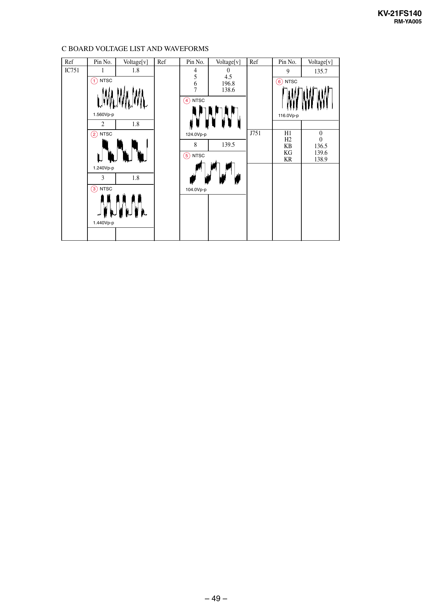

KV-21FS140
RM-YA005

C BOARD VOLTAGE LIST AND WAVEFORMS
Ref
IC751

Pin No.
1

Voltage[v]
1.8

1 NTSC

Ref

Pin No.
4
5
6
7

Voltage[v]
0
4.5
196.8
138.6

Ref

Pin No.
9

Voltage[v]
135.7

6 NTSC

4 NTSC
1.560Vp-p

2

116.0Vp-p

1.8

2 NTSC

J751

124.0Vp-p

8

139.5

5 NTSC
1.240Vp-p

3
3 NTSC

1.8
104.0Vp-p

1.440Vp-p

– 49 –

H1
H2
KB
KG
KR

0
0
136.5
139.6
138.9


