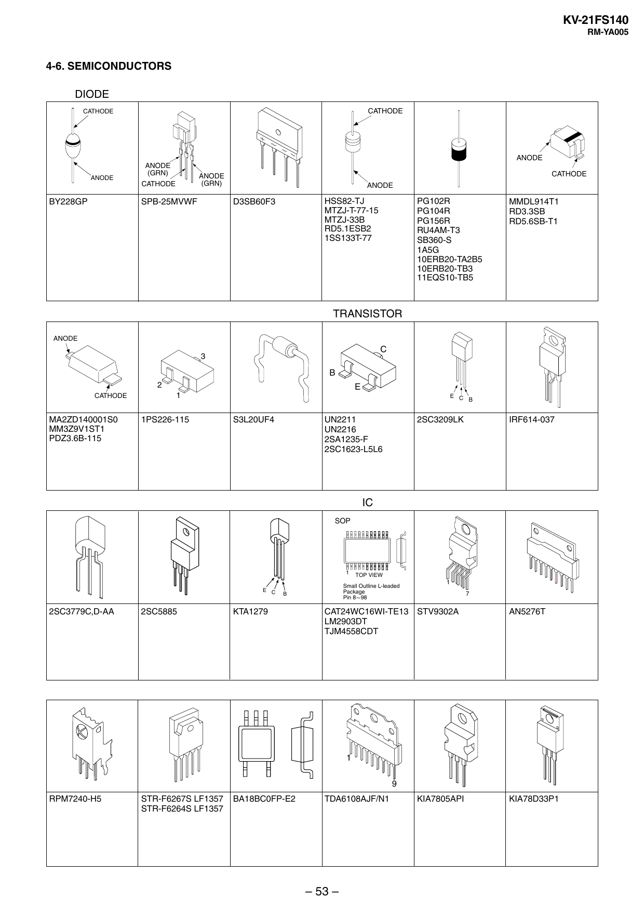

KV-21FS140
RM-YA005

4-6. SEMICONDUCTORS
DIODE
CATHODE

CATHODE

ANODE
ANODE

BY228GP

ANODE
(GRN)

CATHODE

ANODE
(GRN)

CATHODE

ANODE

HSS82-TJ
MTZJ-T-77-15
MTZJ-33B
RD5.1ESB2
1SS133T-77

D3SB60F3

SPB-25MVWF

PG102R
PG104R
PG156R
RU4AM-T3
SB360-S
1A5G
10ERB20-TA2B5
10ERB20-TB3
11EQS10-TB5

MMDL914T1
RD3.3SB
RD5.6SB-T1

TRANSISTOR
ANODE

C

3

B
2
CATHODE

MA2ZD140001S0
MM3Z9V1ST1
PDZ3.6B-115

E
1

1PS226-115

E C
B

S3L20UF4

UN2211
UN2216
2SA1235-F
2SC1623-L5L6

2SC3209LK

IRF614-037

IC
SOP

1
E C

2SC3779C,D-AA

2SC5885

B

KTA1279

TOP VIEW

Small Outline L-leaded
Package
Pin 8~98

1
7

CAT24WC16WI-TE13 STV9302A
LM2903DT
TJM4558CDT

AN5276T

1
9

RPM7240-H5

STR-F6267S LF1357
STR-F6264S LF1357

BA18BC0FP-E2

TDA6108AJF/N1

– 53 –

KIA7805API

KIA78D33P1


