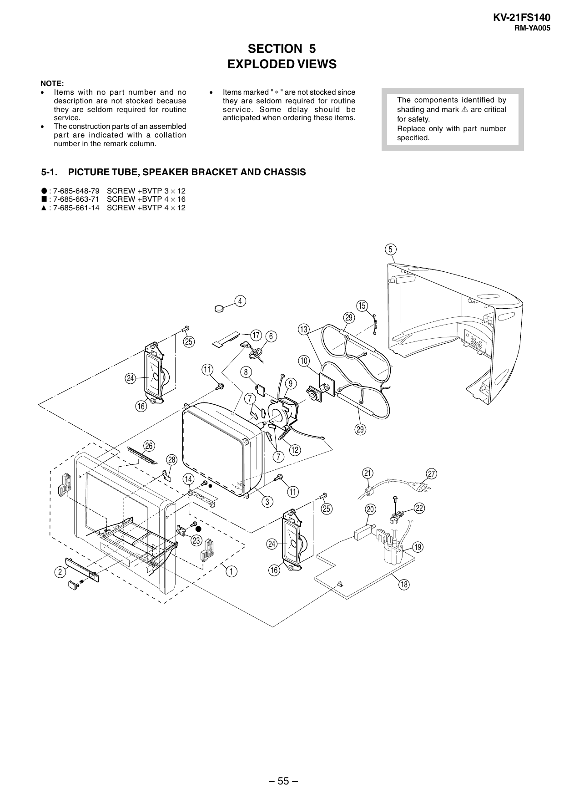

KV-21FS140
RM-YA005

SECTION 5
EXPLODED VIEWS
NOTE:
• Items with no part number and no
description are not stocked because
they are seldom required for routine
service.
• The construction parts of an assembled
par t are indicated with a collation
number in the remark column.

5-1.

•

Items marked " ∗ " are not stocked since
they are seldom required for routine
ser vice. Some delay should be
anticipated when ordering these items.

The components identified by
shading and mark ! are critical
for safety.
Replace only with part number
specified.

PICTURE TUBE, SPEAKER BRACKET AND CHASSIS

r : 7-685-648-79 SCREW +BVTP 3 × 12
p : 7-685-663-71 SCREW +BVTP 4 × 16
4 : 7-685-661-14 SCREW +BVTP 4 × 12

5

4

15
29
17

25

13

6

10
11

8

24

9
7

16

29

26
7

28

12
21

14

27

11
3

23

2

25

22

20

24

1

19

16
18

– 55 –


