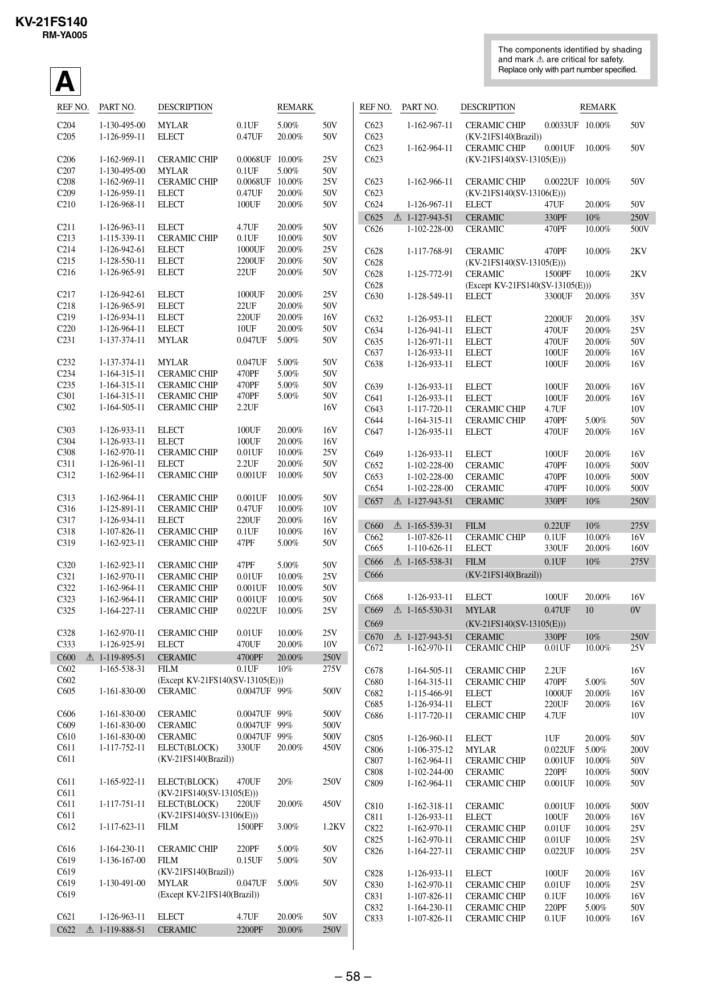

KV-21FS140
RM-YA005
The components identified by shading
and mark ! are critical for safety.
Replace only with part number specified.

A
REF NO.

PART NO.

DESCRIPTION

C204
C205

1-130-495-00
1-126-959-11

MYLAR
ELECT

0.1UF
0.47UF

5.00%
20.00%

50V
50V

C206
C207
C208
C209
C210

1-162-969-11
1-130-495-00
1-162-969-11
1-126-959-11
1-126-968-11

CERAMIC CHIP
MYLAR
CERAMIC CHIP
ELECT
ELECT

0.0068UF 10.00%
0.1UF
5.00%
0.0068UF 10.00%
0.47UF
20.00%
100UF
20.00%

25V
50V
25V
50V
50V

C211
C213
C214
C215
C216

1-126-963-11
1-115-339-11
1-126-942-61
1-128-550-11
1-126-965-91

ELECT
CERAMIC CHIP
ELECT
ELECT
ELECT

4.7UF
0.1UF
1000UF
2200UF
22UF

20.00%
10.00%
20.00%
20.00%
20.00%

50V
50V
25V
50V
50V

C217
C218
C219
C220
C231

1-126-942-61
1-126-965-91
1-126-934-11
1-126-964-11
1-137-374-11

ELECT
ELECT
ELECT
ELECT
MYLAR

1000UF
22UF
220UF
10UF
0.047UF

20.00%
20.00%
20.00%
20.00%
5.00%

25V
50V
16V
50V
50V

C232
C234
C235
C301
C302

1-137-374-11
1-164-315-11
1-164-315-11
1-164-315-11
1-164-505-11

MYLAR
CERAMIC CHIP
CERAMIC CHIP
CERAMIC CHIP
CERAMIC CHIP

0.047UF
470PF
470PF
470PF
2.2UF

5.00%
5.00%
5.00%
5.00%

50V
50V
50V
50V
16V

C303
C304
C308
C311
C312

1-126-933-11
1-126-933-11
1-162-970-11
1-126-961-11
1-162-964-11

ELECT
ELECT
CERAMIC CHIP
ELECT
CERAMIC CHIP

100UF
100UF
0.01UF
2.2UF
0.001UF

20.00%
20.00%
10.00%
20.00%
10.00%

16V
16V
25V
50V
50V

C313
C316
C317
C318
C319

1-162-964-11
1-125-891-11
1-126-934-11
1-107-826-11
1-162-923-11

CERAMIC CHIP
CERAMIC CHIP
ELECT
CERAMIC CHIP
CERAMIC CHIP

0.001UF
0.47UF
220UF
0.1UF
47PF

10.00%
10.00%
20.00%
10.00%
5.00%

50V
10V
16V
16V
50V

C320
C321
C322
C323
C325

1-162-923-11
1-162-970-11
1-162-964-11
1-162-964-11
1-164-227-11

CERAMIC CHIP
CERAMIC CHIP
CERAMIC CHIP
CERAMIC CHIP
CERAMIC CHIP

47PF
0.01UF
0.001UF
0.001UF
0.022UF

5.00%
10.00%
10.00%
10.00%
10.00%

50V
25V
50V
50V
25V

C328
C333
C600
C602
C602
C605

1-162-970-11
1-126-925-91
! 1-119-895-51
1-165-538-31

CERAMIC CHIP
0.01UF
10.00%
ELECT
470UF
20.00%
CERAMIC
4700PF 20.00%
FILM
0.1UF
10%
(Except KV-21FS140(SV-13105(E)))
CERAMIC
0.0047UF 99%

25V
10V
250V
275V

C606
C609
C610
C611
C611

1-161-830-00
1-161-830-00
1-161-830-00
1-117-752-11

CERAMIC
0.0047UF 99%
CERAMIC
0.0047UF 99%
CERAMIC
0.0047UF 99%
ELECT(BLOCK)
330UF
20.00%
(KV-21FS140(Brazil))

500V
500V
500V
450V

C611
C611
C611
C611
C612

1-165-922-11

ELECT(BLOCK)
470UF
(KV-21FS140(SV-13105(E)))
ELECT(BLOCK)
220UF
(KV-21FS140(SV-13106(E)))
FILM
1500PF

20%

250V

20.00%

450V

3.00%

1.2KV

CERAMIC CHIP
220PF
FILM
0.15UF
(KV-21FS140(Brazil))
MYLAR
0.047UF
(Except KV-21FS140(Brazil))

5.00%
5.00%

50V
50V

5.00%

50V

ELECT
CERAMIC

20.00%
20.00%

50V
250V

1-161-830-00

1-117-751-11
1-117-623-11

C616
C619
C619
C619
C619

1-164-230-11
1-136-167-00

C621
C622

1-126-963-11
! 1-119-888-51

1-130-491-00

REMARK

4.7UF
2200PF

500V

REF NO.

PART NO.

DESCRIPTION

C623
C623
C623
C623

1-162-967-11

CERAMIC CHIP
0.0033UF 10.00%
(KV-21FS140(Brazil))
CERAMIC CHIP
0.001UF 10.00%
(KV-21FS140(SV-13105(E)))

C623
C623
C624
C625
C626

1-162-964-11

1-162-966-11
1-126-967-11
! 1-127-943-51
1-102-228-00

C628
C628
C628
C628
C630

1-125-772-91

CERAMIC CHIP
0.0022UF 10.00%
(KV-21FS140(SV-13106(E)))
ELECT
47UF
20.00%
CERAMIC
330PF
10%
CERAMIC
470PF
10.00%

50V
50V

50V
50V
250V
500V

2KV

1-128-549-11

CERAMIC
470PF
10.00%
(KV-21FS140(SV-13105(E)))
CERAMIC
1500PF 10.00%
(Except KV-21FS140(SV-13105(E)))
ELECT
3300UF 20.00%

C632
C634
C635
C637
C638

1-126-953-11
1-126-941-11
1-126-971-11
1-126-933-11
1-126-933-11

ELECT
ELECT
ELECT
ELECT
ELECT

2200UF
470UF
470UF
100UF
100UF

20.00%
20.00%
20.00%
20.00%
20.00%

35V
25V
50V
16V
16V

C639
C641
C643
C644
C647

1-126-933-11
1-126-933-11
1-117-720-11
1-164-315-11
1-126-935-11

ELECT
ELECT
CERAMIC CHIP
CERAMIC CHIP
ELECT

100UF
100UF
4.7UF
470PF
470UF

20.00%
20.00%
5.00%
20.00%

16V
16V
10V
50V
16V

C649
C652
C653
C654
C657

1-126-933-11
1-102-228-00
1-102-228-00
1-102-228-00
! 1-127-943-51

ELECT
CERAMIC
CERAMIC
CERAMIC
CERAMIC

100UF
470PF
470PF
470PF
330PF

20.00%
10.00%
10.00%
10.00%
10%

16V
500V
500V
500V
250V

C660
C662
C665
C666
C666

! 1-165-539-31
1-107-826-11
1-110-626-11
! 1-165-538-31

FILM
0.22UF
CERAMIC CHIP
0.1UF
ELECT
330UF
FILM
0.1UF
(KV-21FS140(Brazil))

10%
10.00%
20.00%
10%

275V
16V
160V
275V

C668
C669
C669
C670
C672

1-126-933-11
! 1-165-530-31

ELECT
100UF
MYLAR
0.47UF
(KV-21FS140(SV-13105(E)))
CERAMIC
330PF
CERAMIC CHIP
0.01UF

20.00%
10

16V
0V

10%
10.00%

250V
25V

C678
C680
C682
C685
C686

1-164-505-11
1-164-315-11
1-115-466-91
1-126-934-11
1-117-720-11

CERAMIC CHIP
CERAMIC CHIP
ELECT
ELECT
CERAMIC CHIP

2.2UF
470PF
1000UF
220UF
4.7UF

5.00%
20.00%
20.00%

16V
50V
16V
16V
10V

C805
C806
C807
C808
C809

1-126-960-11
1-106-375-12
1-162-964-11
1-102-244-00
1-162-964-11

ELECT
MYLAR
CERAMIC CHIP
CERAMIC
CERAMIC CHIP

1UF
0.022UF
0.001UF
220PF
0.001UF

20.00%
5.00%
10.00%
10.00%
10.00%

50V
200V
50V
500V
50V

C810
C811
C822
C825
C826

1-162-318-11
1-126-933-11
1-162-970-11
1-162-970-11
1-164-227-11

CERAMIC
ELECT
CERAMIC CHIP
CERAMIC CHIP
CERAMIC CHIP

0.001UF
100UF
0.01UF
0.01UF
0.022UF

10.00%
20.00%
10.00%
10.00%
10.00%

500V
16V
25V
25V
25V

C828
C830
C831
C832
C833

1-126-933-11
1-162-970-11
1-107-826-11
1-164-230-11
1-107-826-11

ELECT
CERAMIC CHIP
CERAMIC CHIP
CERAMIC CHIP
CERAMIC CHIP

100UF
0.01UF
0.1UF
220PF
0.1UF

20.00%
10.00%
10.00%
5.00%
10.00%

16V
25V
16V
50V
16V

– 58 –

1-117-768-91

REMARK

! 1-127-943-51
1-162-970-11

2KV

35V


