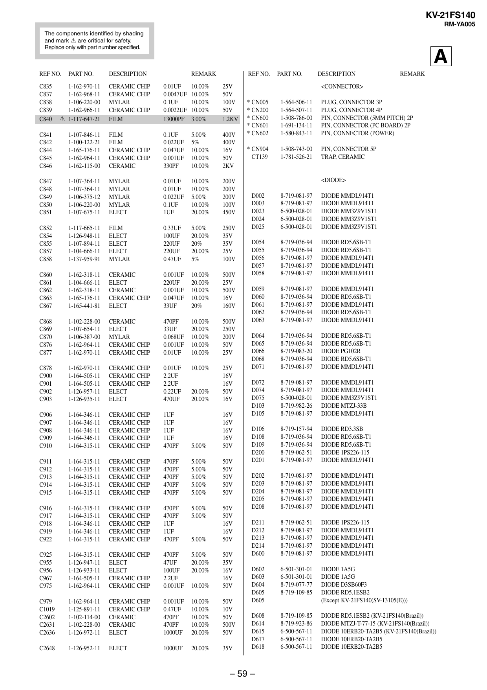

KV-21FS140
RM-YA005
The components identified by shading
and mark ! are critical for safety.
Replace only with part number specified.

REF NO.

A

PART NO.

DESCRIPTION

REMARK

C835
C837
C838
C839
C840

1-162-970-11
1-162-968-11
1-106-220-00
1-162-966-11
! 1-117-647-21

CERAMIC CHIP
CERAMIC CHIP
MYLAR
CERAMIC CHIP
FILM

0.01UF
10.00%
0.0047UF 10.00%
0.1UF
10.00%
0.0022UF 10.00%
13000PF 3.00%

25V
50V
100V
50V
1.2KV

C841
C842
C844
C845
C846

1-107-846-11
1-100-122-21
1-165-176-11
1-162-964-11
1-162-115-00

FILM
FILM
CERAMIC CHIP
CERAMIC CHIP
CERAMIC

0.1UF
0.022UF
0.047UF
0.001UF
330PF

5.00%
5%
10.00%
10.00%
10.00%

400V
400V
16V
50V
2KV

C847
C848
C849
C850
C851

1-107-364-11
1-107-364-11
1-106-375-12
1-106-220-00
1-107-675-11

MYLAR
MYLAR
MYLAR
MYLAR
ELECT

0.01UF
0.01UF
0.022UF
0.1UF
1UF

10.00%
10.00%
5.00%
10.00%
20.00%

200V
200V
200V
100V
450V

C852
C854
C855
C857
C858

1-117-665-11
1-126-948-11
1-107-894-11
1-104-666-11
1-137-959-91

FILM
ELECT
ELECT
ELECT
MYLAR

0.33UF
100UF
220UF
220UF
0.47UF

5.00%
20.00%
20%
20.00%
5%

250V
35V
35V
25V
100V

C860
C861
C862
C863
C867

1-162-318-11
1-104-666-11
1-162-318-11
1-165-176-11
1-165-441-81

CERAMIC
ELECT
CERAMIC
CERAMIC CHIP
ELECT

0.001UF
220UF
0.001UF
0.047UF
33UF

10.00%
20.00%
10.00%
10.00%
20%

500V
25V
500V
16V
160V

C868
C869
C870
C876
C877

1-102-228-00
1-107-654-11
1-106-387-00
1-162-964-11
1-162-970-11

CERAMIC
ELECT
MYLAR
CERAMIC CHIP
CERAMIC CHIP

470PF
33UF
0.068UF
0.001UF
0.01UF

10.00%
20.00%
10.00%
10.00%
10.00%

500V
250V
200V
50V
25V

C878
C900
C901
C902
C903

1-162-970-11
1-164-505-11
1-164-505-11
1-126-957-11
1-126-935-11

CERAMIC CHIP
CERAMIC CHIP
CERAMIC CHIP
ELECT
ELECT

0.01UF
2.2UF
2.2UF
0.22UF
470UF

10.00%

20.00%
20.00%

25V
16V
16V
50V
16V

C906
C907
C908
C909
C910

1-164-346-11
1-164-346-11
1-164-346-11
1-164-346-11
1-164-315-11

CERAMIC CHIP
CERAMIC CHIP
CERAMIC CHIP
CERAMIC CHIP
CERAMIC CHIP

1UF
1UF
1UF
1UF
470PF

5.00%

16V
16V
16V
16V
50V

C911
C912
C913
C914
C915

1-164-315-11
1-164-315-11
1-164-315-11
1-164-315-11
1-164-315-11

CERAMIC CHIP
CERAMIC CHIP
CERAMIC CHIP
CERAMIC CHIP
CERAMIC CHIP

470PF
470PF
470PF
470PF
470PF

5.00%
5.00%
5.00%
5.00%
5.00%

50V
50V
50V
50V
50V

C916
C917
C918
C919
C922

1-164-315-11
1-164-315-11
1-164-346-11
1-164-346-11
1-164-315-11

CERAMIC CHIP
CERAMIC CHIP
CERAMIC CHIP
CERAMIC CHIP
CERAMIC CHIP

470PF
470PF
1UF
1UF
470PF

5.00%
5.00%

50V
50V
16V
16V
50V

C925
C955
C956
C967
C975

1-164-315-11
1-126-947-11
1-126-933-11
1-164-505-11
1-162-964-11

CERAMIC CHIP
ELECT
ELECT
CERAMIC CHIP
CERAMIC CHIP

470PF
47UF
100UF
2.2UF
0.001UF

5.00%
20.00%
20.00%
10.00%

50V
35V
16V
16V
50V

C979
C1019
C2602
C2631
C2636

1-162-964-11
1-125-891-11
1-102-114-00
1-102-228-00
1-126-972-11

CERAMIC CHIP
CERAMIC CHIP
CERAMIC
CERAMIC
ELECT

0.001UF
0.47UF
470PF
470PF
1000UF

10.00%
10.00%
10.00%
10.00%
20.00%

50V
10V
50V
500V
50V

C2648

1-126-952-11

ELECT

1000UF

20.00%

35V

5.00%

REF NO.

PART NO.

DESCRIPTION

REMARK

<CONNECTOR>
* CN005
* CN200
* CN600
* CN601
* CN602

1-564-506-11
1-564-507-11
1-508-786-00
1-691-134-11
1-580-843-11

PLUG, CONNECTOR 3P
PLUG, CONNECTOR 4P
PIN, CONNECTOR (5MM PITCH) 2P
PIN, CONNECTOR (PC BOARD) 2P
PIN, CONNECTOR (POWER)

* CN904
CT139

1-508-743-00
1-781-526-21

PIN, CONNECTOR 5P
TRAP, CERAMIC

<DIODE>
D002
D003
D023
D024
D025

8-719-081-97
8-719-081-97
6-500-028-01
6-500-028-01
6-500-028-01

DIODE MMDL914T1
DIODE MMDL914T1
DIODE MM3Z9V1ST1
DIODE MM3Z9V1ST1
DIODE MM3Z9V1ST1

D054
D055
D056
D057
D058

8-719-036-94
8-719-036-94
8-719-081-97
8-719-081-97
8-719-081-97

DIODE RD5.6SB-T1
DIODE RD5.6SB-T1
DIODE MMDL914T1
DIODE MMDL914T1
DIODE MMDL914T1

D059
D060
D061
D062
D063

8-719-081-97
8-719-036-94
8-719-081-97
8-719-036-94
8-719-081-97

DIODE MMDL914T1
DIODE RD5.6SB-T1
DIODE MMDL914T1
DIODE RD5.6SB-T1
DIODE MMDL914T1

D064
D065
D066
D068
D071

8-719-036-94
8-719-036-94
8-719-083-20
8-719-036-94
8-719-081-97

DIODE RD5.6SB-T1
DIODE RD5.6SB-T1
DIODE PG102R
DIODE RD5.6SB-T1
DIODE MMDL914T1

D072
D074
D075
D103
D105

8-719-081-97
8-719-081-97
6-500-028-01
8-719-982-26
8-719-081-97

DIODE MMDL914T1
DIODE MMDL914T1
DIODE MM3Z9V1ST1
DIODE MTZJ-33B
DIODE MMDL914T1

D106
D108
D109
D200
D201

8-719-157-94
8-719-036-94
8-719-036-94
8-719-062-51
8-719-081-97

DIODE RD3.3SB
DIODE RD5.6SB-T1
DIODE RD5.6SB-T1
DIODE 1PS226-115
DIODE MMDL914T1

D202
D203
D204
D205
D208

8-719-081-97
8-719-081-97
8-719-081-97
8-719-081-97
8-719-081-97

DIODE MMDL914T1
DIODE MMDL914T1
DIODE MMDL914T1
DIODE MMDL914T1
DIODE MMDL914T1

D211
D212
D213
D214
D600

8-719-062-51
8-719-081-97
8-719-081-97
8-719-081-97
8-719-081-97

DIODE 1PS226-115
DIODE MMDL914T1
DIODE MMDL914T1
DIODE MMDL914T1
DIODE MMDL914T1

D602
D603
D604
D605
D605

6-501-301-01
6-501-301-01
8-719-077-77
8-719-109-85

DIODE 1A5G
DIODE 1A5G
DIODE D3SB60F3
DIODE RD5.1ESB2
(Except KV-21FS140(SV-13105(E)))

D608
D614
D615
D617
D618

8-719-109-85
8-719-923-86
6-500-567-11
6-500-567-11
6-500-567-11

DIODE RD5.1ESB2 (KV-21FS140(Brazil))
DIODE MTZJ-T-77-15 (KV-21FS140(Brazil))
DIODE 10ERB20-TA2B5 (KV-21FS140(Brazil))
DIODE 10ERB20-TA2B5
DIODE 10ERB20-TA2B5

– 59 –


