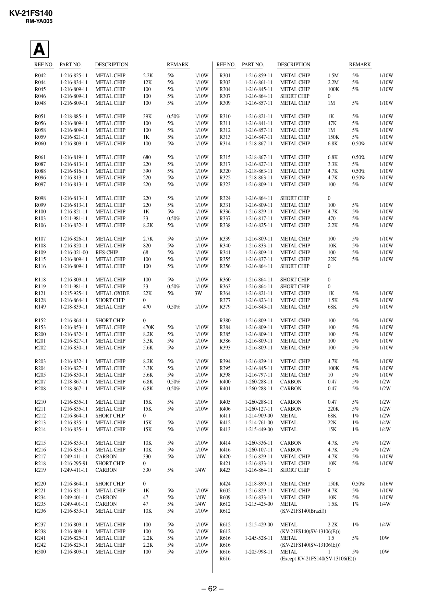

KV-21FS140
RM-YA005
The components identified by shading
and mark ! are critical for safety.
Replace only with part number specified.

A
REF NO.

PART NO.

DESCRIPTION

REMARK

REF NO.

PART NO.

DESCRIPTION

R042
R044
R045
R046
R048

1-216-825-11
1-216-834-11
1-216-809-11
1-216-809-11
1-216-809-11

METAL CHIP
METAL CHIP
METAL CHIP
METAL CHIP
METAL CHIP

2.2K
12K
100
100
100

5%
5%
5%
5%
5%

R051
R056
R058
R059
R060

1-218-885-11
1-216-809-11
1-216-809-11
1-216-821-11
1-216-809-11

METAL CHIP
METAL CHIP
METAL CHIP
METAL CHIP
METAL CHIP

39K
100
100
1K
100

R061
R087
R088
R096
R097

1-216-819-11
1-216-813-11
1-216-816-11
1-216-813-11
1-216-813-11

METAL CHIP
METAL CHIP
METAL CHIP
METAL CHIP
METAL CHIP

R098
R099
R100
R103
R106

1-216-813-11
1-216-813-11
1-216-821-11
1-211-981-11
1-216-832-11

R107
R108
R109
R115
R116

1/10W
1/10W
1/10W
1/10W
1/10W

R301
R303
R304
R307
R309

1-216-859-11
1-216-861-11
1-216-845-11
1-216-864-11
1-216-857-11

METAL CHIP
METAL CHIP
METAL CHIP
SHORT CHIP
METAL CHIP

1.5M
2.2M
100K
0
1M

5%
5%
5%

1/10W
1/10W
1/10W

5%

1/10W

0.50%
5%
5%
5%
5%

1/10W
1/10W
1/10W
1/10W
1/10W

R310
R311
R312
R313
R314

1-216-821-11
1-216-841-11
1-216-857-11
1-216-847-11
1-218-867-11

METAL CHIP
METAL CHIP
METAL CHIP
METAL CHIP
METAL CHIP

1K
47K
1M
150K
6.8K

5%
5%
5%
5%
0.50%

1/10W
1/10W
1/10W
1/10W
1/10W

680
220
390
220
220

5%
5%
5%
5%
5%

1/10W
1/10W
1/10W
1/10W
1/10W

R315
R317
R320
R322
R323

1-218-867-11
1-216-827-11
1-218-863-11
1-218-863-11
1-216-809-11

METAL CHIP
METAL CHIP
METAL CHIP
METAL CHIP
METAL CHIP

6.8K
3.3K
4.7K
4.7K
100

0.50%
5%
0.50%
0.50%
5%

1/10W
1/10W
1/10W
1/10W
1/10W

METAL CHIP
METAL CHIP
METAL CHIP
METAL CHIP
METAL CHIP

220
220
1K
33
8.2K

5%
5%
5%
0.50%
5%

1/10W
1/10W
1/10W
1/10W
1/10W

R324
R331
R336
R337
R338

1-216-864-11
1-216-809-11
1-216-829-11
1-216-817-11
1-216-825-11

SHORT CHIP
METAL CHIP
METAL CHIP
METAL CHIP
METAL CHIP

0
100
4.7K
470
2.2K

5%
5%
5%
5%

1/10W
1/10W
1/10W
1/10W

1-216-826-11
1-216-820-11
1-216-021-00
1-216-809-11
1-216-809-11

METAL CHIP
METAL CHIP
RES-CHIP
METAL CHIP
METAL CHIP

2.7K
820
68
100
100

5%
5%
5%
5%
5%

1/10W
1/10W
1/10W
1/10W
1/10W

R339
R340
R341
R355
R356

1-216-809-11
1-216-833-11
1-216-809-11
1-216-837-11
1-216-864-11

METAL CHIP
METAL CHIP
METAL CHIP
METAL CHIP
SHORT CHIP

100
10K
100
22K
0

5%
5%
5%
5%

1/10W
1/10W
1/10W
1/10W

R118
R119
R121
R128
R149

1-216-809-11
1-211-981-11
1-215-925-11
1-216-864-11
1-218-839-11

METAL CHIP
METAL CHIP
METAL OXIDE
SHORT CHIP
METAL CHIP

100
33
22K
0
470

5%
0.50%
5%

1/10W
1/10W
3W

0.50%

1/10W

R360
R363
R364
R377
R379

1-216-864-11
1-216-864-11
1-216-821-11
1-216-823-11
1-216-843-11

SHORT CHIP
SHORT CHIP
METAL CHIP
METAL CHIP
METAL CHIP

0
0
1K
1.5K
68K

5%
5%
5%

1/10W
1/10W
1/10W

R152
R153
R200
R201
R202

1-216-864-11
1-216-853-11
1-216-832-11
1-216-827-11
1-216-830-11

SHORT CHIP
METAL CHIP
METAL CHIP
METAL CHIP
METAL CHIP

0
470K
8.2K
3.3K
5.6K

5%
5%
5%
5%

1/10W
1/10W
1/10W
1/10W

R380
R384
R385
R386
R393

1-216-809-11
1-216-809-11
1-216-809-11
1-216-809-11
1-216-809-11

METAL CHIP
METAL CHIP
METAL CHIP
METAL CHIP
METAL CHIP

100
100
100
100
100

5%
5%
5%
5%
5%

1/10W
1/10W
1/10W
1/10W
1/10W

R203
R204
R205
R207
R208

1-216-832-11
1-216-827-11
1-216-830-11
1-218-867-11
1-218-867-11

METAL CHIP
METAL CHIP
METAL CHIP
METAL CHIP
METAL CHIP

8.2K
3.3K
5.6K
6.8K
6.8K

5%
5%
5%
0.50%
0.50%

1/10W
1/10W
1/10W
1/10W
1/10W

R394
R395
R398
R400
R401

1-216-829-11
1-216-845-11
1-216-797-11
1-260-288-11
1-260-288-11

METAL CHIP
METAL CHIP
METAL CHIP
CARBON
CARBON

4.7K
100K
10
0.47
0.47

5%
5%
5%
5%
5%

1/10W
1/10W
1/10W
1/2W
1/2W

R210
R211
R212
R213
R214

1-216-835-11
1-216-835-11
1-216-864-11
1-216-835-11
1-216-835-11

METAL CHIP
METAL CHIP
SHORT CHIP
METAL CHIP
METAL CHIP

15K
15K
0
15K
15K

5%
5%

1/10W
1/10W

5%
5%

1/10W
1/10W

R405
R406
R411
R412
R413

1-260-288-11
1-260-127-11
1-214-909-00
1-214-761-00
1-215-449-00

CARBON
CARBON
METAL
METAL
METAL

0.47
220K
68K
22K
15K

5%
5%
1%
1%
1%

1/2W
1/2W
1/2W
1/4W
1/4W

R215
R216
R217
R218
R219

1-216-833-11
1-216-833-11
1-249-411-11
1-216-295-91
1-249-411-11

METAL CHIP
METAL CHIP
CARBON
SHORT CHIP
CARBON

10K
10K
330
0
330

5%
5%
5%

1/10W
1/10W
1/4W

CARBON
CARBON
METAL CHIP
METAL CHIP
SHORT CHIP

4.7K
4.7K
4.7K
10K
0

1/2W
1/2W
1/10W
1/10W

1/4W

1-260-336-11
1-260-107-11
1-216-829-11
1-216-833-11
1-216-864-11

5%
5%
5%
5%

5%

R414
R416
R420
R421
R423

R220
R221
R234
R235
R236

1-216-864-11
1-216-821-11
1-249-401-11
1-249-401-11
1-216-833-11

SHORT CHIP
METAL CHIP
CARBON
CARBON
METAL CHIP

0
1K
47
47
10K

5%
5%
5%
5%

1/10W
1/4W
1/4W
1/10W

R424
R602
R609
R612
R612

1-218-899-11
1-216-829-11
1-216-833-11
1-215-425-00

METAL CHIP
150K
METAL CHIP
4.7K
METAL CHIP
10K
METAL
1.5K
(KV-21FS140(Brazil))

0.50%
5%
5%
1%

1/16W
1/10W
1/10W
1/4W

R237
R238
R241
R242
R300

1-216-809-11
1-216-809-11
1-216-825-11
1-216-825-11
1-216-809-11

METAL CHIP
METAL CHIP
METAL CHIP
METAL CHIP
METAL CHIP

100
100
2.2K
2.2K
100

5%
5%
5%
5%
5%

1/10W
1/10W
1/10W
1/10W
1/10W

R612
R612
R616
R616
R616
R616

1-215-429-00

METAL
2.2K
1%
(KV-21FS140(SV-13106(E)))
METAL
1.5
5%
(KV-21FS140(SV-13106(E)))
METAL
1
5%
(Except KV-21FS140(SV-13106(E)))

– 62 –

1-245-528-11
1-205-998-11

REMARK

1/4W
10W
10W


