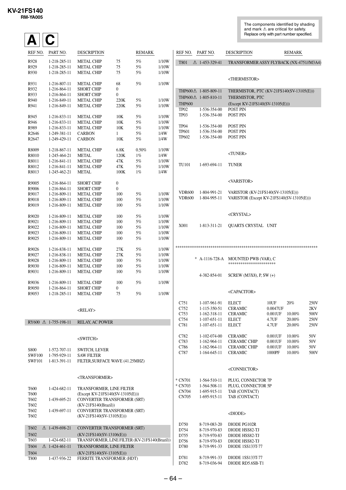

KV-21FS140
RM-YA005
The components identified by shading
and mark ! are critical for safety.
Replace only with part number specified.

A C
REF NO.

PART NO.

DESCRIPTION

REMARK

R928
R929
R930

1-218-285-11
1-218-285-11
1-218-285-11

METAL CHIP
METAL CHIP
METAL CHIP

75
75
75

5%
5%
5%

1/10W
1/10W
1/10W

R931
R932
R933
R940
R941

1-216-807-11
1-216-864-11
1-216-864-11
1-216-849-11
1-216-849-11

METAL CHIP
SHORT CHIP
SHORT CHIP
METAL CHIP
METAL CHIP

68
0
0
220K
220K

5%

1/10W

5%
5%

1/10W
1/10W

R945
R946
R989
R2646
R2647

1-216-833-11
1-216-833-11
1-216-833-11
1-249-381-11
1-249-429-11

METAL CHIP
METAL CHIP
METAL CHIP
CARBON
CARBON

10K
10K
10K
1
10K

5%
5%
5%
5%
5%

1/10W
1/10W
1/10W
1/4W
1/4W

R8009
R8010
R8011
R8012
R8013

1-218-867-11
1-245-464-21
1-216-841-11
1-216-841-11
1-245-462-21

METAL CHIP
METAL
METAL CHIP
METAL CHIP
METAL

6.8K
120K
47K
47K
100K

0.50%
1%
5%
5%
1%

1/10W
1/4W
1/10W
1/10W
1/4W

R9005
R9006
R9017
R9018
R9019

1-216-864-11
1-216-864-11
1-216-809-11
1-216-809-11
1-216-809-11

SHORT CHIP
SHORT CHIP
METAL CHIP
METAL CHIP
METAL CHIP

0
0
100
100
100

5%
5%
5%

1/10W
1/10W
1/10W

R9020
R9021
R9022
R9023
R9025

1-216-809-11
1-216-809-11
1-216-809-11
1-216-809-11
1-216-809-11

METAL CHIP
METAL CHIP
METAL CHIP
METAL CHIP
METAL CHIP

100
100
100
100
100

5%
5%
5%
5%
5%

1/10W
1/10W
1/10W
1/10W
1/10W

R9026
R9027
R9028
R9030
R9031

1-216-838-11
1-216-838-11
1-216-809-11
1-216-809-11
1-216-809-11

METAL CHIP
METAL CHIP
METAL CHIP
METAL CHIP
METAL CHIP

27K
27K
100
100
100

5%
5%
5%
5%
5%

1/10W
1/10W
1/10W
1/10W
1/10W

R9036
R9050
R9053

1-216-809-11
1-216-864-11
1-218-285-11

METAL CHIP
SHORT CHIP
METAL CHIP

100
0
75

5%

1/10W

5%

1/10W

REF NO.

PART NO.

T801

! 1-453-329-41

DESCRIPTION

REMARK

TRANSFORMER ASSY FLYBACK (NX-4751//M3A4)

<THERMISTOR>

RELAY, AC POWER

<SWITCH>
S800
SWF100
SWF101

1-572-707-11
1-795-929-11
1-813-391-11

THERMISTOR, PTC (KV-21FS140(SV-13105(E)))
THERMISTOR, PTC
(Except KV-21FS140(SV-13105(E)))
POST PIN
POST PIN

TP04
TP601
TP602

POST PIN
POST PIN
POST PIN

1-536-354-00
1-536-354-00
1-536-354-00

<TUNER>
TU101

1-693-694-11

TUNER

<VARISTOR>

<RELAY>
RY600 ! 1-755-198-11

THP600! 1-805-809-11
THP600! 1-805-810-11
THP600
TP02
1-536-354-00
TP03
1-536-354-00

SWITCH, LEVER
SAW FILTER
FILTER,SURFACE WAVE (41.25MHZ)

VDR600
VDR600

1-804-991-21
1-804-995-11

VARISTOR (KV-21FS140(SV-13105(E)))
VARISTOR (Except KV-21FS140(SV-13105(E)))

<CRYSTAL>
X001

1-813-311-21

QUARTS CRYSTAL UNIT

*********************************************************************
* A-1116-728-A MOUNTED PWB (VAR), C
***********************
4-382-854-01

SCREW (M3X8), P, SW (+)

<CAPACITOR>
C751
C752
C753
C754
C781

1-107-961-91
1-115-350-51
1-162-318-11
1-107-651-11
1-107-651-11

ELECT
CERAMIC
CERAMIC
ELECT
ELECT

10UF
20%
0.0047UF
0.001UF 10.00%
4.7UF
20.00%
4.7UF
20.00%

250V
2KV
500V
250V
250V

C782
C783
C786
C787

1-102-074-00
1-162-964-11
1-162-964-11
1-164-645-11

CERAMIC
CERAMIC CHIP
CERAMIC CHIP
CERAMIC

0.001UF
0.001UF
0.001UF
1000PF

50V
50V
50V
500V

<CONNECTOR>
<TRANSFORMER>
T600
T600
T602
T602
T602
T602
T602
T602
T603
T604
T604
T800

1-424-682-11
1-439-695-21
1-439-697-11

! 1-439-698-21
1-424-682-11
! 1-424-461-11
1-437-936-22

* CN701
* CN703
CN704
CN705

TRANSFORMER, LINE FILTER
(Except KV-21FS140(SV-13105(E)))
CONVERTER TRANSFORMER (SRT)
(KV-21FS140(Brazil))
CONVERTER TRANSFORMER (SRT)
(KV-21FS140(SV-13105(E)))

1-564-510-11
1-564-508-11
1-695-915-11
1-695-915-11

PLUG, CONNECTOR 7P
PLUG, CONNECTOR 5P
TAB (CONTACT)
TAB (CONTACT)

<DIODE>

CONVERTER TRANSFORMER (SRT)
(KV-21FS140(SV-13106(E)))
TRANSFORMER, LINE FILTER (KV-21FS140(Brazil))
TRANSFORMER, LINE FILTER
(KV-21FS140(SV-13105(E)))
FERRITE TRANSFORMER (HDT)

D750
D754
D755
D756
D780

8-719-083-20
8-719-970-83
8-719-970-83
8-719-970-83
8-719-991-33

DIODE PG102R
DIODE HSS82-TJ
DIODE HSS82-TJ
DIODE HSS82-TJ
DIODE 1SS133T-77

D781
D782

8-719-991-33
8-719-036-94

DIODE 1SS133T-77
DIODE RD5.6SB-T1

– 64 –

10.00%
10.00%
10.00%
10.00%


