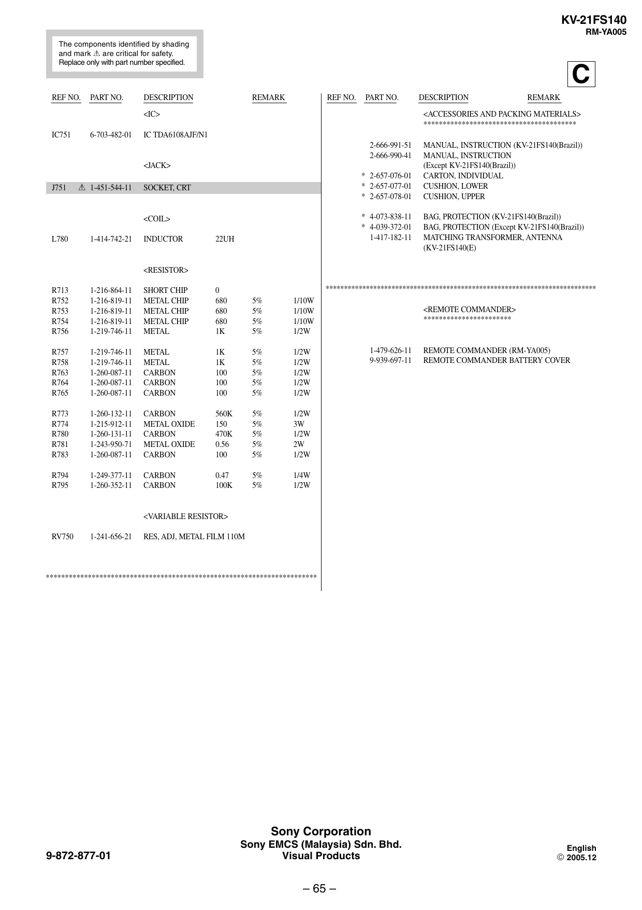

KV-21FS140
RM-YA005
The components identified by shading
and mark ! are critical for safety.
Replace only with part number specified.

REF NO.

PART NO.

C

DESCRIPTION

REMARK

REF NO.

PART NO.

6-703-482-01

IC TDA6108AJF/N1
2-666-991-51
2-666-990-41
<JACK>

J751

! 1-451-544-11

* 2-657-076-01
* 2-657-077-01
* 2-657-078-01

SOCKET, CRT

* 4-073-838-11
* 4-039-372-01
1-417-182-11

<COIL>
L780

1-414-742-21

REMARK

<ACCESSORIES AND PACKING MATERIALS>
****************************************

<IC>
IC751

DESCRIPTION

INDUCTOR

22UH

MANUAL, INSTRUCTION (KV-21FS140(Brazil))
MANUAL, INSTRUCTION
(Except KV-21FS140(Brazil))
CARTON, INDIVIDUAL
CUSHION, LOWER
CUSHION, UPPER
BAG, PROTECTION (KV-21FS140(Brazil))
BAG, PROTECTION (Except KV-21FS140(Brazil))
MATCHING TRANSFORMER, ANTENNA
(KV-21FS140(E)

<RESISTOR>
**************************************************************************

R713
R752
R753
R754
R756

1-216-864-11
1-216-819-11
1-216-819-11
1-216-819-11
1-219-746-11

SHORT CHIP
METAL CHIP
METAL CHIP
METAL CHIP
METAL

0
680
680
680
1K

5%
5%
5%
5%

1/10W
1/10W
1/10W
1/2W

R757
R758
R763
R764
R765

1-219-746-11
1-219-746-11
1-260-087-11
1-260-087-11
1-260-087-11

METAL
METAL
CARBON
CARBON
CARBON

1K
1K
100
100
100

5%
5%
5%
5%
5%

1/2W
1/2W
1/2W
1/2W
1/2W

R773
R774
R780
R781
R783

1-260-132-11
1-215-912-11
1-260-131-11
1-243-950-71
1-260-087-11

CARBON
METAL OXIDE
CARBON
METAL OXIDE
CARBON

560K
150
470K
0.56
100

5%
5%
5%
5%
5%

1/2W
3W
1/2W
2W
1/2W

R794
R795

1-249-377-11
1-260-352-11

CARBON
CARBON

0.47
100K

5%
5%

1/4W
1/2W

<REMOTE COMMANDER>
***********************

1-479-626-11
9-939-697-11

REMOTE COMMANDER (RM-YA005)
REMOTE COMMANDER BATTERY COVER

<VARIABLE RESISTOR>
RV750

1-241-656-21

RES, ADJ, METAL FILM 110M

***********************************************************************

Sony Corporation
9-872-877-01

Sony EMCS (Malaysia) Sdn. Bhd.
Visual Products

– 65 –

English

 2005.12


