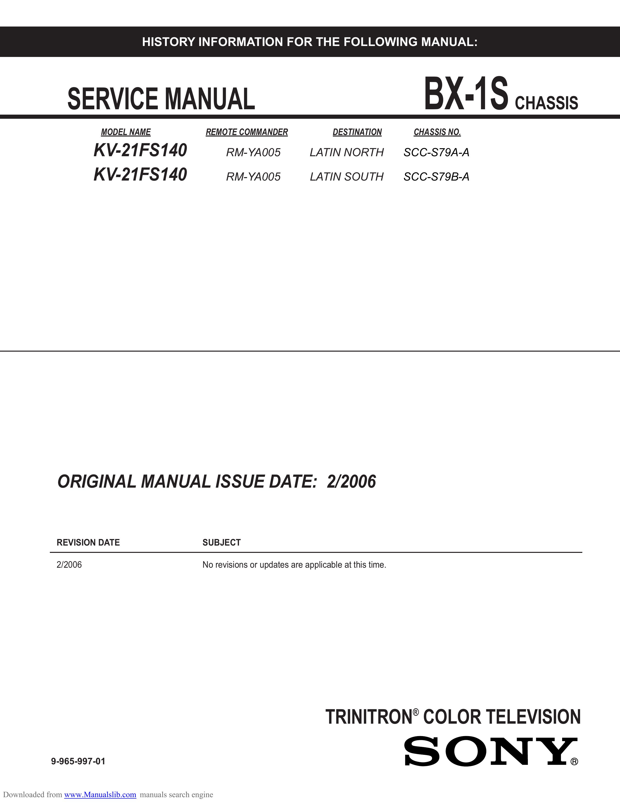

                                     HISTORY INFORMATION FOR THE FOLLOWING MANUAL:

                 SERVICE MANUAL                                                                                BX-1S       CHASSIS
                          MODEL NAME                  REMOTE COMMANDER                   DESTINATION         CHASSIS NO.

                        KV-21FS140                         RM-YA005                LATIN NORTH              SCC-S79A-A

                        KV-21FS140                         RM-YA005                LATIN SOUTH              SCC-S79B-A

              ORIGINAL MANUAL ISSUE DATE: 2/2006

              REVISION DATE                          SUBJECT

              2/2006                                 No revisions or updates are applicable at this time.

                                                                                       TRINITRON® COLOR TELEVISION
            9-965-997-01

Downloaded from www.Manualslib.com manuals search engine
