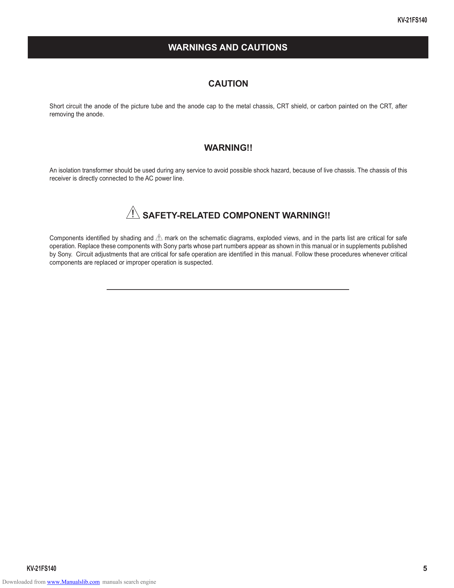

                                                                                                                                                      KV-21FS140

                                                              WARNINGS AND CAUTIONS

                                                                             CAUTION

                 Short circuit the anode of the picture tube and the anode cap to the metal chassis, CRT shield, or carbon painted on the CRT, after
                 removing the anode.

                                                                            WARNING!!

                 An isolation transformer should be used during any service to avoid possible shock hazard, because of live chassis. The chassis of this
                 receiver is directly connected to the AC power line.

                                              ! SAFETY-RELATED COMPONENT WARNING!!
                 Components identified by shading and ! mark on the schematic diagrams, exploded views, and in the parts list are critical for safe
                 operation. Replace these components with Sony parts whose part numbers appear as shown in this manual or in supplements published
                 by Sony. Circuit adjustments that are critical for safe operation are identified in this manual. Follow these procedures whenever critical
                 components are replaced or improper operation is suspected.

        KV-21FS140                                                                                                                                            5
Downloaded from www.Manualslib.com manuals search engine
