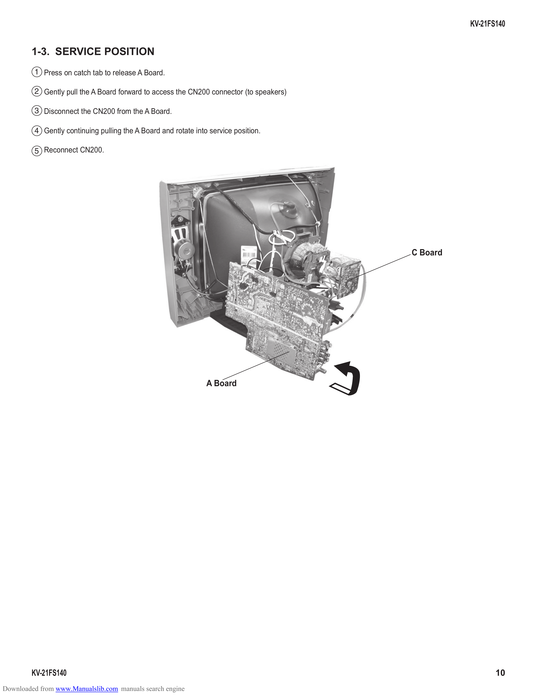

                                                                                                   KV-21FS140

        1-3. SERVICE POSITION
         1 Press on catch tab to release A Board.

         2 Gently pull the A Board forward to access the CN200 connector (to speakers)

         3 Disconnect the CN200 from the A Board.

         4 Gently continuing pulling the A Board and rotate into service position.

         5 Reconnect CN200.

                                                                                         C Board

                                                                A Board

        KV-21FS140                                                                                        10
Downloaded from www.Manualslib.com manuals search engine
