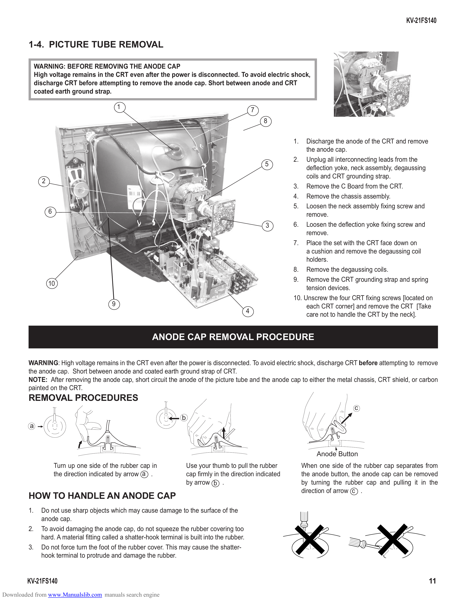

                                                                                                                                                           KV-21FS140

         1-4. PICTURE TUBE REMOVAL

              WARNING: BEFORE REMOVING THE ANODE CAP
              High voltage remains in the CRT even after the power is disconnected. To avoid electric shock,
              discharge CRT before attempting to remove the anode cap. Short between anode and CRT
              coated earth ground strap.

                                                1                                                      7
                                                                                                           8

                                                                                                                  1.   Discharge the anode of the CRT and remove
                                                                                                                       the anode cap.
                                                                                                                  2. Unplug all interconnecting leads from the
                                                                                                           5
                                                                                                                       deflection yoke, neck assembly, degaussing
                                                                                                                       coils and CRT grounding strap.
                2
                                                                                                                  3. Remove the C Board from the CRT.
                                                                                                                  4. Remove the chassis assembly.
                                                                                                                  5. Loosen the neck assembly fixing screw and
                    6                                                                                                  remove.
                                                                                                           3      6. Loosen the deflection yoke fixing screw and
                                                                                                                       remove.
                                                                                                                  7. Place the set with the CRT face down on
                                                                                                                       a cushion and remove the degaussing coil
                                                                                                                       holders.
                                                                                                                  8. Remove the degaussing coils.
                                                                                                                  9. Remove the CRT grounding strap and spring
                    10
                                                                                                                       tension devices.
                                                                                                                  10. Unscrew the four CRT fixing screws [located on
                                            9                                                                          each CRT corner] and remove the CRT [Take
                                                                                                   4
                                                                                                                       care not to handle the CRT by the neck].

                                                           ANODE CAP REMOVAL PROCEDURE

         WARNING: High voltage remains in the CRT even after the power is disconnected. To avoid electric shock, discharge CRT before attempting to remove
         the anode cap. Short between anode and coated earth ground strap of CRT.
         NOTE: After removing the anode cap, short circuit the anode of the picture tube and the anode cap to either the metal chassis, CRT shield, or carbon
         painted on the CRT.
         REMOVAL PROCEDURES
                                                                                                                                         c
                                                                       b
         a

                                                                                                                            Anode Button
                        Turn up one side of the rubber cap in              Use your thumb to pull the rubber           When one side of the rubber cap separates from
                        the direction indicated by arrow a .               cap firmly in the direction indicated        the anode button, the anode cap can be removed
                                                                           by arrow b .                                by turning the rubber cap and pulling it in the
                                                                                                                       direction of arrow c .
         HOW TO HANDLE AN ANODE CAP
         1.     Do not use sharp objects which may cause damage to the surface of the
                anode cap.
         2.     To avoid damaging the anode cap, do not squeeze the rubber covering too
                hard. A material fitting called a shatter-hook terminal is built into the rubber.
         3.     Do not force turn the foot of the rubber cover. This may cause the shatter-
                hook terminal to protrude and damage the rubber.

        KV-21FS140                                                                                                                                                11
Downloaded from www.Manualslib.com manuals search engine
