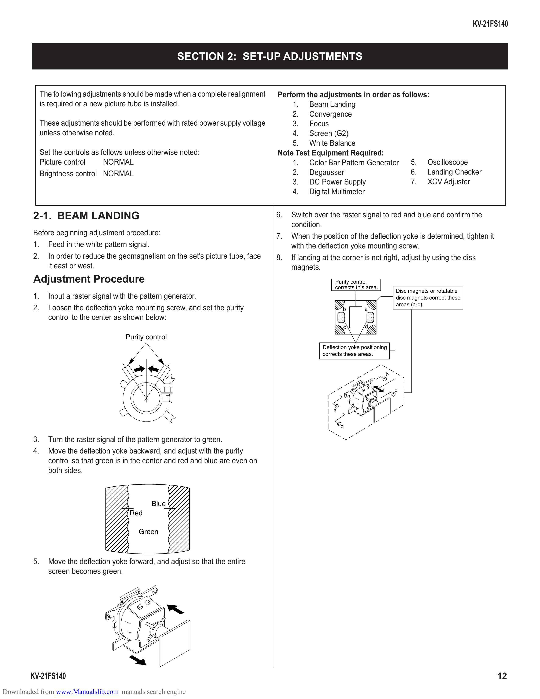

                                                                                                                                                                 KV-21FS140

                                                          SECTION 2: SET-UP ADJUSTMENTS

              The following adjustments should be made when a complete realignment    Perform the adjustments in order as follows:
              is required or a new picture tube is installed.                             1. Beam Landing
                                                                                          2. Convergence
              These adjustments should be performed with rated power supply voltage       3. Focus
              unless otherwise noted.                                                     4. Screen (G2)
                                                                                          5. White Balance
              Set the controls as follows unless otherwise noted:                     Note Test Equipment Required:
              Picture control      NORMAL                                                 1. Color Bar Pattern Generator 5. Oscilloscope
              Brightness control NORMAL                                                   2. Degausser                       6. Landing Checker
                                                                                          3. DC Power Supply                 7. XCV Adjuster
                                                                                          4. Digital Multimeter

         2-1. BEAM LANDING                                                            6.   Switch over the raster signal to red and blue and confirm the
                                                                                           condition.
         Before beginning adjustment procedure:                                       7.   When the position of the deflection yoke is determined, tighten it
         1. Feed in the white pattern signal.                                              with the deflection yoke mounting screw.
         2. In order to reduce the geomagnetism on the set’s picture tube, face       8.   If landing at the corner is not right, adjust by using the disk
             it east or west.                                                              magnets.
         Adjustment Procedure                                                                             Purity control
                                                                                                          corrects this area.
                                                                                                                                    Disc magnets or rotatable
         1.     Input a raster signal with the pattern generator.                                                                   disc magnets correct these
                                                                                                                                    areas (a-d).
         2.     Loosen the deflection yoke mounting screw, and set the purity                                 b         a
                control to the center as shown below:
                                                                                                             c         d

                                         Purity control
                                                                                                     Deflection yoke positioning
                                                                                                     corrects these areas.

                                                                                                                                b

                                                                                                                                    c

                                                                                                         a

                                                                                                             d

         3.     Turn the raster signal of the pattern generator to green.
         4.     Move the deflection yoke backward, and adjust with the purity
                control so that green is in the center and red and blue are even on
                both sides.

                                                 Blue
                                          Red

                                             Green

         5.     Move the deflection yoke forward, and adjust so that the entire
                screen becomes green.

        KV-21FS140                                                                                                                                                     12
Downloaded from www.Manualslib.com manuals search engine
