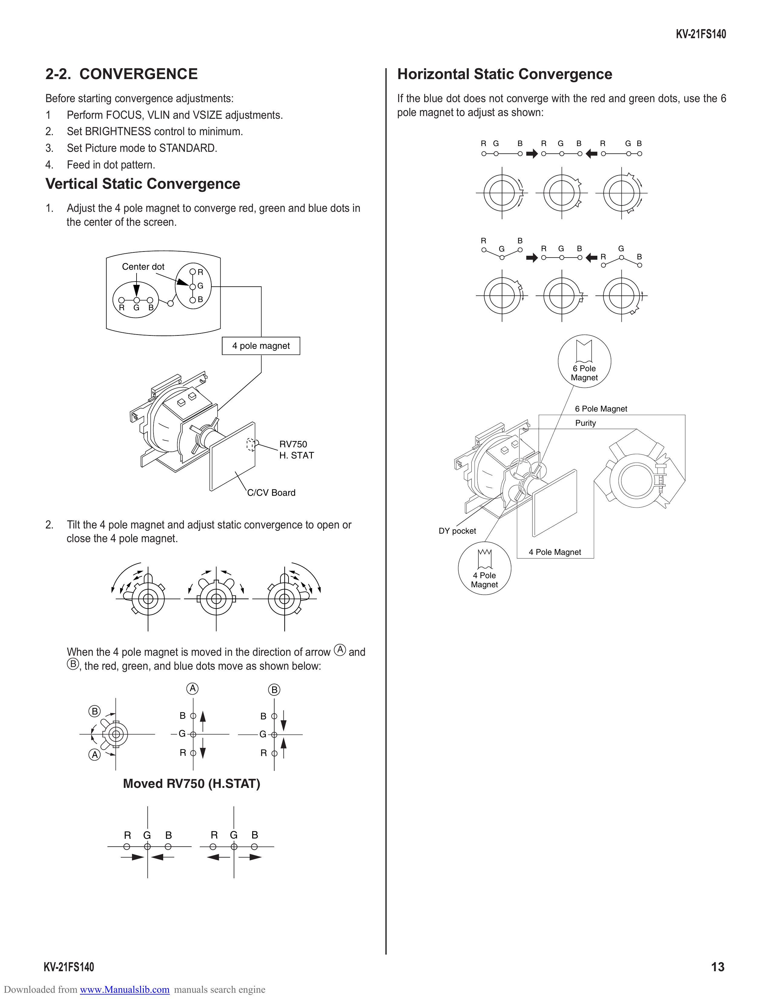

                                                                                                                                                       KV-21FS140

        2-2. CONVERGENCE                                                            Horizontal Static Convergence
        Before starting convergence adjustments:                                    If the blue dot does not converge with the red and green dots, use the 6
        1 Perform FOCUS, VLIN and VSIZE adjustments.                                pole magnet to adjust as shown:
        2. Set BRIGHTNESS control to minimum.
                                                                                                         R G     B      R   G    B       R       G B
        3. Set Picture mode to STANDARD.
        4. Feed in dot pattern.
        Vertical Static Convergence
        1.   Adjust the 4 pole magnet to converge red, green and blue dots in
             the center of the screen.
                                                                                                         R       B
                                                                                                             G          R   G    B           G
                                                                                                                                         R         B
                         Center dot
                                                  R
                                                  G
                                                  B
                        R    G   B

                                                          4 pole magnet

                                                                                                                                6 Pole
                                                                                                                                Magnet

                                                                                                                                6 Pole Magnet
                                                                                                                                Purity

                                                                          RV750
                                                                          H. STAT

                                                              C/CV Board

        2.   Tilt the 4 pole magnet and adjust static convergence to open or                 DY pocket
             close the 4 pole magnet.
                                                                                                                     4 Pole Magnet

                                                                                                    4 Pole
                                                                                                    Magnet

             When the 4 pole magnet is moved in the direction of arrow A and
             B , the red, green, and blue dots move as shown below:

                                              A                       B

                  B                       B                       B
                                          G                       G

                  A                       R                       R

                         Moved RV750 (H.STAT)

                         R       G    B               R   G   B

        KV-21FS140                                                                                                                                           13
Downloaded from www.Manualslib.com manuals search engine
