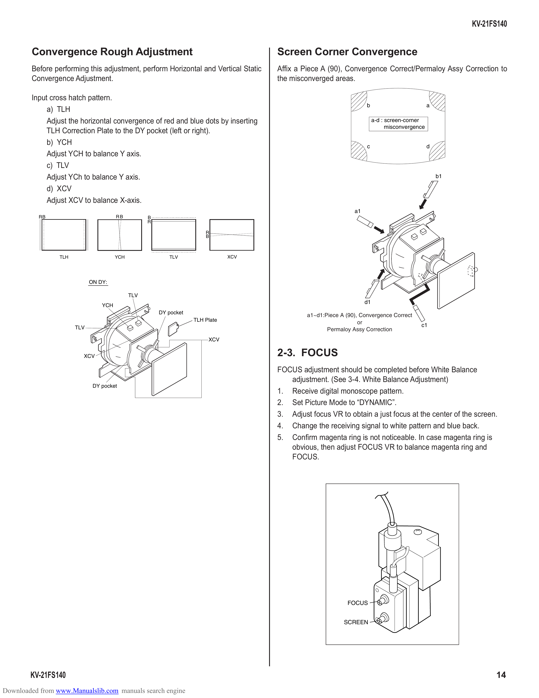

                                                                                                                                                         KV-21FS140

        Convergence Rough Adjustment                                                 Screen Corner Convergence
        Before performing this adjustment, perform Horizontal and Vertical Static    Affix a Piece A (90), Convergence Correct/Permaloy Assy Correction to
        Convergence Adjustment.                                                      the misconverged areas.

        Input cross hatch pattern.
                                                                                                                    b                           a
             a) TLH
             Adjust the horizontal convergence of red and blue dots by inserting                                         a-d : screen-corner
                                                                                                                               misconvergence
             TLH Correction Plate to the DY pocket (left or right).
             b) YCH                                                                                                 c                           d
             Adjust YCH to balance Y axis.
             c) TLV
             Adjust YCh to balance Y axis.                                                                                                          b1

             d) XCV
             Adjust XCV to balance X-axis.
                                                                                                               a1
           RB                          RB          B
                                                   R

                                                                       R
                                                                       B

                 TLH                   YCH                TLV                  XCV

                             ON DY:

                                             TLV
                                                                                                                    d1
                                 YCH
                                                       DY pocket
                                                                                              a1~d1:Piece A (90), Convergence Correct
                                                                   TLH Plate                                     or
                       TLV                                                                                                                 c1
                                                                                                     Permaloy Assy Correction
                                                                        XCV

                         XCV                                                         2-3. FOCUS
                                                                                     FOCUS adjustment should be completed before White Balance
                                                                                        adjustment. (See 3-4. White Balance Adjustment)
                              DY pocket
                                                                                     1. Receive digital monoscope pattern.
                                                                                     2. Set Picture Mode to “DYNAMIC”.
                                                                                     3. Adjust focus VR to obtain a just focus at the center of the screen.
                                                                                     4. Change the receiving signal to white pattern and blue back.
                                                                                     5. Confirm magenta ring is not noticeable. In case magenta ring is
                                                                                        obvious, then adjust FOCUS VR to balance magenta ring and
                                                                                        FOCUS.

                                                                                                             FOCUS

                                                                                                           SCREEN

        KV-21FS140                                                                                                                                             14
Downloaded from www.Manualslib.com manuals search engine
