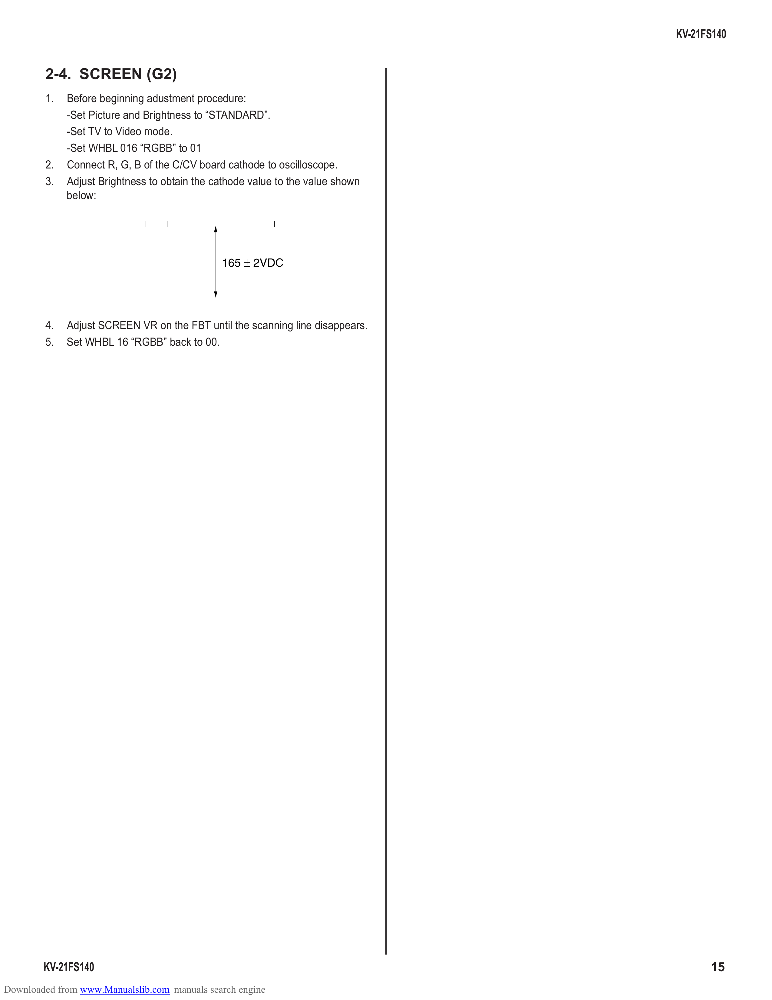

                                                                                KV-21FS140

        2-4. SCREEN (G2)
        1.   Before beginning adustment procedure:
             -Set Picture and Brightness to “STANDARD”.
             -Set TV to Video mode.
             -Set WHBL 016 “RGBB” to 01
        2.   Connect R, G, B of the C/CV board cathode to oscilloscope.
        3.   Adjust Brightness to obtain the cathode value to the value shown
             below:

                                              165 ± 2VDC

        4.   Adjust SCREEN VR on the FBT until the scanning line disappears.
        5.   Set WHBL 16 “RGBB” back to 00.

        KV-21FS140                                                                    15
Downloaded from www.Manualslib.com manuals search engine
