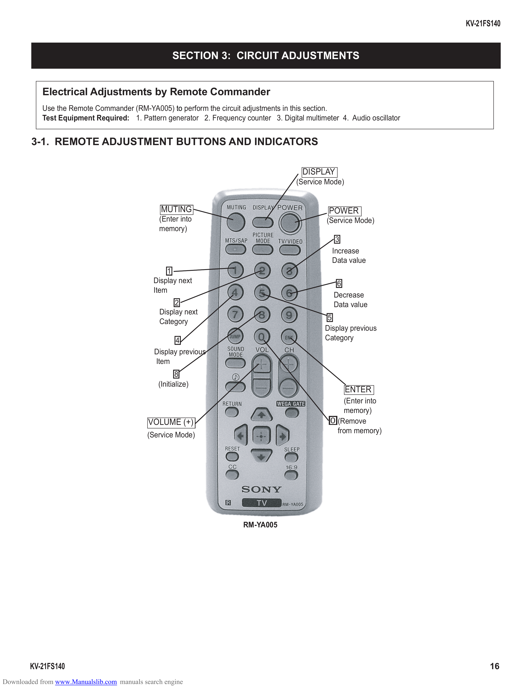

                                                                                                                           KV-21FS140

                                                     SECTION 3: CIRCUIT ADJUSTMENTS

            Electrical Adjustments by Remote Commander
            Use the Remote Commander (RM-YA005) to perform the circuit adjustments in this section.
            Test Equipment Required: 1. Pattern generator 2. Frequency counter 3. Digital multimeter 4. Audio oscillator

        3-1. REMOTE ADJUSTMENT BUTTONS AND INDICATORS

                                                                                          DISPLAY
                                                                                        (Service Mode)

                                                 MUTING                                           POWER
                                                (Enter into                                      (Service Mode)
                                                memory)
                                                                                                    3
                                                                                                   Increase
                                                                                                   Data value
                                                  1
                                              Display next                                          6
                                              Item
                                                                                                   Decrease
                                                     2                                             Data value
                                                Display next
                                                Category                                          5
                                                                                                 Display previous
                                                      4                                          Category
                                               Display previous
                                               Item
                                                       8
                                                (Initialize)
                                                                                                         ENTER
                                                                                                      (Enter into
                                                                                                      memory)
                                             VOLUME (+)                                           0 (Remove
                                                                                                    from memory)
                                            (Service Mode)

                                                                        RM-YA005

        KV-21FS140                                                                                                               16
Downloaded from www.Manualslib.com manuals search engine
