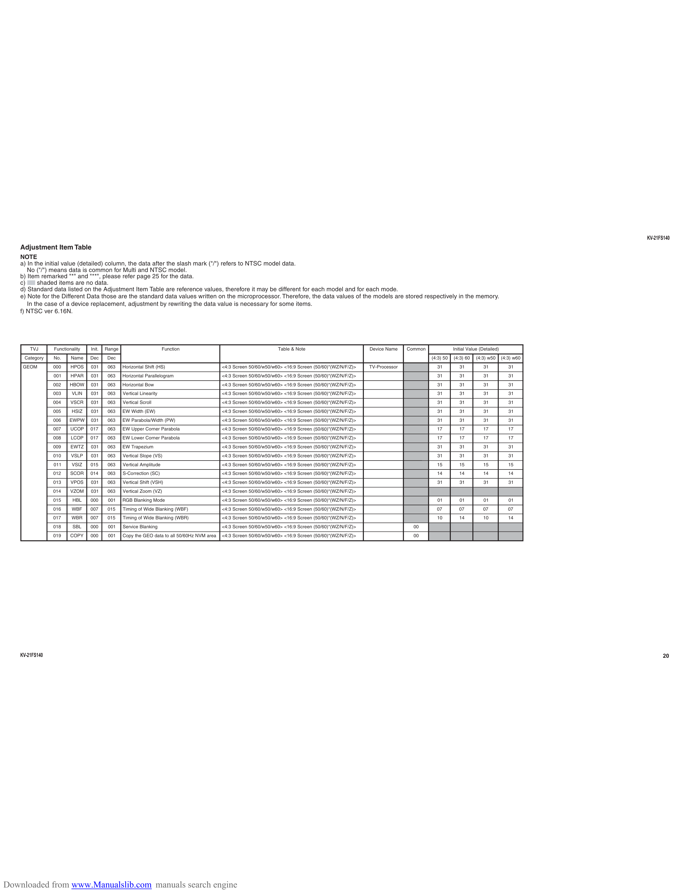

                                                                                                                                                                                                                                      KV-21FS140
    Adjustment Item Table
    NOTE
    a) In the initial value (detailed) column, the data after the slash mark ("/") refers to NTSC model data.
       No ("/") means data is common for Multi and NTSC model.
    b) Item remar ked "*" and "**", please refer page 25 for the data.
    c)     shaded items are no data.
    d) Standard data listed on the Adjustment Item Table are reference values, therefore it may be different for each model and for each mode.
    e) Note for the Different Data those are the standard data values written on the microprocessor. Therefore, the data values of the models are stored respectively in the memor y.
       In the case of a device replacement, adjustment by rewriting the data value is necessary for some items.
    f) NTSC ver 6.16N.

        TVJ      Functionality    Init.   Range                        Function                                       Table & Note                          Device Name    Common              Initial Value (Detailed)
     Category    No.     Name     Dec     De c                                                                                                                                      (4:3) 50   (4:3) 60    (4:3) w50      (4:3) w60
     GEOM        000     HPOS     031      0 63   Horizontal Shift (HS)                       <4:3 Screen 50/60/w50/w60> <16:9 Screen (50/60)*(WZ/N/F/Z)>   TV-Processor              31          31          31             31
                 001     HPAR     0 31     063    Horizontal Parallelogram                    <4:3 Screen 50/60/w50/w60> <16:9 Screen (50/60)*(WZ/N/F/Z)>                             31          31          31             31
                 002    HBOW      031      063    Horizontal Bow                              <4:3 Screen 50/60/w50/w60> <16:9 Screen (50/60)*(WZ/N/F/Z)>                             31          31          31             31
                 003     VLIN     031      06 3   Vertical Linearity                          <4:3 Screen 50/60/w50/w60> <16:9 Screen (50/60)*(WZ/N/F/Z)>                             31          31          31             31
                 004     VSCR     031      063    Vertical Scroll                             <4:3 Screen 50/60/w50/w60> <16:9 Screen (50/60)*(WZ/N/F/Z)>                             31          31          31             31
                 005     HSIZ     031      063    EW Width (EW)                               <4:3 Screen 50/60/w50/w60> <16:9 Screen (50/60)*(WZ/N/F/Z)>                             31          31          31             31
                 006    EWPW      03 1     063    EW Parabola/Width (PW)                      <4:3 Screen 50/60/w50/w60> <16:9 Screen (50/60)*(WZ/N/F/Z)>                             31          31          31             31
                 007     UCOP     017      063    EW Upper Corner Parabola                    <4:3 Screen 50/60/w50/w60> <16:9 Screen (50/60)*(WZ/N/F/Z)>                             17          17          17             17
                 008     LCOP     01 7     06 3   EW Lower Corner Parabola                    <4:3 Screen 50/60/w50/w60> <16:9 Screen (50/60)*(WZ/N/F/Z)>                             17          17          17             17
                 009     EWTZ     031      063    EW Trapezium                                <4:3 Screen 50/60/w50/w60> <16:9 Screen (50/60)*(WZ/N/F/Z)>                             31          31          31             31
                 010     VSLP     03 1     063    Vertical Slope (VS)                         <4:3 Screen 50/60/w50/w60> <16:9 Screen (50/60)*(WZ/N/F/Z)>                             31          31          31             31
                 011     VSIZ     015      063    Vertical Amplitude                          <4:3 Screen 50/60/w50/w60> <16:9 Screen (50/60)*(WZ/N/F/Z)>                             15          15          15             15
                 012     SCOR     014      063    S-Correction (SC)                           <4:3 Screen 50/60/w50/w60> <16:9 Screen (50/60)*(WZ/N/F/Z)>                             14          14          14             14
                 013     VPOS     031      06 3   Vertical Shift (VSH)                        <4:3 Screen 50/60/w50/w60> <16:9 Screen (50/60)*(WZ/N/F/Z)>                             31          31          31             31
                 014     V Z OM   03 1     063    Vertical Zoom (VZ)                          <4:3 Screen 50/60/w50/w60> <16:9 Screen (50/60)*(WZ/N/F/Z)>
                 015      HBL     000      001    RGB Blanking Mode                           <4:3 Screen 50/60/w50/w60> <16:9 Screen (50/60)*(WZ/N/F/Z)>                             01          01          01             01
                 016     W BF     007      015    Timing of Wide Blanking (WBF)               <4:3 Screen 50/60/w50/w60> <16:9 Screen (50/60)*(WZ/N/F/Z)>                             07          07          07             07
                 017     WBR      007      015    Timing of Wide Blanking (WBR)               <4:3 Screen 50/60/w50/w60> <16:9 Screen (50/60)*(WZ/N/F/Z)>                             10          14          10             14
                 018      SBL     000      001    Service Blanking                            <4:3 Screen 50/60/w50/w60> <16:9 Screen (50/60)*(WZ/N/F/Z)>                    00
                 019     COPY     0 00     001    Copy the GEO data to all 50/60Hz NVM area   <4:3 Screen 50/60/w50/w60> <16:9 Screen (50/60)*(WZ/N/F/Z)>                    00

    KV-21FS140                                                                                                                                                                                                                              20

Downloaded from www.Manualslib.com manuals search engine
