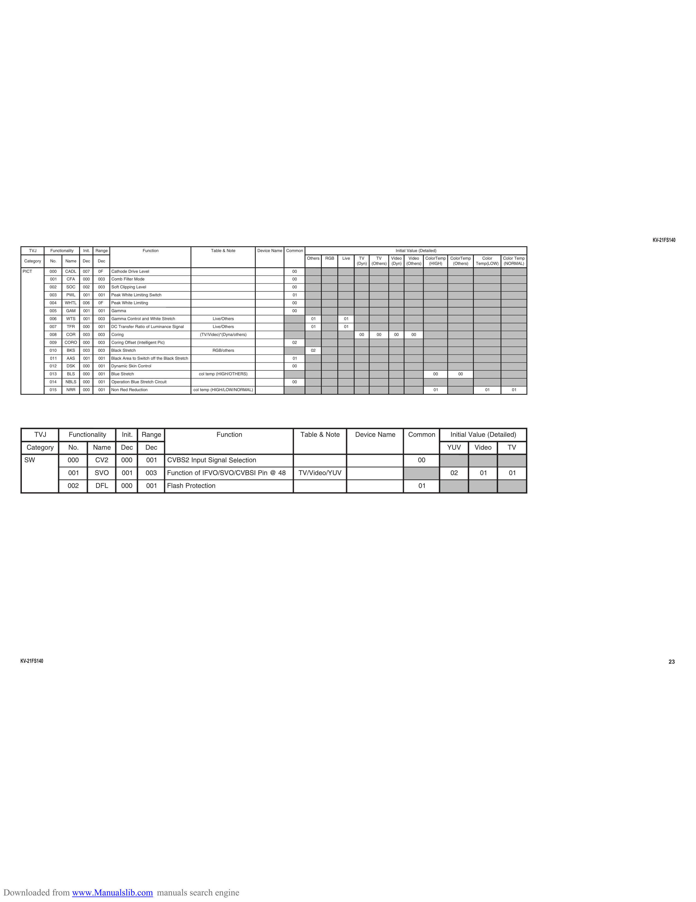

                                                                                                                                                                                                                                                            KV-21FS140
       T VJ       Functionality   Init.   Range                     Function                          Table & Note          Device Name Common                                              Initial Value (Detailed)
                                                                                                                                                 Others   RGB   Live    TV       TV       Video    Video   ColorTemp   ColorTemp     Color     Color Temp
     Category     No.     Name    De c     Dec
                                                                                                                                                                       (Dyn)   (Others)   (Dyn)   (Others)  (HIGH)      (Others)   Temp(LOW)   (NORMAL)
    PICT          000     CADL    007      0F     Cathode Drive Level                                                                    00
                  001      CFA    000      003    Comb Filter Mode                                                                       00
                  002     SOC     0 02     003    Soft Clipping Level                                                                    00
                  003     PWL     001      001    Peak White Limiting Switch                                                             01
                  004     WHTL    006      0F     Peak White Limiting                                                                    00
                  005     GAM     001      001    Gamma                                                                                  00
                  006     WTS     001      003    Gamma Control and White Stretch                      Live/Others                                 01           01
                  007      TFR    000      00 1   DC Transfer Ratio of Luminance Signal                Live/Others                                 01           01
                  008     COR     003      003    Coring                                         (TV/Video)*(Dyna/others)                                               00       00        00        00
                  009    C OR O   000      003    Coring Offset (Intelligent Pic)                                                        02
                  010      BKS    003      003    Black Stretch                                        RGB/others                                 02
                  011      A AS   001      001    Black Area to Switch off the Black Stretch                                             01
                  012      DSK    000      001    Dynamic Skin Control                                                                   00
                  013      BLS    000      001    Blue Stretch                                   col temp (HIGH/OTHERS)                                                                                           00        00
                  014     NBLS    000      001    Operation Blue Stretch Circuit                                                         00
                  015     NRR     000      001    Non Red Reduction                            col temp (HIGH/LOW/NORMAL)                                                                                         01                  01           01

           T VJ             Functionality               Init.      Range                                 Function                             Table & Note             Device Name                 Common              Initial Value (Detailed)
      Category              No.           Name         Dec           Dec                                                                                                                                               Y UV        Video         TV
     SW                    00 0           CV2          000              001         CVBS2 Input Signal Selection                                                                                          00
                           001            SVO           001          003            Function of IFVO/SVO/CVBSI Pin @ 48                       TV/Video/YUV                                                             02           01           01
                           002            DFL          00 0             001         Flash Protection                                                                                                      01

    KV-21FS140                                                                                                                                                                                                                                                    23

Downloaded from www.Manualslib.com manuals search engine
