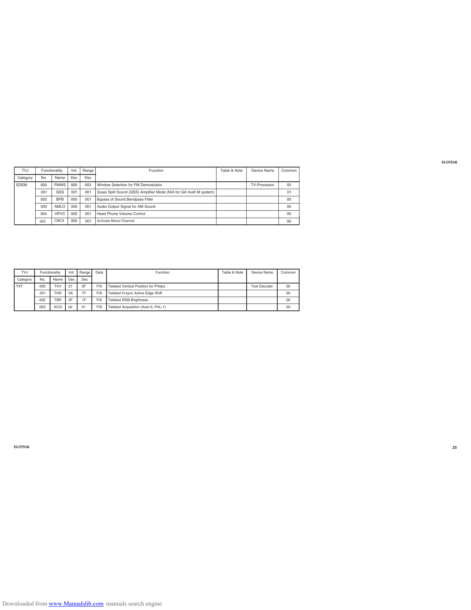

                                                                                                                                                                 KV-21FS140

         TVJ      Functionality     Init.    Range                                     Function                           Table & Note   Device Name    Common
      Category    No.     Name     Dec        Dec
     SDEM        00 0     FMWS     0 00       00 3   Window Selection for FM Demodulator                                                 TV-Processor     02
                 001       QSS      001       001    Quasi Split Sound (QSS) Amplifier Mode (N/A for GA multi M system)                                   01
                 002       BPB     000        001    Bypass of Sound Bandpass Filter                                                                      00
                 003      AMLO     000        001    Audio Output Signal for AM Sound                                                                     00
                 004      HPVC     0 00       001    Head Phone Volume Control                                                                            00
                 005      CMCA     000        001    Activate Mono Channel                                                                                00

        TVJ      Functionality    Init.     Range    Data                                  Function                       Table & Note   Device Name    Common
      Category   No.     Na m e   Dec       Dec
     TXT         000      TXV     27         3F      FIX    Teletext Vertical Position for Philips                                       Text Decoder     00
                 001      T HD    0A         7F      FIX    Teletext H-sync Active Edge Shift                                                             00
                 002      T BR    0F         1F      FIX    Teletext RGB Brightness                                                                       00
                 0 03    ACQ      00         01      FIX    Teletext Acquisition (Auto-0, PAL-1)                                                          00

    KV-21FS140                                                                                                                                                         25

Downloaded from www.Manualslib.com manuals search engine
