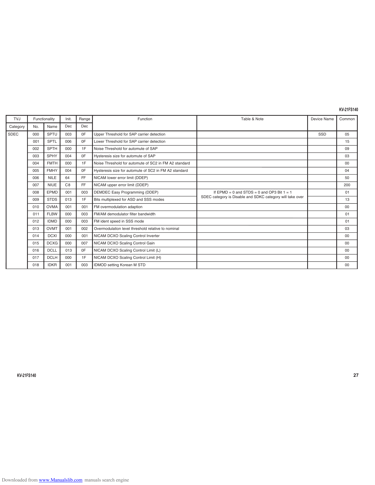

                                                                                                                                                                                  KV-21FS140
     TVJ       Functionality    Init.   Range                            Function                                             Table & Note                          Device Name   Common

   Category    No.     Name     Dec     Dec

  SDEC         00 0    SPTU     0 03     0F     Upper Threshold for SAP carrier detection                                                                              SSD           05
               001     SP T L   006      0F     Lower Threshold for SAP carrier detection                                                                                            15
               002     SPTH     000      1F     Noise Threshold for automute of SAP                                                                                                  09
               003     SPHY     004      0F     Hysteresis size for automute of SAP                                                                                                  03
               004     FMTH     000      1F     Noise Threshold for automute of SC2 in FM A2 standard                                                                                00
               005     FMHY     004      0F     Hysteresis size for automute of SC2 in FM A2 standard                                                                                04
               006     NILE     64       FF     NICAM lower error limit (DDEP)                                                                                                       50
               007     NIUE     C8       FF     NICAM upper error limit (DDEP)                                                                                                      200
               008     EPMD     001      003    DEMDEC Easy Programming (DDEP)                               If EPMD = 0 and STDS = 0 and OP3 Bit 1 = 1                              01
                                                                                                        SDEC category is Disable and SDKC category will take over
               009     STDS     013      1F     Bits multiplexed for ASD and SSS modes                                                                                               13
               010     OVMA     001      0 01   FM overmodulation adaption                                                                                                           00
               011     FLBW     000      003    FM/AM demodulator filter bandwidth                                                                                                   01
               012     IDMD     000      003    FM ident speed in SSS mode                                                                                                           01
               013     OVMT     001      00 2   Overmodulation level threshold relative to nominal                                                                                   03
               014     DCXI     000      001    NICAM DCXO Scaling Control Inverter                                                                                                  00
               015     DCXG     000      007    NICAM DCXO Scaling Control Gain                                                                                                      00
               016     DCLL     013      0F     NICAM DCXO Scaling Control Limit (L)                                                                                                 00
               017     D CL H   000      1F     NICAM DCXO Scaling Control Limit (H)                                                                                                 00
               018     IDKR     001      003    IDMOD setting Korean M STD                                                                                                           00

       KV-21FS140                                                                                                                                                                         27

Downloaded from www.Manualslib.com manuals search engine
