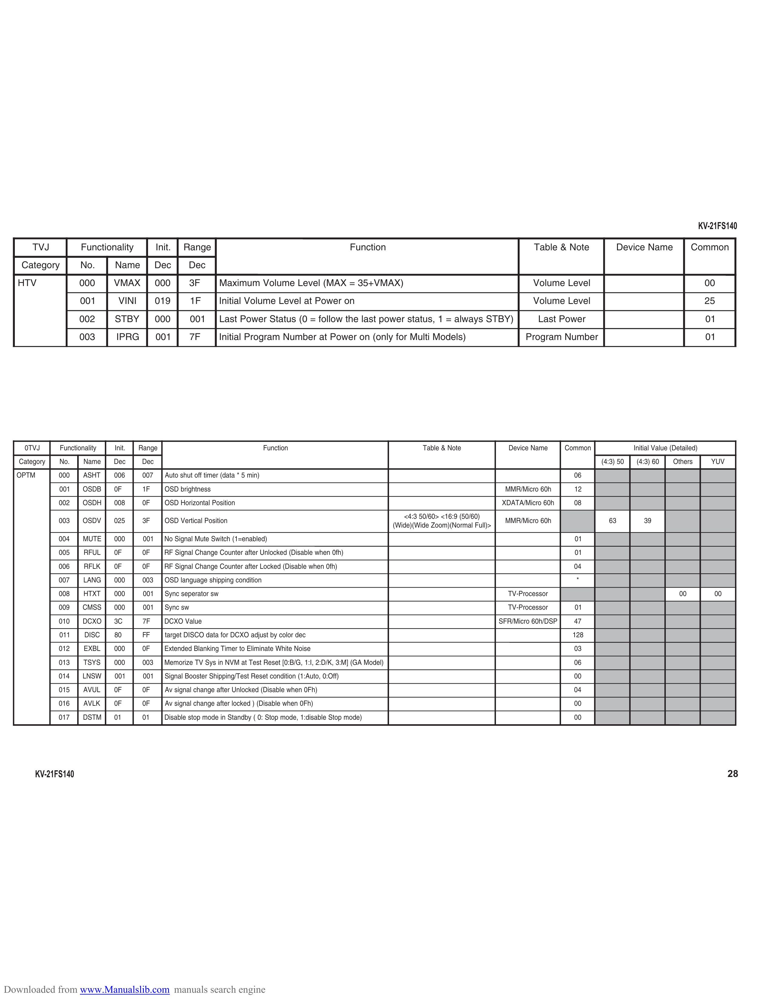

                                                                                                                                                                                                                                 KV-21FS140

       TVJ           Functionality             Init.    Range                                                   Function                                                Table & Note            Device Name                 Common
   Category          No.       Name            Dec        Dec
   HTV               000       VMAX            0 00        3F        Maximum Volume Level (MAX = 35+VMAX)                                                              Volume Level                                               00
                     001        VINI           019         1F        Initial Volume Level at Power on                                                                  Volume Level                                               25
                     002       STBY            000         001       Last Power Status (0 = follow the last power status, 1 = always STBY)                               Last Power                                               01
                     003       IPRG            00 1        7F        Initial Program Number at Power on (only for Multi Models)                                      Program Number                                               01

    0TVJ      Functionality    Init.   Range                                           Function                                      Table & Note               Device Name       Common              Initial Value (Detailed)
   Category   No.     Name     Dec     Dec                                                                                                                                                 (4:3) 50    (4:3) 60     Others          YUV
  OPTM        000     ASHT     006      007       Auto shut off timer (data * 5 min)                                                                                                06
              001     OSDB     0F       1F       OSD brightness                                                                                                MMR/Micro 60h        12
              002     O SD H   008      0F       OSD Horizontal Position                                                                                      XDATA/Micro 60h       08
                                                                                                                               <4:3 50/60> <16:9 (50/60)
              003     OSDV     025      3F       OSD Vertical Position                                                                                         MMR/Micro 60h                 63          39
                                                                                                                            (Wide)(Wide Zoom)(Normal Full)>
              004     MUTE     000      001      No Signal Mute Switch (1=enabled)                                                                                                  01
              005     RFUL     0F       0F       RF Signal Change Counter after Unlocked (Disable when 0fh)                                                                         01
              006     RFLK     0F       0F       RF Signal Change Counter after Locked (Disable when 0fh)                                                                           04
              007     LANG     000      003      OSD language shipping condition                                                                                                    *
              008     HTXT     000      00 1     Sync seperator sw                                                                                              TV-Processor                                           00            00
              009     CMSS     000      001      Sync sw                                                                                                        TV-Processor        01
              0 10    DCXO     3C       7F       DCXO Value                                                                                                   SFR/Micro 60h/DSP     47
              011     DISC     80       FF        target DISCO data for DCXO adjust by color dec                                                                                   1 28
              012     EXBL     000      0F       Extended Blanking Timer to Eliminate White Noise                                                                                   03
              013     TSYS     000      003      Memorize TV Sys in NVM at Test Reset [0:B/G, 1:I, 2:D/K, 3:M] (GA Model)                                                           06
              014     LNSW     0 01     001      Signal Booster Shipping/Test Reset condition (1:Auto, 0:Off)                                                                       00
              015     AVU L    0F       0F        Av signal change after Unlocked (Disable when 0Fh)                                                                                04
              016     AVLK     0F       0F        Av signal change after locked ) (Disable when 0Fh)                                                                                00
              017     DSTM     01       01       Disable stop mode in Standby ( 0: Stop mode, 1:disable Stop mode)                                                                  00

       KV-21FS140                                                                                                                                                                                                                         28

Downloaded from www.Manualslib.com manuals search engine
