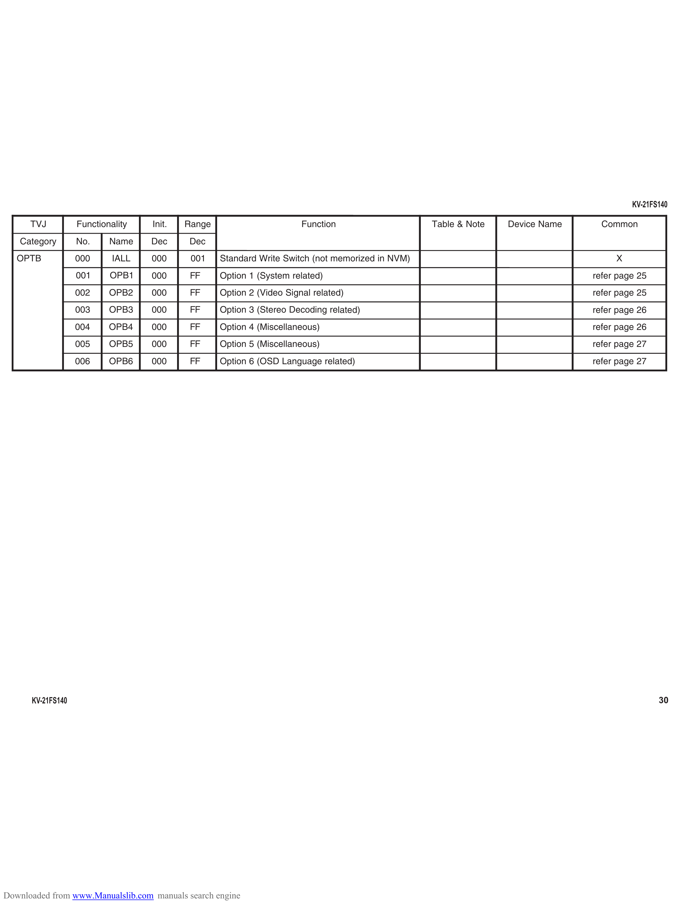

                                                                                                                                         KV-21FS140

      TVJ          Functionality    Init.   Range                       Function                   Table & Note   Device Name     Common
   Category        No.     Name     Dec     Dec
   OPTB            000      IALL    000      00 1   Standard Write Switch (not memorized in NVM)                                     X
                   001     OPB1     000      FF     Option 1 (System related)                                                   refer page 25
                   002     O PB 2   000      FF     Option 2 (Video Signal related)                                             refer page 25
                   003     OPB3     000      FF     Option 3 (Stereo Decoding related)                                          refer page 26
                   004     O PB4    000      FF     Option 4 (Miscellaneous)                                                    refer page 26
                   005     OPB5     000      FF     Option 5 (Miscellaneous)                                                    refer page 27
                   006     OPB6     000      FF     Option 6 (OSD Language related)                                             refer page 27

      KV-21FS140                                                                                                                                30

Downloaded from www.Manualslib.com manuals search engine
