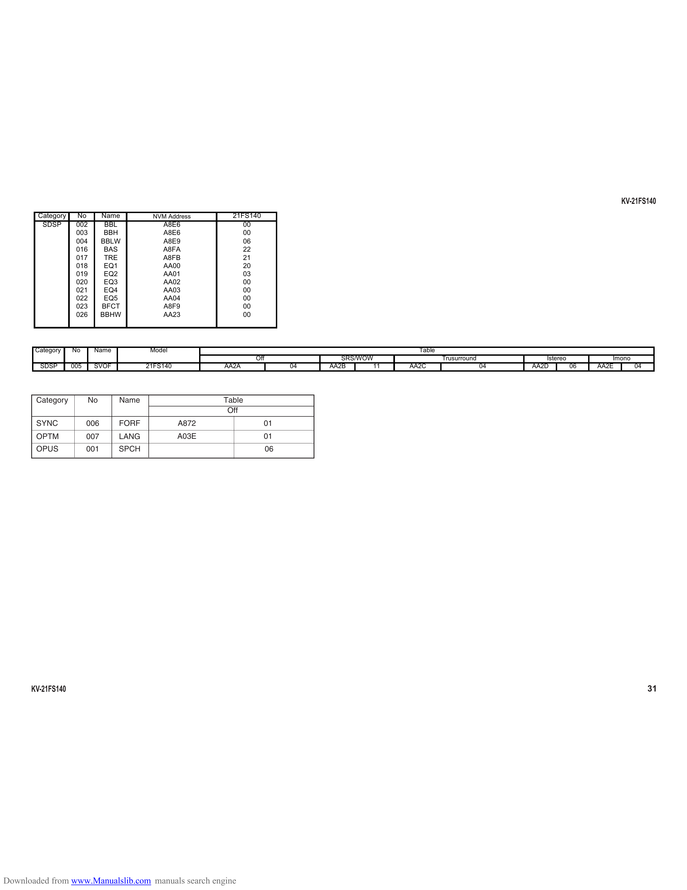

                                                                                                                                                     KV-21FS140
        Category    No         Name       NVM Address       21FS140
         SDSP       002         BBL          A8E6              00
                    003         BBH          A8E6              00
                    004        BBLW          A8E9              06
                    016         BAS          A8FA              22
                    017         TRE          A8FB              21
                    018         EQ1          AA00              20
                    019         EQ2          AA01              03
                    020         EQ3          AA02              00
                    021         EQ4          AA03              00
                    022         EQ5          AA04              00
                    023        BFCT          A8F9              00
                    026        BBHW          AA23              00

       Category    No      Name           Model                                                    Table
                                                                  Off                SRS/WOW               Trusurround            Istereo          Imono
        SDSP       005     SVOF          21FS140          AA2A               04   AA2B      11   AA2C                    04   AA2D        06   AA2E      04

       Category           No      Name                    Table
                                                           Off
       SYNC              006      FORF             A872               01
       OPTM              007      LANG             A03E               01
       OPUS              001      SPCH                                  06

      KV-21FS140                                                                                                                                              31

Downloaded from www.Manualslib.com manuals search engine
