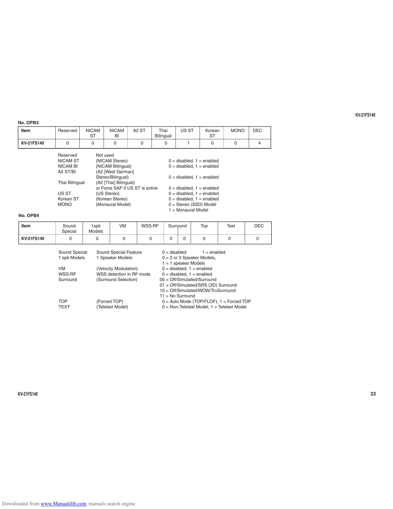

                                                                                                                                    KV-21FS140
      No. OPB3
        Item           Reserved         NICAM       NICAM        A2 ST         Thai        US ST        Korean        MONO    DEC
                                          ST          BI                     Bilingual                    ST
        KV-21FS140         0              0            0            0             0              1         0           0       4

                       Reserved               Not used
                       NICAM ST               (NICAM Stereo)                          0 = disabled, 1 = enabled
                       NICAM BI               (NICAM Bilingual)                       0 = disabled, 1 = enabled
                       A2 ST/BI               (A2 [West German]
                                              Stereo/Bilingual)                       0 = disabled, 1 = enabled
                       Thai Bilingual         (A2 [Thai] Bilingual)
                                              or Force SAP if US ST is active         0 = disabled, 1 = enabled
                       US ST                  (US Stereo)                             0 = disabled, 1 = enabled
                       Korean ST              (Korean Stereo)                         0 = disabled, 1 = enabled
                       MONO                   (Monaural Model)                        0 = Stereo (SSD) Model
                                                                                      1 = Monaural Model
      No. OPB4

        Item             Sound            1spk             VM       WSS-RF            Surround       Top          Text        DEC
                         Special         Models
        KV-21FS140             0              0             0            0            0      0         0          0            0

                       Sound Special          Sound Special Feature              0 = disabled        1 = enabled
                       1 spk Models           1 Speaker Models                   0 = 2 or 3 Speaker Models,
                                                                                 1 = 1 speaker Models
                       VM                     (Velocity Modulation)              0 = disabled, 1 = enabled
                       WSS-RF                 WSS detection in RF mode           0 = disabled, 1 = enabled
                       Surround               (Surround Selection)              00 = Off/Simulated/Surround
                                                                                01 = Off/Simulated/SRS (3D) Surround
                                                                                10 = Off/Simulated/WOW/TruSurround
                                                                                11 = No Surround
                       TOP                    (Forced TOP)                       0 = Auto Mode (TOP/FLOF), 1 = Forced TOP
                       TEXT                   (Teletext Model)                   0 = Non-Teletext Model, 1 = Teletext Model

      KV-21FS140                                                                                                                           33

Downloaded from www.Manualslib.com manuals search engine
