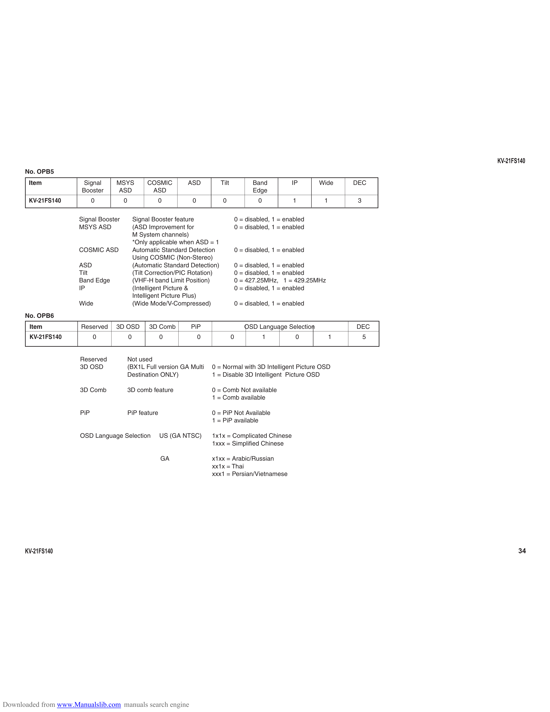

                                                                                                                                         KV-21FS140
      No. OPB5
       Item            Signal     MSYS              COSMIC        ASD           Tilt             Band          IP      Wide     DEC
                       Booster    ASD                ASD                                         Edge
       KV-21FS140            0         0               0           0             0                 0           1        1        3

                      Signal Booster           Signal Booster feature                      0 = disabled, 1 = enabled
                      MSYS ASD                 (ASD Improvement for                        0 = disabled, 1 = enabled
                                               M System channels)
                                               *Only applicable when ASD = 1
                      COSMIC ASD               Automatic Standard Detection                0 = disabled, 1 = enabled
                                               Using COSMIC (Non-Stereo)
                      ASD                      (Automatic Standard Detection)              0 = disabled, 1 = enabled
                      Tilt                     (Tilt Correction/PIC Rotation)              0 = disabled, 1 = enabled
                      Band Edge                (VHF-H band Limit Position)                 0 = 427.25MHz, 1 = 429.25MHz
                      IP                       (Intelligent Picture &                      0 = disabled, 1 = enabled
                                               Intelligent Picture Plus)
                      Wide                     (Wide Mode/V-Compressed)                    0 = disabled, 1 = enabled
      No. OPB6
        Item           Reserved   3D OSD            3D Comb        PiP                        OSD Language Selection            DEC
        KV-21FS140           0             0             0             0               0               1        0           1        5

                       Reserved            Not used
                       3D OSD              (BX1L Full version GA Multi     0 = Normal with 3D Intelligent Picture OSD
                                           Destination ONLY)               1 = Disable 3D Intelligent Picture OSD

                       3D Comb             3D comb feature                 0 = Comb Not available
                                                                           1 = Comb available

                       PiP                 PiP feature                     0 = PiP Not Available
                                                                           1 = PiP available

                       OSD Language Selection            US (GA NTSC)      1x1x = Complicated Chinese
                                                                           1xxx = Simplified Chinese

                                                         GA                x1xx = Arabic/Russian
                                                                           xx1x = Thai
                                                                           xxx1 = Persian/Vietnamese

      KV-21FS140                                                                                                                                34

Downloaded from www.Manualslib.com manuals search engine
