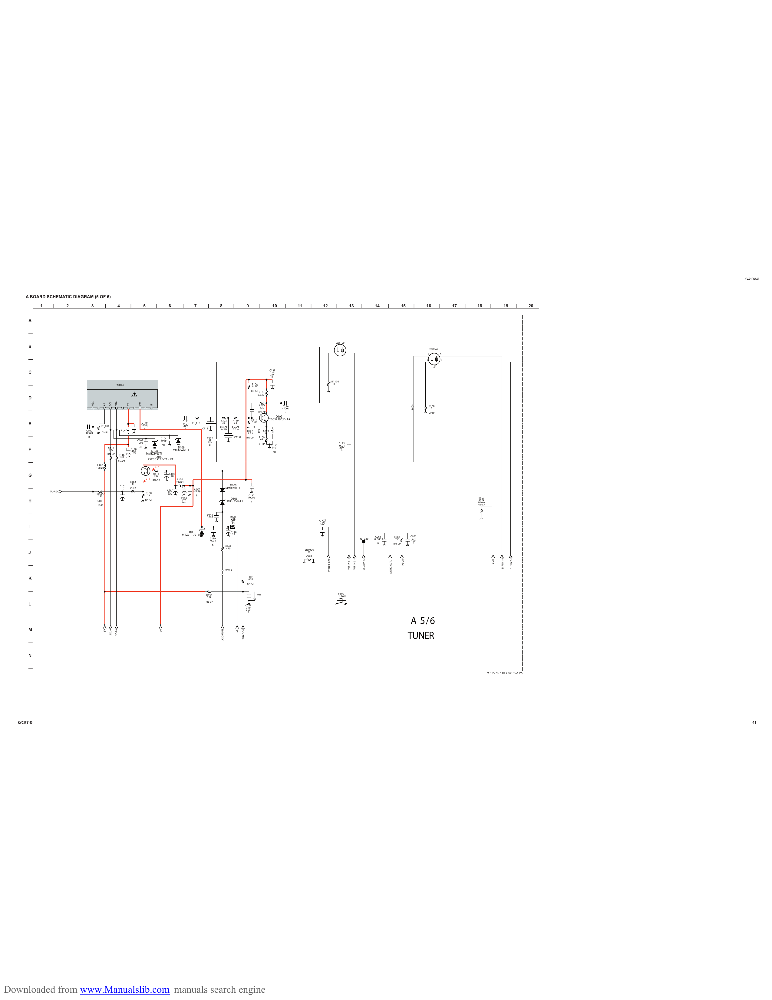

                                                                                                                                                                                                                                                                                                                                                                                                                                                                                                 KV-21FS140

        A BOARD SCHEMATIC DIAGRAM (5 OF 6)

                1     |      2   |        3              |                4                 |             5               |             6           |       7          |           8                  |                   9             |             10       |     11      |       12                |                13                  |               14       |                       15         |   16             |       17   |   18       |                 19               |   20

          A

          —

                                                                                                                                                                                                                                                                                                       SWF100
          B
                                                                                                                                                                                                                                                                                                                                                                                                                SWF101
                                                                                                                                                                                                                                                                                                                                                                                                            1              3

          —                                                                                                                                                                                                                                                                                                                                                                                                 2                  4
                                                                                                                                                                                                                                                                                                                                                                                                                       5
                                                                                                                                                                                                                                                     C138
          C                                                                                                                                                                                                                                          0.01
                                                                                                                                                                                                                                                     25V
                                                                                                                                                                                                                                                      B
                                                                                                                                                                                                                                                                                                   JR1100
          —                                                             TU101                                                                                                                                                    R106
                                                                                                                                                                                                                                 8.2K
                                                                                                                                                                                                                                                                                                     0

                                                                                                                                                                                                                              RN-CP
                                                                                                                                                                                                                                       L101
                                                                                                                                                                                                                                      0.33UH
          D
                                          AGC          AS     SCL     SDA              5V          30V              IF
                                                                                                                                                                                                                                                                                                                                                                                                     1608
                                                                                                                                                                                                                                         R108                C116                                                                                                                                               R128
                                                                                                                                                                                                                                         820                 4700p                                                                                                                                               0
          —                                                                                                                                                                                                                             RN-CP                 B                                                                                                                                                 CHIP
                                                                                                                                                                                                                                                         Q102
                                                                                                                                                                                   R103               R119                    C115                   2SC3779C,D-AA
                                                                                                                                                    C111
          E                                        JR1101
                                                                                                     C140
                                                                                                     1000p
                                                                                                                                                    0.01
                                                                                                                                                    25V
                                                                                                                                                           JR1110
                                                                                                                                                             0
                                                                                                                                                                                    33                 33                     0.01

                                                                                                                                                     B                             RN-CP              RN-CP                       B
                                                     0                                                                                                              CT131           0.5%               0.5%
                                                                                L107                      B
                                     C100
                                     1000p         CHIP                          0                                                                                                                                         R107         10%   L103
                                                                                                                                                                                                                           2.7K                0
          —                           B                                                                                         C104                                   C112                            CT139              RN-CP          R109
                                                                                                   C102                         100p                                    5P                                                                68
                                                                                                   100p                                                                25V                                                                                                                                 C135
                                                                                                                                 CH                                     B                                                                CHIP
                                                                                                                                                                                                                                                      C117                                                 0.01
                                                             R115                                  CH                                           D109
          F
                                                                                                                                                                                                                                                      0.01                                                 25V
                                                             100                            C120                                              MM3Z5V6ST1                                                                                                                                                    B
                                                                                            470                  D108                                                                                                                                  CH
                                                             RN-CP            R116          16V               MM3Z5V6ST1
                                                                              100                                   Q100
                                                                                                               2SC3052EF-T1-LEF
          —                                                                   RN-CP
                                                 L106
                                                100uH                                                                    2.7

          G                                                                                                              R118
                                                                                                                         100
                                                                                                                                        C106
                                                                                                                                         10
                                                                                                              2.1                                L100
                                                                                                                     RN-CP
                                                                                            R152                                                100uH
                                                                                             0
                                                                                                                                                                                                D105
          —
                                                                               C101
                                                                                10          CHIP                                                            C109                              MMDL914T1
                                                                                                                                       C107                 4700p
                    TU-AGC                                                                                                             470
                                                JR1050                                                        R100                     16V
                                                 150                                                           1k                                             B                                                            C137
                                                                                                                                                   C108                                          D106                      1000p                                                                                                                                                                                                             R153
          H                                     CHIP                                                      RN-CP                                    470
                                                                                                                                                   16V                                         RD3.3SB-T1                     B
                                                                                                                                                                                                                                                                                                                                                                                                                                             470k
                                                                                                                                                                                                                                                                                                                                                                                                                                            1/10W
                                                1608                                                                                                                                                                                                                                                                                                                                                                                        RN-CP

          —                                                                                                                                                            C133
                                                                                                                                                                       100P                       R121
                                                                                                                                                                                                   22k                                                                             C1019
                                                                                                                                                                                                   3W                                                                               0.47
                                                                                                                                                                                                   RS                                                                               10V
          I
                                                                                                                                                      D103                                        C118
                                                                                                                                                   MTZJ-T-77-33B                                   22
                                                                                                                                                                                                                                                                                                                                                             C061                    R088            C070
          —                                                                                                                                                                 C119
                                                                                                                                                                            0.01
                                                                                                                                                                                                                                                                                                                                           JL1039           0.0033                   390              0.1
                                                                                                                                                                                                                                                                                                                                                                                                     16V
                                                                                                                                                                                                                                                                                                                                                              B                      RN-CP             B
                                                                                                                                                                             B
                                                                                                                                                                                              R149
                                                                                                                                                                                              470                                                                         JR1006
          J                                                                                                                                                                                                                                                                 0
                                                                                                                                                                                                                                                                          CHIP

                                                                                                                                                                                                                                                                                                                   VIFIN1-IF   VIFIN2-IF        SECAM-L-L                                                                                                       SIFIN1-IF   SIFIN2-IF
                                                                                                                                                                                                                                                                                                                                                                                             PLLIF                                                       2SIF

                                                                                                                                                                                                                                                                                           VDDC4_CAP
                                                                                                                                                                                                                                                                                                                                                                         MONO_OUTL
          —
                                                                                                                                                                                              JW015

          K                                                                                                                                                                                                                R061
                                                                                                                                                                                                                           680
                                                                                                                                                                                                                           RN-CP

          —                                                                                                                                                                                                                                                                                                FB001
                                                                                                                                                                      R355                                                            W058
                                                                                                                                                                       22k                                                                                                                                 1.1uH

                                                                                                                                                                      RN-CP
          L                                                                                                                                                                                                               C057
                                                                                                                                                                                                                          0.01
                                                                                                                                                                                                                          25V
                                                                                                                                                                                                                           B
          —
                                                                                                                                                                                                                                                                                                                                                                                                      A 5/6
          M
                                                                                                                                                                                                               TUAGC-IF
                                                              SCL-0   SDA-0
                                                                                                                                                                                   AGC-MUTE
                                                        5V                                                                      9V                                                                        +B

                                                                                                                                                                                                                                                                                                                                                                                                     TUNER
          —

          N

          —
                                                                                                                                                                                                                                                                                                                                                                                                                                                    9-965-997-01<BX1S>A-P5

   KV-21FS140                                                                                                                                                                                                                                                                                                                                                                                                                                                                                         41

Downloaded from www.Manualslib.com manuals search engine
