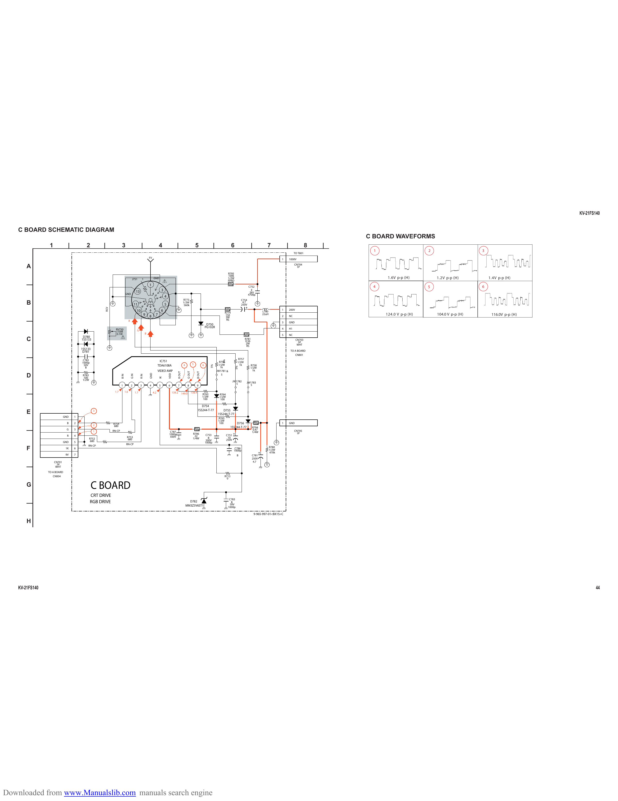

                                                                                                                                                                                                                                                                                                                                                                             KV-21FS140

    C BOARD SCHEMATIC DIAGRAM
                                                                                                                                                                                                                                                                                                          C BOARD WAVEFORMS
                  1             |          2           |                 3                              |                      4                     |                                5                      |                  6                   |           7              |                  8   |
                                                                                                                                                                                                                                                                                        TO T801
                                                                                                                                                                                                                                                                                                           1                     2                     3
                                                                                                                   FV                                                                                                                                                      1       1000V

        A                                                                                                                                                                                                                                                                               CN704
                                                                                                                                                                                                                                                                                         1P

                                                                                                                                                                                                                           R795
                                                                                                                                                                                                                           100k
                                                                                           J751            1             GND                                                                                               1/2W                                                                                 1.6V p-p (H)         1.2V p-p (H)          1.4V p-p (H)
                                                                                                                                                                                                                           FPRD
        —                                                                                                          1                                                                                                                            C752                                                       4                     5                     6
                                                                                                  13                               3                                                                                                              E
                                                                                                                                                                                                                                                 2kV
                                                                                GND                                                                                                                                                             4700p
                                                                                                                                       4
                                                                                                                                                                  R773
        B
                                                                                                                                                                                                                                         C754
                                                                                                                                                                  1/2W                                                                    4.7
                                                                                                 11                                    5                           560k                                                                  250V
                                                           RCV                                    10                               6                                                                                                                                       1       200V
                                                                                                                                                                                                                         R774                                L780
                                                                                                              9    8       7                                                                                              150                                22uH
                                                                                                                                                                                                                                                                           2       NC                          124.0 V p-p (H)       104.0 V p-p (H)        116.0V p-p (H)
                                                                                                                                                                                                                          3W
        —                                                                             R
                                                                                                                                                                                                      D750
                                                                                                                                                                                                                          RS
                                                                                                                                                                                                                                                                           3       GND
                                                                                                                                                                                                     PG102R                                                                4       H1
                                                                   RV750                           G
                                                                   110M
                                                                    0.1W                                       B                                                                                                                                                           5       NC
        C
                                         D780
                                        1SS133                                                                                                                                                                                               R781                                         CN703
                                                                                                                                                                                                                                             0.56                                           5P
                                                                                                                                                                                                                                              2W                                           WHT
                                                                                                                                                                                                                                              RS
                                        1SS133
                                         D781                                                                                                                                                                                                                                       TO A BOARD

        —
                                                                                                                                                                                                                                                                                       CN801
                                        C782                                                                                                                                                                                          R757
                                        1000p
                                                                                                                                IC751                                                                                5%
                                                                                                                                                                                                                   R756              1/2W
                                         50V                                                                                   TDA6108A                           4               5              6                1/2W                 1k        R758
                                                                                                                                                                                                        5%
                                          B                                                                                                                                                                         1k              5%           1/2W
                                                                                                                               VIDEO AMP                                                                         JW1781 &                         1k

        D                                R783                            B IN             G IN         R IN        GND          IK         VDD           R OUT           G OUT           B OUT
                                                                                                                                                                                                                     5
                                          100
                                         1/2W                                                                                                                                                                                    JW1782
                                                                                                                                                                                                                                   5          JW1783
                                                                         1                2            3           4           5           6         7                 8              9                                                         5

        —                                                         1.7           1.6              1.7                     4.2                     139.2           149.0           138.4
                                                                                                                                                                                                 R763
                                                                                                                                                                                                 1/2W
                                                                                                                                                                                                                   R764
                                                                                                                                                                                                                   1/2W
                                                                                                                                                                                                  100               100

                                                                                                                                                                                            D754

        E                                         3                                                                                                                                      1SS244-T-77                  D755
                                                                                                                                                                                                                  1SS244-T-77
                              GND   1
                                                                                                                                                                                                                  R765
                                                                                                                                                                                                                  1/2W
                                B   2                            R754                                                                                                                                              100          D756                                       1       GND
                                                  2              680                                                                                                                                                        1SS244-T-77
        —
                                                                                                                                                                                                                                                    R794
                                G   3                            RN-CP                                                                                                                                                                              0.47                                CN705
                                                  1                                                                                        C787                                                                                                     1/4W
                                                                                                                                           1000p                                  R796                                                                                                   1P
                                R   4                                                                                                                                              22                C753                 C751
                                                                                  R753                                                      500V                                                        B                  10
                                                R752                              680                                                                                             1/4W
                                                 680                                                                                                                                                  500V                250V
                              GND   5                                                                                                                                                                1000p
                                                                                 RN-CP
        F
                                            RN-CP                                                                                                                                                                                                                   R780
                               1K   6                                                                                                                                                                                            C786
                                                                                                                                                                                                                                 1000p                              1/2W
                                                                                                                                                                                                                                                                    470k
                               9V   7                                                                                                                                                                                               B               C781
                                                                                                                                                                                                                                                    250V
                      CN701                                                                                                                                                                                                                          4.7

        —               7P
                       WHT
                 TO A BOARD
                    CN004                                                                                                                                                                                                R713
                                                                                                                                                                                                                          0

        G                                        C BOARD
                                                CRT DRIVE
                                                                                                                                                                                                                            C783
        —                                       RGB DRIVE                                                                                                               D782
                                                                                                                                                                      MM3Z5V6ST1
                                                                                                                                                                                                                             B
                                                                                                                                                                                                                            50V
                                                                                                                                                                                                                           1000p

                                                                                                                                                                                                                                                        9-965-997-01<BX1S>C

        H

    KV-21FS140                                                                                                                                                                                                                                                                                                                                                                       44

Downloaded from www.Manualslib.com manuals search engine
