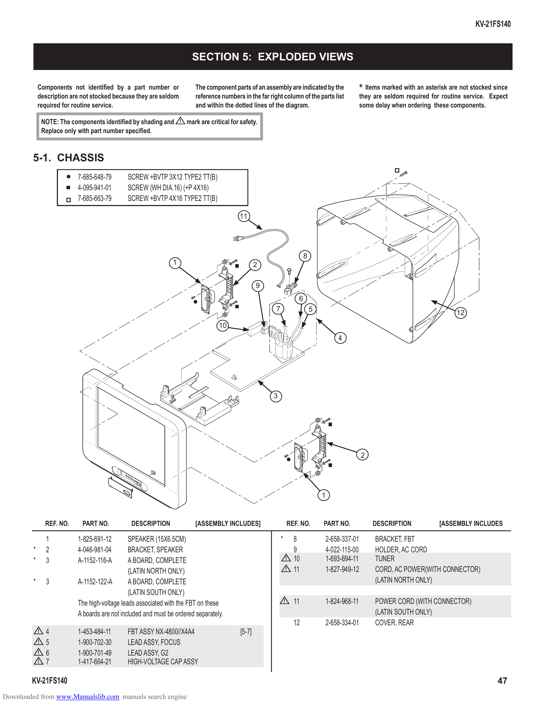

                                                                                                                                                                                                     KV-21FS140

                                                                            SECTION 5: EXPLODED VIEWS

             Components not identified by a part number or                    The component parts of an assembly are indicated by the                        * Items marked with an asterisk are not stocked since
             description are not stocked because they are seldom             reference numbers in the far right column of the parts list                    they are seldom required for routine service. Expect
             required for routine service.                                   and within the dotted lines of the diagram.                                    some delay when ordering these components.

                 NOTE: The components identified by shading and        !   mark are critical for safety.
                 Replace only with part number specified.

         5-1. CHASSIS
                             7-685-648-79       SCREW +BVTP 3X12 TYPE2 TT(B)
                             4-095-941-01       SCREW (WH DIA.16) (+P 4X16)
                             7-685-663-79       SCREW +BVTP 4X16 TYPE2 TT(B)

                                                                                               11

                                                                                                                                 8
                                                                  1                                     2

                                                                                                        9
                                                                                                                             6
                                                                                                             7                       5                                                        12
                                                                                       10
                                                                                                                                                 4

                                                                                                            3

                                                                                                                                                            2

                                                                                                                                         1

                  REF. NO.    PART NO.           DESCRIPTION                 [ASSEMBLY INCLUDES]                         REF. NO.        PART NO.               DESCRIPTION             [ASSEMBLY INCLUDES

                  1          1-825-691-12        SPEAKER (15X6.5CM)                                              *         8                 2-658-337-01        BRACKET, FBT
         *        2          4-046-981-04        BRACKET, SPEAKER                                                          9                 4-022-115-00        HOLDER, AC CORD
         *        3          A-1152-116-A        A BOARD, COMPLETE                                                   !     10                1-693-694-11        TUNER
                                                 (LATIN NORTH ONLY)                                                  !     11                1-827-949-12        CORD, AC POWER(WITH CONNECTOR)
         *        3          A-1152-122-A        A BOARD, COMPLETE                                                                                               (LATIN NORTH ONLY)
                                                 (LATIN SOUTH ONLY)
                             The high-voltage leads associated with the FBT on these                                 !     11                1-824-968-11        POWER CORD (WITH CONNECTOR)
                             A boards are not included and must be ordered separately.                                                                           (LATIN SOUTH ONLY)
                                                                                                                           12                2-658-334-01        COVER, REAR
             !    4          1-453-484-11       FBT ASSY NX-4800//X4A4                          [5-7]
             !    5          1-900-702-30       LEAD ASSY, FOCUS
             !    6          1-900-701-49       LEAD ASSY, G2
             !    7          1-417-664-21       HIGH-VOLTAGE CAP ASSY

        KV-21FS140                                                                                                                                                                                           47
Downloaded from www.Manualslib.com manuals search engine
