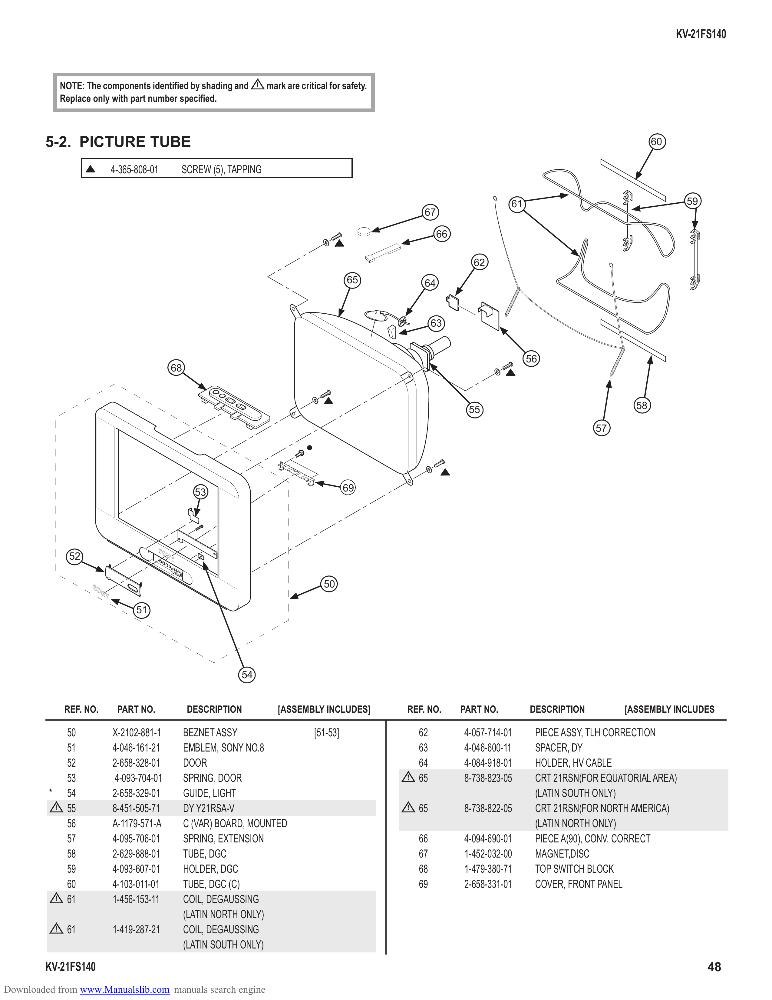

                                                                                                                                                                      KV-21FS140

                 NOTE: The components identified by shading and     !   mark are critical for safety.
                 Replace only with part number specified.

        5-2. PICTURE TUBE                                                                                                                                        60

                             4-365-808-01     SCREW (5), TAPPING

                                                                                                                                 61                                     59
                                                                                                            67

                                                                                                                 66

                                                                                                                        62
                                                                                              65            64

                                                                                                                63

                                                                                                                                      56
                                             68

                                                                                                                       55                                   58

                                                                                                                                                    57

                                                    53                                        69

                   52

                                                                                       50

                                   51

                                                              54

                  REF. NO.    PART NO.            DESCRIPTION             [ASSEMBLY INCLUDES]          REF. NO.       PART NO.        DESCRIPTION        [ASSEMBLY INCLUDES

                  50         X-2102-881-1         BEZNET ASSY                       [51-53]                62         4-057-714-01     PIECE ASSY, TLH CORRECTION
                  51         4-046-161-21         EMBLEM, SONY NO.8                                        63         4-046-600-11     SPACER, DY
                  52         2-658-328-01         DOOR                                                     64         4-084-918-01     HOLDER, HV CABLE
                  53          4-093-704-01        SPRING, DOOR                                         !   65         8-738-823-05     CRT 21RSN(FOR EQUATORIAL AREA)
         *        54         2-658-329-01         GUIDE, LIGHT                                                                         (LATIN SOUTH ONLY)
             !    55         8-451-505-71         DY Y21RSA-V                                          !   65         8-738-822-05     CRT 21RSN(FOR NORTH AMERICA)
                  56         A-1179-571-A         C (VAR) BOARD, MOUNTED                                                               (LATIN NORTH ONLY)
                  57         4-095-706-01         SPRING, EXTENSION                                        66         4-094-690-01     PIECE A(90), CONV. CORRECT
                  58         2-629-888-01         TUBE, DGC                                                67         1-452-032-00     MAGNET,DISC
                  59         4-093-607-01         HOLDER, DGC                                              68         1-479-380-71     TOP SWITCH BLOCK
                  60         4-103-011-01         TUBE, DGC (C)                                            69         2-658-331-01     COVER, FRONT PANEL
             !    61         1-456-153-11         COIL, DEGAUSSING
                                                  (LATIN NORTH ONLY)
             !    61         1-419-287-21         COIL, DEGAUSSING
                                                  (LATIN SOUTH ONLY)
        KV-21FS140                                                                                                                                                           48
Downloaded from www.Manualslib.com manuals search engine
