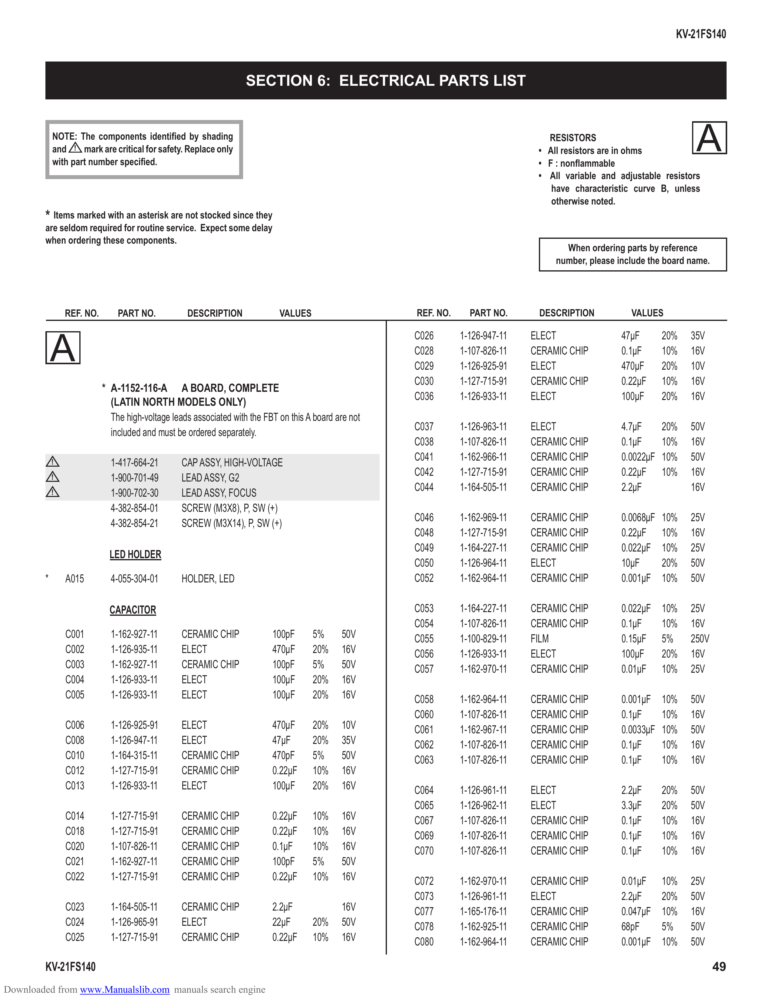

                                                                                                                                                                  KV-21FS140

                                                                   SECTION 6: ELECTRICAL PARTS LIST

            NOTE: The components identified by shading
            and ! mark are critical for safety. Replace only
            with part number specified.
                                                                                                                                   RESISTORS
                                                                                                                                 • All resistors are in ohms
                                                                                                                                 • F : nonflammable
                                                                                                                                                                       A
                                                                                                                                 • All variable and adjustable resistors
                                                                                                                                    have characteristic curve B, unless
                                                                                                                                    otherwise noted.
        * Items marked with an asterisk are not stocked since they
        are seldom required for routine service. Expect some delay
        when ordering these components.
                                                                                                                                       When ordering parts by reference
                                                                                                                                     number, please include the board name.

                REF. NO.       PART NO.           DESCRIPTION               VALUES                    REF. NO.     PART NO.      DESCRIPTION           VALUES

                                                                                                      C026       1-126-947-11   ELECT                47µF      20%    35V
            A                                                                                         C028
                                                                                                      C029
                                                                                                                 1-107-826-11
                                                                                                                 1-126-925-91
                                                                                                                                CERAMIC CHIP
                                                                                                                                ELECT
                                                                                                                                                     0.1µF
                                                                                                                                                     470µF
                                                                                                                                                               10%
                                                                                                                                                               20%
                                                                                                                                                                      16V
                                                                                                                                                                      10V
                                                                                                      C030       1-127-715-91   CERAMIC CHIP         0.22µF    10%    16V
                           * A-1152-116-A A BOARD, COMPLETE
                                                                                                      C036       1-126-933-11   ELECT                100µF     20%    16V
                             (LATIN NORTH MODELS ONLY)
                             The high-voltage leads associated with the FBT on this A board are not
                                                                                                      C037       1-126-963-11   ELECT                4.7µF    20%     50V
                             included and must be ordered separately.
                                                                                                      C038       1-107-826-11   CERAMIC CHIP         0.1µF    10%     16V
                                                                                                      C041       1-162-966-11   CERAMIC CHIP         0.0022µF 10%     50V
            !                1-417-664-21        CAP ASSY, HIGH-VOLTAGE
                                                                                                      C042       1-127-715-91   CERAMIC CHIP         0.22µF 10%       16V
            !                1-900-701-49        LEAD ASSY, G2
                                                                                                      C044       1-164-505-11   CERAMIC CHIP         2.2µF            16V
            !                1-900-702-30        LEAD ASSY, FOCUS
                             4-382-854-01        SCREW (M3X8), P, SW (+)
                                                                                                      C046       1-162-969-11   CERAMIC CHIP         0.0068µF 10%     25V
                             4-382-854-21        SCREW (M3X14), P, SW (+)
                                                                                                      C048       1-127-715-91   CERAMIC CHIP         0.22µF 10%       16V
                                                                                                      C049       1-164-227-11   CERAMIC CHIP         0.022µF 10%      25V
                             LED HOLDER
                                                                                                      C050       1-126-964-11   ELECT                10µF     20%     50V
        *       A015         4-055-304-01        HOLDER, LED                                          C052       1-162-964-11   CERAMIC CHIP         0.001µF 10%      50V

                             CAPACITOR                                                                C053       1-164-227-11   CERAMIC CHIP         0.022µF   10%    25V
                                                                                                      C054       1-107-826-11   CERAMIC CHIP         0.1µF     10%    16V
                C001         1-162-927-11        CERAMIC CHIP             100pF      5%      50V      C055       1-100-829-11   FILM                 0.15µF    5%     250V
                C002         1-126-935-11        ELECT                    470µF      20%     16V      C056       1-126-933-11   ELECT                100µF     20%    16V
                C003         1-162-927-11        CERAMIC CHIP             100pF      5%      50V      C057       1-162-970-11   CERAMIC CHIP         0.01µF    10%    25V
                C004         1-126-933-11        ELECT                    100µF      20%     16V
                C005         1-126-933-11        ELECT                    100µF      20%     16V      C058       1-162-964-11   CERAMIC CHIP         0.001µF 10%      50V
                                                                                                      C060       1-107-826-11   CERAMIC CHIP         0.1µF    10%     16V
                C006         1-126-925-91        ELECT                    470µF      20%     10V      C061       1-162-967-11   CERAMIC CHIP         0.0033µF 10%     50V
                C008         1-126-947-11        ELECT                    47µF       20%     35V      C062       1-107-826-11   CERAMIC CHIP         0.1µF    10%     16V
                C010         1-164-315-11        CERAMIC CHIP             470pF      5%      50V      C063       1-107-826-11   CERAMIC CHIP         0.1µF    10%     16V
                C012         1-127-715-91        CERAMIC CHIP             0.22µF     10%     16V
                C013         1-126-933-11        ELECT                    100µF      20%     16V      C064       1-126-961-11   ELECT                2.2µF     20%    50V
                                                                                                      C065       1-126-962-11   ELECT                3.3µF     20%    50V
                C014         1-127-715-91        CERAMIC CHIP             0.22µF     10%     16V      C067       1-107-826-11   CERAMIC CHIP         0.1µF     10%    16V
                C018         1-127-715-91        CERAMIC CHIP             0.22µF     10%     16V      C069       1-107-826-11   CERAMIC CHIP         0.1µF     10%    16V
                C020         1-107-826-11        CERAMIC CHIP             0.1µF      10%     16V      C070       1-107-826-11   CERAMIC CHIP         0.1µF     10%    16V
                C021         1-162-927-11        CERAMIC CHIP             100pF      5%      50V
                C022         1-127-715-91        CERAMIC CHIP             0.22µF     10%     16V      C072       1-162-970-11   CERAMIC CHIP         0.01µF    10%    25V
                                                                                                      C073       1-126-961-11   ELECT                2.2µF     20%    50V
                C023         1-164-505-11        CERAMIC CHIP             2.2µF              16V      C077       1-165-176-11   CERAMIC CHIP         0.047µF   10%    16V
                C024         1-126-965-91        ELECT                    22µF       20%     50V      C078       1-162-925-11   CERAMIC CHIP         68pF      5%     50V
                C025         1-127-715-91        CERAMIC CHIP             0.22µF     10%     16V      C080       1-162-964-11   CERAMIC CHIP         0.001µF   10%    50V

        KV-21FS140                                                                                                                                                            49
Downloaded from www.Manualslib.com manuals search engine
