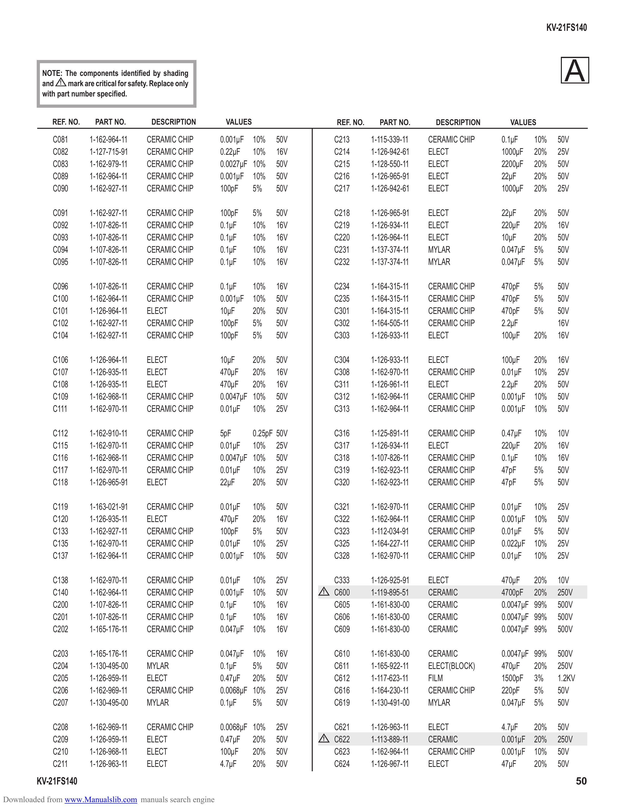

                                                                                                                                               KV-21FS140

          NOTE: The components identified by shading
          and ! mark are critical for safety. Replace only
          with part number specified.
                                                                                                                                                   A
             REF. NO.      PART NO.          DESCRIPTION      VALUES                   REF. NO.     PART NO.      DESCRIPTION     VALUES

             C081        1-162-964-11       CERAMIC CHIP     0.001µF 10%     50V       C213       1-115-339-11   CERAMIC CHIP   0.1µF     10%    50V
             C082        1-127-715-91       CERAMIC CHIP     0.22µF 10%      16V       C214       1-126-942-61   ELECT          1000µF    20%    25V
             C083        1-162-979-11       CERAMIC CHIP     0.0027µF 10%    50V       C215       1-128-550-11   ELECT          2200µF    20%    50V
             C089        1-162-964-11       CERAMIC CHIP     0.001µF 10%     50V       C216       1-126-965-91   ELECT          22µF      20%    50V
             C090        1-162-927-11       CERAMIC CHIP     100pF    5%     50V       C217       1-126-942-61   ELECT          1000µF    20%    25V

             C091        1-162-927-11       CERAMIC CHIP     100pF     5%    50V       C218       1-126-965-91   ELECT          22µF      20%    50V
             C092        1-107-826-11       CERAMIC CHIP     0.1µF     10%   16V       C219       1-126-934-11   ELECT          220µF     20%    16V
             C093        1-107-826-11       CERAMIC CHIP     0.1µF     10%   16V       C220       1-126-964-11   ELECT          10µF      20%    50V
             C094        1-107-826-11       CERAMIC CHIP     0.1µF     10%   16V       C231       1-137-374-11   MYLAR          0.047µF   5%     50V
             C095        1-107-826-11       CERAMIC CHIP     0.1µF     10%   16V       C232       1-137-374-11   MYLAR          0.047µF   5%     50V

             C096        1-107-826-11       CERAMIC CHIP     0.1µF     10%   16V       C234       1-164-315-11   CERAMIC CHIP   470pF     5%     50V
             C100        1-162-964-11       CERAMIC CHIP     0.001µF   10%   50V       C235       1-164-315-11   CERAMIC CHIP   470pF     5%     50V
             C101        1-126-964-11       ELECT            10µF      20%   50V       C301       1-164-315-11   CERAMIC CHIP   470pF     5%     50V
             C102        1-162-927-11       CERAMIC CHIP     100pF     5%    50V       C302       1-164-505-11   CERAMIC CHIP   2.2µF            16V
             C104        1-162-927-11       CERAMIC CHIP     100pF     5%    50V       C303       1-126-933-11   ELECT          100µF     20%    16V

             C106        1-126-964-11       ELECT            10µF     20%    50V       C304       1-126-933-11   ELECT          100µF     20%    16V
             C107        1-126-935-11       ELECT            470µF    20%    16V       C308       1-162-970-11   CERAMIC CHIP   0.01µF    10%    25V
             C108        1-126-935-11       ELECT            470µF    20%    16V       C311       1-126-961-11   ELECT          2.2µF     20%    50V
             C109        1-162-968-11       CERAMIC CHIP     0.0047µF 10%    50V       C312       1-162-964-11   CERAMIC CHIP   0.001µF   10%    50V
             C111        1-162-970-11       CERAMIC CHIP     0.01µF 10%      25V       C313       1-162-964-11   CERAMIC CHIP   0.001µF   10%    50V

             C112        1-162-910-11       CERAMIC CHIP     5pF      0.25pF 50V       C316       1-125-891-11   CERAMIC CHIP   0.47µF    10%    10V
             C115        1-162-970-11       CERAMIC CHIP     0.01µF 10% 25V            C317       1-126-934-11   ELECT          220µF     20%    16V
             C116        1-162-968-11       CERAMIC CHIP     0.0047µF 10% 50V          C318       1-107-826-11   CERAMIC CHIP   0.1µF     10%    16V
             C117        1-162-970-11       CERAMIC CHIP     0.01µF 10% 25V            C319       1-162-923-11   CERAMIC CHIP   47pF      5%     50V
             C118        1-126-965-91       ELECT            22µF     20% 50V          C320       1-162-923-11   CERAMIC CHIP   47pF      5%     50V

             C119        1-163-021-91       CERAMIC CHIP     0.01µF    10%   50V       C321       1-162-970-11   CERAMIC CHIP   0.01µF    10%    25V
             C120        1-126-935-11       ELECT            470µF     20%   16V       C322       1-162-964-11   CERAMIC CHIP   0.001µF   10%    50V
             C133        1-162-927-11       CERAMIC CHIP     100pF     5%    50V       C323       1-112-034-91   CERAMIC CHIP   0.01µF    5%     50V
             C135        1-162-970-11       CERAMIC CHIP     0.01µF    10%   25V       C325       1-164-227-11   CERAMIC CHIP   0.022µF   10%    25V
             C137        1-162-964-11       CERAMIC CHIP     0.001µF   10%   50V       C328       1-162-970-11   CERAMIC CHIP   0.01µF    10%    25V

             C138        1-162-970-11       CERAMIC CHIP     0.01µF    10%   25V       C333       1-126-925-91   ELECT          470µF    20%     10V
             C140        1-162-964-11       CERAMIC CHIP     0.001µF   10%   50V   !   C600       1-119-895-51   CERAMIC        4700pF 20%       250V
             C200        1-107-826-11       CERAMIC CHIP     0.1µF     10%   16V       C605       1-161-830-00   CERAMIC        0.0047µF 99%     500V
             C201        1-107-826-11       CERAMIC CHIP     0.1µF     10%   16V       C606       1-161-830-00   CERAMIC        0.0047µF 99%     500V
             C202        1-165-176-11       CERAMIC CHIP     0.047µF   10%   16V       C609       1-161-830-00   CERAMIC        0.0047µF 99%     500V

             C203        1-165-176-11       CERAMIC CHIP     0.047µF 10%     16V       C610       1-161-830-00   CERAMIC        0.0047µF 99%     500V
             C204        1-130-495-00       MYLAR            0.1µF    5%     50V       C611       1-165-922-11   ELECT(BLOCK)   470µF    20%     250V
             C205        1-126-959-11       ELECT            0.47µF 20%      50V       C612       1-117-623-11   FILM           1500pF 3%        1.2KV
             C206        1-162-969-11       CERAMIC CHIP     0.0068µF 10%    25V       C616       1-164-230-11   CERAMIC CHIP   220pF    5%      50V
             C207        1-130-495-00       MYLAR            0.1µF    5%     50V       C619       1-130-491-00   MYLAR          0.047µF 5%       50V

             C208        1-162-969-11       CERAMIC CHIP     0.0068µF 10%    25V       C621       1-126-963-11   ELECT          4.7µF     20%    50V
             C209        1-126-959-11       ELECT            0.47µF 20%      50V   !   C622       1-113-889-11   CERAMIC        0.001µF   20%    250V
             C210        1-126-968-11       ELECT            100µF    20%    50V       C623       1-162-964-11   CERAMIC CHIP   0.001µF   10%    50V
             C211        1-126-963-11       ELECT            4.7µF    20%    50V       C624       1-126-967-11   ELECT          47µF      20%    50V
        KV-21FS140                                                                                                                                       50
Downloaded from www.Manualslib.com manuals search engine
