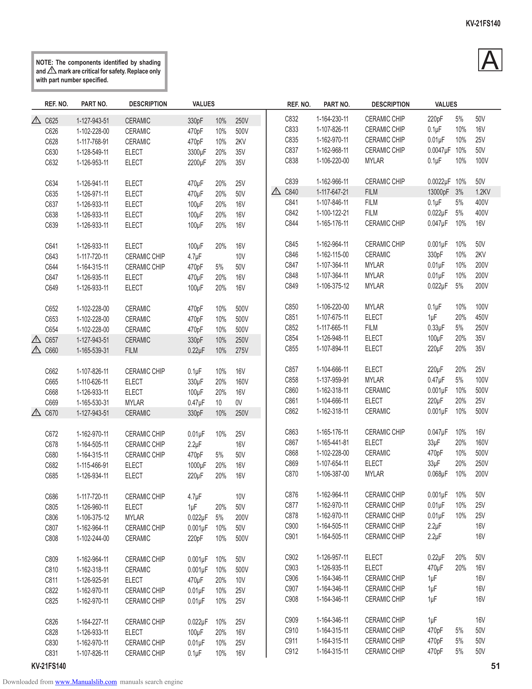

                                                                                                                                                KV-21FS140

          NOTE: The components identified by shading
          and ! mark are critical for safety. Replace only
          with part number specified.
                                                                                                                                                    A
              REF. NO.     PART NO.          DESCRIPTION      VALUES                    REF. NO.     PART NO.      DESCRIPTION     VALUES

          !   C625       1-127-943-51       CERAMIC          330pF     10%   250V       C832       1-164-230-11   CERAMIC CHIP   220pF    5%      50V
              C626       1-102-228-00       CERAMIC          470pF     10%   500V       C833       1-107-826-11   CERAMIC CHIP   0.1µF    10%     16V
              C628       1-117-768-91       CERAMIC          470pF     10%   2KV        C835       1-162-970-11   CERAMIC CHIP   0.01µF 10%       25V
              C630       1-128-549-11       ELECT            3300µF    20%   35V        C837       1-162-968-11   CERAMIC CHIP   0.0047µF 10%     50V
              C632       1-126-953-11       ELECT            2200µF    20%   35V        C838       1-106-220-00   MYLAR          0.1µF    10%     100V

              C634       1-126-941-11       ELECT            470µF     20%   25V        C839       1-162-966-11   CERAMIC CHIP   0.0022µF 10%     50V
              C635       1-126-971-11       ELECT            470µF     20%   50V    !   C840       1-117-647-21   FILM           13000pF 3%       1.2KV
              C637       1-126-933-11       ELECT            100µF     20%   16V        C841       1-107-846-11   FILM           0.1µF    5%      400V
              C638       1-126-933-11       ELECT            100µF     20%   16V        C842       1-100-122-21   FILM           0.022µF 5%       400V
              C639       1-126-933-11       ELECT            100µF     20%   16V        C844       1-165-176-11   CERAMIC CHIP   0.047µF 10%      16V

              C641       1-126-933-11       ELECT            100µF     20%   16V        C845       1-162-964-11   CERAMIC CHIP   0.001µF   10%    50V
              C643       1-117-720-11       CERAMIC CHIP     4.7µF           10V        C846       1-162-115-00   CERAMIC        330pF     10%    2KV
              C644       1-164-315-11       CERAMIC CHIP     470pF     5%    50V        C847       1-107-364-11   MYLAR          0.01µF    10%    200V
              C647       1-126-935-11       ELECT            470µF     20%   16V        C848       1-107-364-11   MYLAR          0.01µF    10%    200V
              C649       1-126-933-11       ELECT            100µF     20%   16V        C849       1-106-375-12   MYLAR          0.022µF   5%     200V

              C652       1-102-228-00       CERAMIC          470pF     10%   500V       C850       1-106-220-00   MYLAR          0.1µF     10%    100V
              C653       1-102-228-00       CERAMIC          470pF     10%   500V       C851       1-107-675-11   ELECT          1µF       20%    450V
              C654       1-102-228-00       CERAMIC          470pF     10%   500V       C852       1-117-665-11   FILM           0.33µF    5%     250V
          !   C657       1-127-943-51       CERAMIC          330pF     10%   250V       C854       1-126-948-11   ELECT          100µF     20%    35V
          !   C660       1-165-539-31       FILM             0.22µF    10%   275V       C855       1-107-894-11   ELECT          220µF     20%    35V

              C662       1-107-826-11       CERAMIC CHIP     0.1µF     10%   16V        C857       1-104-666-11   ELECT          220µF     20%    25V
              C665       1-110-626-11       ELECT            330µF     20%   160V       C858       1-137-959-91   MYLAR          0.47µF    5%     100V
              C668       1-126-933-11       ELECT            100µF     20%   16V        C860       1-162-318-11   CERAMIC        0.001µF   10%    500V
              C669       1-165-530-31       MYLAR            0.47µF    10    0V         C861       1-104-666-11   ELECT          220µF     20%    25V
          !   C670       1-127-943-51       CERAMIC          330pF     10%   250V       C862       1-162-318-11   CERAMIC        0.001µF   10%    500V

              C672       1-162-970-11       CERAMIC CHIP     0.01µF    10%   25V        C863       1-165-176-11   CERAMIC CHIP   0.047µF   10%    16V
              C678       1-164-505-11       CERAMIC CHIP     2.2µF           16V        C867       1-165-441-81   ELECT          33µF      20%    160V
              C680       1-164-315-11       CERAMIC CHIP     470pF     5%    50V        C868       1-102-228-00   CERAMIC        470pF     10%    500V
              C682       1-115-466-91       ELECT            1000µF    20%   16V        C869       1-107-654-11   ELECT          33µF      20%    250V
              C685       1-126-934-11       ELECT            220µF     20%   16V        C870       1-106-387-00   MYLAR          0.068µF   10%    200V

              C686       1-117-720-11       CERAMIC CHIP     4.7µF           10V        C876       1-162-964-11   CERAMIC CHIP   0.001µF 10%      50V
              C805       1-126-960-11       ELECT            1µF       20%   50V        C877       1-162-970-11   CERAMIC CHIP   0.01µF 10%       25V
              C806       1-106-375-12       MYLAR            0.022µF   5%    200V       C878       1-162-970-11   CERAMIC CHIP   0.01µF 10%       25V
              C807       1-162-964-11       CERAMIC CHIP     0.001µF   10%   50V        C900       1-164-505-11   CERAMIC CHIP   2.2µF            16V
              C808       1-102-244-00       CERAMIC          220pF     10%   500V       C901       1-164-505-11   CERAMIC CHIP   2.2µF            16V

              C809       1-162-964-11       CERAMIC CHIP     0.001µF   10%   50V        C902       1-126-957-11   ELECT          0.22µF    20%    50V
              C810       1-162-318-11       CERAMIC          0.001µF   10%   500V       C903       1-126-935-11   ELECT          470µF     20%    16V
              C811       1-126-925-91       ELECT            470µF     20%   10V        C906       1-164-346-11   CERAMIC CHIP   1µF              16V
              C822       1-162-970-11       CERAMIC CHIP     0.01µF    10%   25V        C907       1-164-346-11   CERAMIC CHIP   1µF              16V
              C825       1-162-970-11       CERAMIC CHIP     0.01µF    10%   25V        C908       1-164-346-11   CERAMIC CHIP   1µF              16V

              C826       1-164-227-11       CERAMIC CHIP     0.022µF   10%   25V        C909       1-164-346-11   CERAMIC CHIP   1µF              16V
              C828       1-126-933-11       ELECT            100µF     20%   16V        C910       1-164-315-11   CERAMIC CHIP   470pF     5%     50V
              C830       1-162-970-11       CERAMIC CHIP     0.01µF    10%   25V        C911       1-164-315-11   CERAMIC CHIP   470pF     5%     50V
              C831       1-107-826-11       CERAMIC CHIP     0.1µF     10%   16V        C912       1-164-315-11   CERAMIC CHIP   470pF     5%     50V
        KV-21FS140                                                                                                                                        51
Downloaded from www.Manualslib.com manuals search engine
