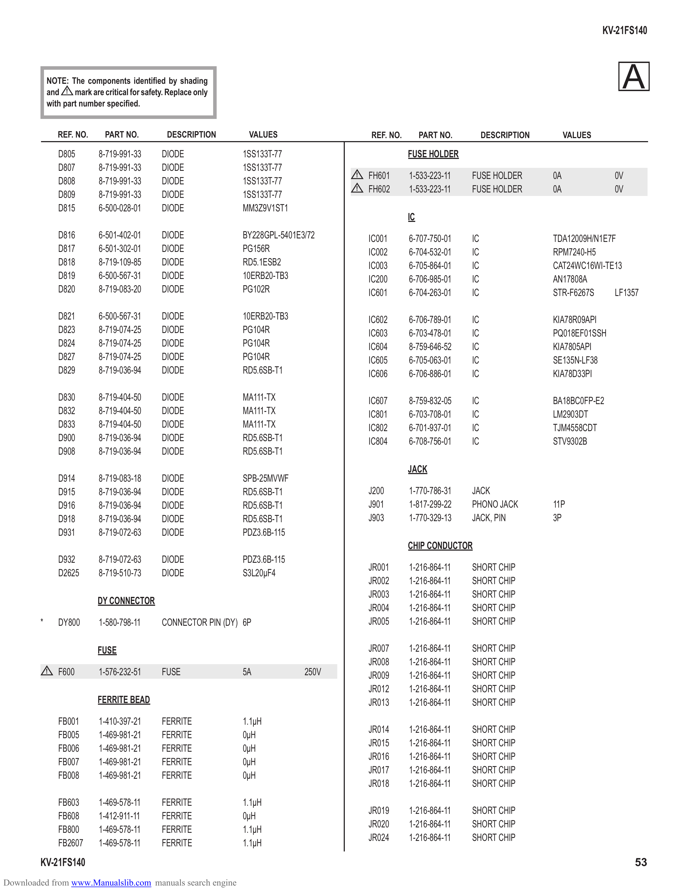

                                                                                                                                                      KV-21FS140

            NOTE: The components identified by shading
            and ! mark are critical for safety. Replace only
                                                                                                                                                          A
            with part number specified.

                REF. NO.     PART NO.          DESCRIPTION        VALUES                  REF. NO.        PART NO.        DESCRIPTION        VALUES

                D805       8-719-991-33       DIODE             1SS133T-77                           FUSE HOLDER
                D807       8-719-991-33       DIODE             1SS133T-77
                                                                                      !   FH601      1-533-223-11    FUSE HOLDER        0A              0V
                D808       8-719-991-33       DIODE             1SS133T-77
                                                                                      !   FH602      1-533-223-11    FUSE HOLDER        0A              0V
                D809       8-719-991-33       DIODE             1SS133T-77
                D815       6-500-028-01       DIODE             MM3Z9V1ST1
                                                                                                     IC
                D816       6-501-402-01       DIODE             BY228GPL-5401E3/72        IC001      6-707-750-01    IC                 TDA12009H/N1E7F
                D817       6-501-302-01       DIODE             PG156R                    IC002      6-704-532-01    IC                 RPM7240-H5
                D818       8-719-109-85       DIODE             RD5.1ESB2                 IC003      6-705-864-01    IC                 CAT24WC16WI-TE13
                D819       6-500-567-31       DIODE             10ERB20-TB3               IC200      6-706-985-01    IC                 AN17808A
                D820       8-719-083-20       DIODE             PG102R                    IC601      6-704-263-01    IC                 STR-F6267S     LF1357

                D821       6-500-567-31       DIODE             10ERB20-TB3               IC602      6-706-789-01    IC                 KIA78R09API
                D823       8-719-074-25       DIODE             PG104R                    IC603      6-703-478-01    IC                 PQ018EF01SSH
                D824       8-719-074-25       DIODE             PG104R                    IC604      8-759-646-52    IC                 KIA7805API
                D827       8-719-074-25       DIODE             PG104R                    IC605      6-705-063-01    IC                 SE135N-LF38
                D829       8-719-036-94       DIODE             RD5.6SB-T1                IC606      6-706-886-01    IC                 KIA78D33PI

                D830       8-719-404-50       DIODE             MA111-TX                  IC607      8-759-832-05    IC                 BA18BC0FP-E2
                D832       8-719-404-50       DIODE             MA111-TX                  IC801      6-703-708-01    IC                 LM2903DT
                D833       8-719-404-50       DIODE             MA111-TX                  IC802      6-701-937-01    IC                 TJM4558CDT
                D900       8-719-036-94       DIODE             RD5.6SB-T1                IC804      6-708-756-01    IC                 STV9302B
                D908       8-719-036-94       DIODE             RD5.6SB-T1
                                                                                                     JACK
                D914       8-719-083-18       DIODE             SPB-25MVWF
                D915       8-719-036-94       DIODE             RD5.6SB-T1                J200       1-770-786-31    JACK
                D916       8-719-036-94       DIODE             RD5.6SB-T1                J901       1-817-299-22    PHONO JACK         11P
                D918       8-719-036-94       DIODE             RD5.6SB-T1                J903       1-770-329-13    JACK, PIN          3P
                D931       8-719-072-63       DIODE             PDZ3.6B-115
                                                                                                     CHIP CONDUCTOR
                D932       8-719-072-63       DIODE             PDZ3.6B-115
                                                                                          JR001      1-216-864-11    SHORT CHIP
                D2625      8-719-510-73       DIODE             S3L20µF4
                                                                                          JR002      1-216-864-11    SHORT CHIP
                                                                                          JR003      1-216-864-11    SHORT CHIP
                           DY CONNECTOR
                                                                                          JR004      1-216-864-11    SHORT CHIP
        *       DY800      1-580-798-11       CONNECTOR PIN (DY) 6P                       JR005      1-216-864-11    SHORT CHIP

                           FUSE                                                           JR007      1-216-864-11    SHORT CHIP
                                                                                          JR008      1-216-864-11    SHORT CHIP
            !   F600       1-576-232-51       FUSE              5A             250V       JR009      1-216-864-11    SHORT CHIP
                                                                                          JR012      1-216-864-11    SHORT CHIP
                           FERRITE BEAD                                                   JR013      1-216-864-11    SHORT CHIP
                FB001      1-410-397-21       FERRITE           1.1µH
                                                                                          JR014      1-216-864-11    SHORT CHIP
                FB005      1-469-981-21       FERRITE           0µH
                                                                                          JR015      1-216-864-11    SHORT CHIP
                FB006      1-469-981-21       FERRITE           0µH
                                                                                          JR016      1-216-864-11    SHORT CHIP
                FB007      1-469-981-21       FERRITE           0µH
                                                                                          JR017      1-216-864-11    SHORT CHIP
                FB008      1-469-981-21       FERRITE           0µH
                                                                                          JR018      1-216-864-11    SHORT CHIP
                FB603      1-469-578-11       FERRITE           1.1µH
                                                                                          JR019      1-216-864-11    SHORT CHIP
                FB608      1-412-911-11       FERRITE           0µH
                                                                                          JR020      1-216-864-11    SHORT CHIP
                FB800      1-469-578-11       FERRITE           1.1µH
                                                                                          JR024      1-216-864-11    SHORT CHIP
                FB2607     1-469-578-11       FERRITE           1.1µH
        KV-21FS140                                                                                                                                           53
Downloaded from www.Manualslib.com manuals search engine
