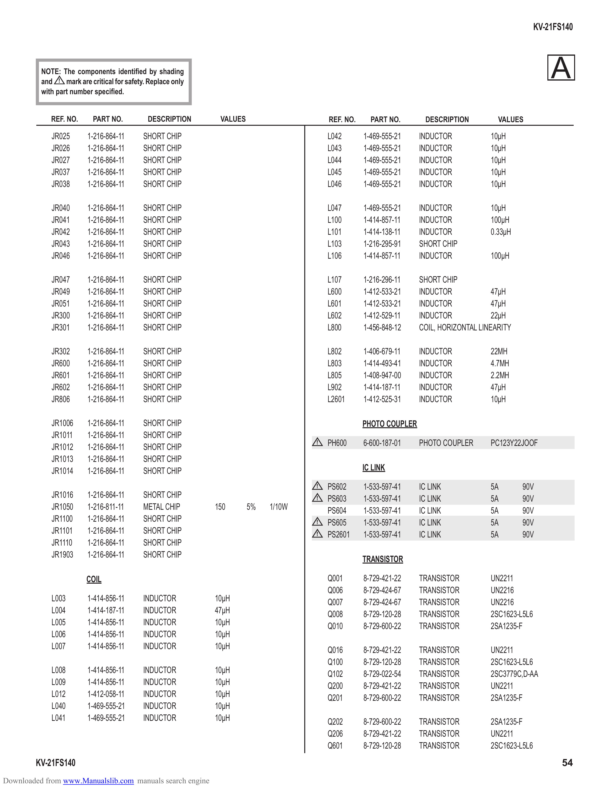

                                                                                                                                                      KV-21FS140

          NOTE: The components identified by shading
          and ! mark are critical for safety. Replace only
                                                                                                                                                          A
          with part number specified.

             REF. NO.      PART NO.          DESCRIPTION      VALUES                    REF. NO.     PART NO.       DESCRIPTION          VALUES

             JR025       1-216-864-11       SHORT CHIP                                  L042       1-469-555-21    INDUCTOR            10µH
             JR026       1-216-864-11       SHORT CHIP                                  L043       1-469-555-21    INDUCTOR            10µH
             JR027       1-216-864-11       SHORT CHIP                                  L044       1-469-555-21    INDUCTOR            10µH
             JR037       1-216-864-11       SHORT CHIP                                  L045       1-469-555-21    INDUCTOR            10µH
             JR038       1-216-864-11       SHORT CHIP                                  L046       1-469-555-21    INDUCTOR            10µH

             JR040       1-216-864-11       SHORT CHIP                                  L047       1-469-555-21    INDUCTOR            10µH
             JR041       1-216-864-11       SHORT CHIP                                  L100       1-414-857-11    INDUCTOR            100µH
             JR042       1-216-864-11       SHORT CHIP                                  L101       1-414-138-11    INDUCTOR            0.33µH
             JR043       1-216-864-11       SHORT CHIP                                  L103       1-216-295-91    SHORT CHIP
             JR046       1-216-864-11       SHORT CHIP                                  L106       1-414-857-11    INDUCTOR            100µH

             JR047       1-216-864-11       SHORT CHIP                                  L107       1-216-296-11    SHORT CHIP
             JR049       1-216-864-11       SHORT CHIP                                  L600       1-412-533-21    INDUCTOR             47µH
             JR051       1-216-864-11       SHORT CHIP                                  L601       1-412-533-21    INDUCTOR             47µH
             JR300       1-216-864-11       SHORT CHIP                                  L602       1-412-529-11    INDUCTOR             22µH
             JR301       1-216-864-11       SHORT CHIP                                  L800       1-456-848-12    COIL, HORIZONTAL LINEARITY

             JR302       1-216-864-11       SHORT CHIP                                  L802       1-406-679-11    INDUCTOR            22MH
             JR600       1-216-864-11       SHORT CHIP                                  L803       1-414-493-41    INDUCTOR            4.7MH
             JR601       1-216-864-11       SHORT CHIP                                  L805       1-408-947-00    INDUCTOR            2.2MH
             JR602       1-216-864-11       SHORT CHIP                                  L902       1-414-187-11    INDUCTOR            47µH
             JR806       1-216-864-11       SHORT CHIP                                  L2601      1-412-525-31    INDUCTOR            10µH

             JR1006      1-216-864-11       SHORT CHIP                                             PHOTO COUPLER
             JR1011      1-216-864-11       SHORT CHIP
             JR1012      1-216-864-11       SHORT CHIP
                                                                                    !   PH600      6-600-187-01    PHOTO COUPLER       PC123Y22JOOF
             JR1013      1-216-864-11       SHORT CHIP
             JR1014      1-216-864-11       SHORT CHIP                                             IC LINK
                                                                                    !   PS602      1-533-597-41    IC LINK             5A       90V
             JR1016      1-216-864-11       SHORT CHIP                              !   PS603      1-533-597-41    IC LINK             5A       90V
             JR1050      1-216-811-11       METAL CHIP       150       5%   1/10W       PS604      1-533-597-41    IC LINK             5A       90V
             JR1100      1-216-864-11       SHORT CHIP                              !   PS605      1-533-597-41    IC LINK             5A       90V
             JR1101      1-216-864-11       SHORT CHIP                              !   PS2601     1-533-597-41    IC LINK             5A       90V
             JR1110      1-216-864-11       SHORT CHIP
             JR1903      1-216-864-11       SHORT CHIP
                                                                                                   TRANSISTOR

                         COIL                                                           Q001       8-729-421-22    TRANSISTOR          UN2211
                                                                                        Q006       8-729-424-67    TRANSISTOR          UN2216
             L003        1-414-856-11       INDUCTOR         10µH                       Q007       8-729-424-67    TRANSISTOR          UN2216
             L004        1-414-187-11       INDUCTOR         47µH                       Q008       8-729-120-28    TRANSISTOR          2SC1623-L5L6
             L005        1-414-856-11       INDUCTOR         10µH                       Q010       8-729-600-22    TRANSISTOR          2SA1235-F
             L006        1-414-856-11       INDUCTOR         10µH
             L007        1-414-856-11       INDUCTOR         10µH                       Q016       8-729-421-22    TRANSISTOR          UN2211
                                                                                        Q100       8-729-120-28    TRANSISTOR          2SC1623-L5L6
             L008        1-414-856-11       INDUCTOR         10µH                       Q102       8-729-022-54    TRANSISTOR          2SC3779C,D-AA
             L009        1-414-856-11       INDUCTOR         10µH                       Q200       8-729-421-22    TRANSISTOR          UN2211
             L012        1-412-058-11       INDUCTOR         10µH                       Q201       8-729-600-22    TRANSISTOR          2SA1235-F
             L040        1-469-555-21       INDUCTOR         10µH
             L041        1-469-555-21       INDUCTOR         10µH                       Q202       8-729-600-22    TRANSISTOR          2SA1235-F
                                                                                        Q206       8-729-421-22    TRANSISTOR          UN2211
                                                                                        Q601       8-729-120-28    TRANSISTOR          2SC1623-L5L6
        KV-21FS140                                                                                                                                           54
Downloaded from www.Manualslib.com manuals search engine
