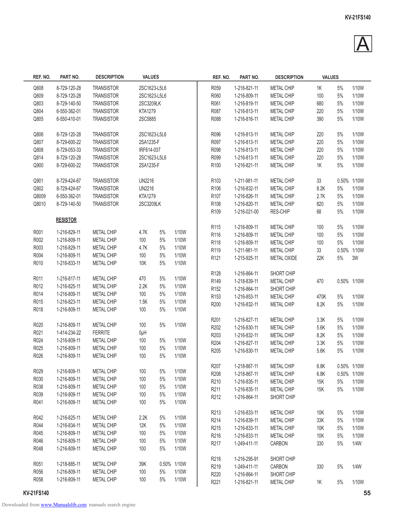

                                                                                                                                            KV-21FS140

                                                                                                                                                A
             REF. NO.    PART NO.       DESCRIPTION         VALUES                 REF. NO.     PART NO.       DESCRIPTION        VALUES

             Q608       8-729-120-28   TRANSISTOR          2SC1623-L5L6            R059       1-216-821-11   METAL CHIP      1K        5%     1/10W
             Q609       8-729-120-28   TRANSISTOR          2SC1623-L5L6            R060       1-216-809-11   METAL CHIP      100       5%     1/10W
             Q803       8-729-140-50   TRANSISTOR          2SC3209LK               R061       1-216-819-11   METAL CHIP      680       5%     1/10W
             Q804       6-550-362-01   TRANSISTOR          KTA1279                 R087       1-216-813-11   METAL CHIP      220       5%     1/10W
             Q805       6-550-410-01   TRANSISTOR          2SC5885                 R088       1-216-816-11   METAL CHIP      390       5%     1/10W

             Q806       8-729-120-28   TRANSISTOR          2SC1623-L5L6            R096       1-216-813-11   METAL CHIP      220       5%     1/10W
             Q807       8-729-600-22   TRANSISTOR          2SA1235-F               R097       1-216-813-11   METAL CHIP      220       5%     1/10W
             Q808       8-729-053-33   TRANSISTOR          IRF614-037              R098       1-216-813-11   METAL CHIP      220       5%     1/10W
             Q814       8-729-120-28   TRANSISTOR          2SC1623-L5L6            R099       1-216-813-11   METAL CHIP      220       5%     1/10W
             Q900       8-729-600-22   TRANSISTOR          2SA1235-F               R100       1-216-821-11   METAL CHIP      1K        5%     1/10W

             Q901       8-729-424-67   TRANSISTOR          UN2216                  R103       1-211-981-11   METAL CHIP      33        0.50% 1/10W
             Q902       8-729-424-67   TRANSISTOR          UN2216                  R106       1-216-832-11   METAL CHIP      8.2K      5%    1/10W
             Q8009      6-550-362-01   TRANSISTOR          KTA1279                 R107       1-216-826-11   METAL CHIP      2.7K      5%    1/10W
             Q8010      8-729-140-50   TRANSISTOR          2SC3209LK               R108       1-216-820-11   METAL CHIP      820       5%    1/10W
                                                                                   R109       1-216-021-00   RES-CHIP        68        5%    1/10W
                        RESISTOR
                                                                                   R115       1-216-809-11   METAL CHIP      100       5%    1/10W
             R001       1-216-829-11   METAL CHIP          4.7K      5%    1/10W   R116       1-216-809-11   METAL CHIP      100       5%    1/10W
             R002       1-216-809-11   METAL CHIP          100       5%    1/10W   R118       1-216-809-11   METAL CHIP      100       5%    1/10W
             R003       1-216-829-11   METAL CHIP          4.7K      5%    1/10W   R119       1-211-981-11   METAL CHIP      33        0.50% 1/10W
             R004       1-216-809-11   METAL CHIP          100       5%    1/10W   R121       1-215-925-11   METAL OXIDE     22K       5%    3W
             R010       1-216-833-11   METAL CHIP          10K       5%    1/10W
                                                                                   R128       1-216-864-11   SHORT CHIP
             R011       1-216-817-11   METAL CHIP          470       5%    1/10W   R149       1-218-839-11   METAL CHIP      470       0.50% 1/10W
             R012       1-216-825-11   METAL CHIP          2.2K      5%    1/10W   R152       1-216-864-11   SHORT CHIP
             R014       1-216-809-11   METAL CHIP          100       5%    1/10W   R153       1-216-853-11   METAL CHIP      470K      5%     1/10W
             R015       1-216-823-11   METAL CHIP          1.5K      5%    1/10W   R200       1-216-832-11   METAL CHIP      8.2K      5%     1/10W
             R018       1-216-809-11   METAL CHIP          100       5%    1/10W
                                                                                   R201       1-216-827-11   METAL CHIP      3.3K      5%     1/10W
             R020       1-216-809-11   METAL CHIP          100       5%    1/10W   R202       1-216-830-11   METAL CHIP      5.6K      5%     1/10W
             R021       1-414-234-22   FERRITE             0µH                     R203       1-216-832-11   METAL CHIP      8.2K      5%     1/10W
             R024       1-216-809-11   METAL CHIP          100       5%    1/10W   R204       1-216-827-11   METAL CHIP      3.3K      5%     1/10W
             R025       1-216-809-11   METAL CHIP          100       5%    1/10W   R205       1-216-830-11   METAL CHIP      5.6K      5%     1/10W
             R026       1-216-809-11   METAL CHIP          100       5%    1/10W
                                                                                   R207       1-218-867-11   METAL CHIP      6.8K      0.50% 1/10W
             R029       1-216-809-11   METAL CHIP          100       5%    1/10W   R208       1-218-867-11   METAL CHIP      6.8K      0.50% 1/10W
             R030       1-216-809-11   METAL CHIP          100       5%    1/10W   R210       1-216-835-11   METAL CHIP      15K       5%    1/10W
             R038       1-216-809-11   METAL CHIP          100       5%    1/10W   R211       1-216-835-11   METAL CHIP      15K       5%    1/10W
             R039       1-216-809-11   METAL CHIP          100       5%    1/10W   R212       1-216-864-11   SHORT CHIP
             R041       1-216-809-11   METAL CHIP          100       5%    1/10W
                                                                                   R213       1-216-833-11   METAL CHIP      10K       5%     1/10W
             R042       1-216-825-11   METAL CHIP          2.2K      5%    1/10W   R214       1-216-839-11   METAL CHIP      33K       5%     1/10W
             R044       1-216-834-11   METAL CHIP          12K       5%    1/10W   R215       1-216-833-11   METAL CHIP      10K       5%     1/10W
             R045       1-216-809-11   METAL CHIP          100       5%    1/10W   R216       1-216-833-11   METAL CHIP      10K       5%     1/10W
             R046       1-216-809-11   METAL CHIP          100       5%    1/10W   R217       1-249-411-11   CARBON          330       5%     1/4W
             R048       1-216-809-11   METAL CHIP          100       5%    1/10W
                                                                                   R218       1-216-295-91   SHORT CHIP
             R051       1-218-885-11   METAL CHIP          39K       0.50% 1/10W   R219       1-249-411-11   CARBON          330       5%     1/4W
             R056       1-216-809-11   METAL CHIP          100       5%    1/10W   R220       1-216-864-11   SHORT CHIP
             R058       1-216-809-11   METAL CHIP          100       5%    1/10W   R221       1-216-821-11   METAL CHIP      1K        5%     1/10W
        KV-21FS140                                                                                                                                   55
Downloaded from www.Manualslib.com manuals search engine
