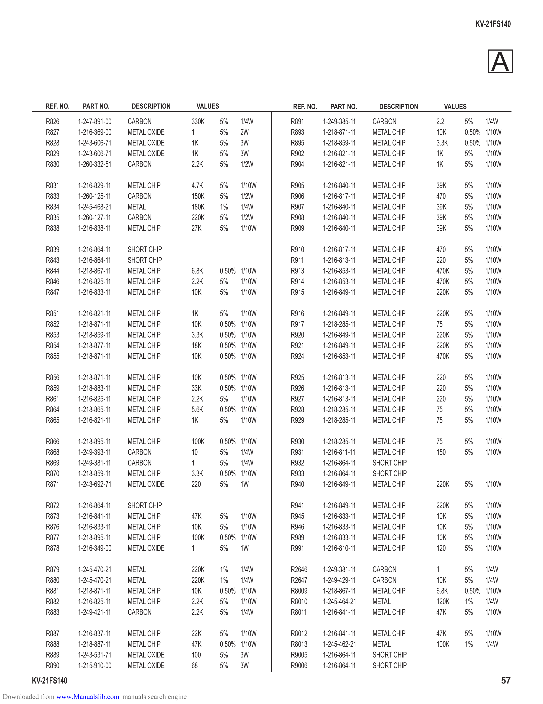

                                                                                                                                         KV-21FS140

                                                                                                                                             A
             REF. NO.    PART NO.       DESCRIPTION         VALUES                 REF. NO.     PART NO.       DESCRIPTION     VALUES

             R826       1-247-891-00   CARBON              330K      5%    1/4W    R891       1-249-385-11   CARBON          2.2    5%    1/4W
             R827       1-216-369-00   METAL OXIDE         1         5%    2W      R893       1-218-871-11   METAL CHIP      10K    0.50% 1/10W
             R828       1-243-606-71   METAL OXIDE         1K        5%    3W      R895       1-218-859-11   METAL CHIP      3.3K   0.50% 1/10W
             R829       1-243-606-71   METAL OXIDE         1K        5%    3W      R902       1-216-821-11   METAL CHIP      1K     5%    1/10W
             R830       1-260-332-51   CARBON              2.2K      5%    1/2W    R904       1-216-821-11   METAL CHIP      1K     5%    1/10W

             R831       1-216-829-11   METAL CHIP          4.7K      5%    1/10W   R905       1-216-840-11   METAL CHIP      39K    5%     1/10W
             R833       1-260-125-11   CARBON              150K      5%    1/2W    R906       1-216-817-11   METAL CHIP      470    5%     1/10W
             R834       1-245-468-21   METAL               180K      1%    1/4W    R907       1-216-840-11   METAL CHIP      39K    5%     1/10W
             R835       1-260-127-11   CARBON              220K      5%    1/2W    R908       1-216-840-11   METAL CHIP      39K    5%     1/10W
             R838       1-216-838-11   METAL CHIP          27K       5%    1/10W   R909       1-216-840-11   METAL CHIP      39K    5%     1/10W

             R839       1-216-864-11   SHORT CHIP                                  R910       1-216-817-11   METAL CHIP      470    5%     1/10W
             R843       1-216-864-11   SHORT CHIP                                  R911       1-216-813-11   METAL CHIP      220    5%     1/10W
             R844       1-218-867-11   METAL CHIP          6.8K      0.50% 1/10W   R913       1-216-853-11   METAL CHIP      470K   5%     1/10W
             R846       1-216-825-11   METAL CHIP          2.2K      5%    1/10W   R914       1-216-853-11   METAL CHIP      470K   5%     1/10W
             R847       1-216-833-11   METAL CHIP          10K       5%    1/10W   R915       1-216-849-11   METAL CHIP      220K   5%     1/10W

             R851       1-216-821-11   METAL CHIP          1K        5%    1/10W   R916       1-216-849-11   METAL CHIP      220K   5%     1/10W
             R852       1-218-871-11   METAL CHIP          10K       0.50% 1/10W   R917       1-218-285-11   METAL CHIP      75     5%     1/10W
             R853       1-218-859-11   METAL CHIP          3.3K      0.50% 1/10W   R920       1-216-849-11   METAL CHIP      220K   5%     1/10W
             R854       1-218-877-11   METAL CHIP          18K       0.50% 1/10W   R921       1-216-849-11   METAL CHIP      220K   5%     1/10W
             R855       1-218-871-11   METAL CHIP          10K       0.50% 1/10W   R924       1-216-853-11   METAL CHIP      470K   5%     1/10W

             R856       1-218-871-11   METAL CHIP          10K       0.50% 1/10W   R925       1-216-813-11   METAL CHIP      220    5%     1/10W
             R859       1-218-883-11   METAL CHIP          33K       0.50% 1/10W   R926       1-216-813-11   METAL CHIP      220    5%     1/10W
             R861       1-216-825-11   METAL CHIP          2.2K      5%    1/10W   R927       1-216-813-11   METAL CHIP      220    5%     1/10W
             R864       1-218-865-11   METAL CHIP          5.6K      0.50% 1/10W   R928       1-218-285-11   METAL CHIP      75     5%     1/10W
             R865       1-216-821-11   METAL CHIP          1K        5%    1/10W   R929       1-218-285-11   METAL CHIP      75     5%     1/10W

             R866       1-218-895-11   METAL CHIP          100K      0.50% 1/10W   R930       1-218-285-11   METAL CHIP      75     5%     1/10W
             R868       1-249-393-11   CARBON              10        5%    1/4W    R931       1-216-811-11   METAL CHIP      150    5%     1/10W
             R869       1-249-381-11   CARBON              1         5%    1/4W    R932       1-216-864-11   SHORT CHIP
             R870       1-218-859-11   METAL CHIP          3.3K      0.50% 1/10W   R933       1-216-864-11   SHORT CHIP
             R871       1-243-692-71   METAL OXIDE         220       5%    1W      R940       1-216-849-11   METAL CHIP      220K   5%     1/10W

             R872       1-216-864-11   SHORT CHIP                                  R941       1-216-849-11   METAL CHIP      220K   5%     1/10W
             R873       1-216-841-11   METAL CHIP          47K       5%    1/10W   R945       1-216-833-11   METAL CHIP      10K    5%     1/10W
             R876       1-216-833-11   METAL CHIP          10K       5%    1/10W   R946       1-216-833-11   METAL CHIP      10K    5%     1/10W
             R877       1-218-895-11   METAL CHIP          100K      0.50% 1/10W   R989       1-216-833-11   METAL CHIP      10K    5%     1/10W
             R878       1-216-349-00   METAL OXIDE         1         5%    1W      R991       1-216-810-11   METAL CHIP      120    5%     1/10W

             R879       1-245-470-21   METAL               220K      1%    1/4W    R2646      1-249-381-11   CARBON          1      5%    1/4W
             R880       1-245-470-21   METAL               220K      1%    1/4W    R2647      1-249-429-11   CARBON          10K    5%    1/4W
             R881       1-218-871-11   METAL CHIP          10K       0.50% 1/10W   R8009      1-218-867-11   METAL CHIP      6.8K   0.50% 1/10W
             R882       1-216-825-11   METAL CHIP          2.2K      5%    1/10W   R8010      1-245-464-21   METAL           120K   1%    1/4W
             R883       1-249-421-11   CARBON              2.2K      5%    1/4W    R8011      1-216-841-11   METAL CHIP      47K    5%    1/10W

             R887       1-216-837-11   METAL CHIP          22K       5%    1/10W   R8012      1-216-841-11   METAL CHIP      47K    5%     1/10W
             R888       1-218-887-11   METAL CHIP          47K       0.50% 1/10W   R8013      1-245-462-21   METAL           100K   1%     1/4W
             R889       1-243-531-71   METAL OXIDE         100       5%    3W      R9005      1-216-864-11   SHORT CHIP
             R890       1-215-910-00   METAL OXIDE         68        5%    3W      R9006      1-216-864-11   SHORT CHIP
        KV-21FS140                                                                                                                              57
Downloaded from www.Manualslib.com manuals search engine
